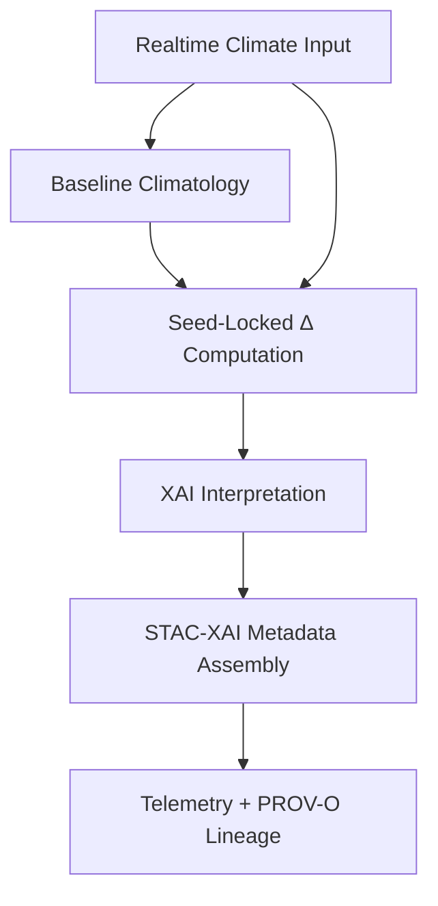

# 🌡️📉🤖 **Climate Anomaly Models — KFM v11.2.2**  
`docs/pipelines/ai/inference/climate/models/anomalies/README.md`

**Purpose**  
Define and govern the anomaly-generation models that compute **deviations from climatology** for use in realtime inference, statewide anomaly maps, hazard analyses, and Focus Mode v3 narratives.

---

## 📘 Overview

Climate anomaly models produce **deviation surfaces** by comparing realtime or forecast fields against:

- PRISM normals  
- NCEI 30-year climate normals  
- Downscaled HRRR/ERA5 baselines  
- Long-term statewide climatologies  
- Model-generated climatology (if selected)  

Anomalies are primary drivers for:

- Heatwave detection  
- Cold spell analysis  
- Rainfall departure maps  
- Drought onset signals  
- Soil moisture deficit/surplus  
- Hazard risk chains (fire weather, flooding)  
- Story Node v3 anomaly-context text  
- Focus Mode v3 in-situ anomaly overlays  

Models MUST be:

- Deterministic  
- FAIR+CARE aligned  
- XAI-compatible  
- STAC-XAI v11 publishable  
- CRS/vertical-axis explicit  
- Provenance-rich (PROV-O)  

---

## 🗂️ Directory Layout (v11.2.2)

    docs/pipelines/ai/inference/climate/models/anomalies/
        📄 README.md                # This file
        📄 anomaly-baseline.md      # Climatology baseline description
        📄 anomaly-diff-model.md    # Anomaly-generation model card

---

## 🧩 Anomaly Model Types

### 🧱 Baseline Climatology Model  
Defines the reference against which anomalies are computed.

Options:  
- Static 30-yr normals (1991–2020)  
- Rolling multi-decadal climatology  
- Downscaled historical reanalysis  

### 📉 Anomaly Difference Model  
Computes Δ(field) = realtime_field – baseline_climatology.

Supports:  
- Temperature anomalies  
- Dewpoint anomalies  
- Precipitation departures  
- Soil moisture deviations  
- Fire-weather indices  
- Energy-balance anomaly fields  

---

## 🧬 Anomaly Pipeline Flow

<!-- mermaid-end -->

---

## 🎛 Model Requirements

Each anomaly model card MUST include:

- Baseline definition (dataset, period)  
- Variables included  
- Preprocessing rules  
- Deterministic (seed-locked) diff computation  
- CRS + vertical-axis metadata  
- Metrics: MBE, RMSE, MAE, corr  
- Energy + carbon telemetry  
- FAIR+CARE review  
- Sovereignty-safe evaluation  
- XAI compatibility (SHAP, IG)  
- STAC-XAI asset metadata  

---

## 🧪 CI Requirements

CI MUST verify:

- Model-card schema validity  
- Baseline metadata completeness  
- Deterministic reproduction  
- Variable consistency  
- FAIR+CARE compliance  
- Sovereignty safety  
- XAI fields present  
- CRS + vertical-axis fields present  
- STAC-XAI blocks valid  
- PROV-O lineage correct  

CI failure → 🚫 merge blocked.

---

## 🕰 Version History

| Version | Date       | Notes                                      |
| ------- | ---------- | ------------------------------------------ |
| v11.2.2 | 2025-11-28 | Initial anomaly model documentation added. |

---

### 🔗 Footer

[⬅ Back to Climate Models](../README.md) ·  
[🌡️ Climate Pipeline Root](../../README.md) ·  
[🏛 Governance](../../../../../standards/governance/ROOT-GOVERNANCE.md)

