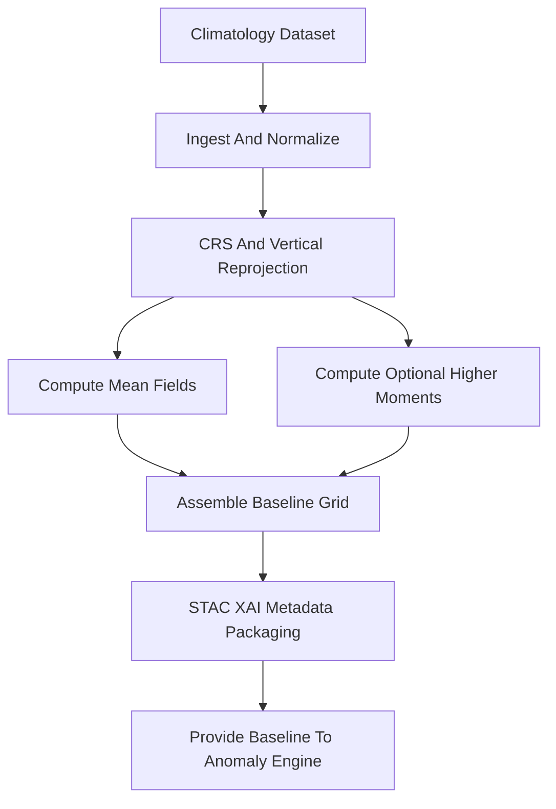

<div align="center">

# 🌡️📉📘 **Baseline Climatology Model**  
`docs/pipelines/ai/inference/climate/models/anomalies/anomaly-baseline.md`

**Purpose**  
Define the authoritative **baseline climatology model** used to compute climate anomalies  
(Δ = realtime − baseline).  
This baseline establishes long-term reference values for temperature, dewpoint, wind fields,  
precipitation metrics, and derived variables.  
Supports deterministic anomaly generation, hazard chains, XAI attribution, FAIR+CARE safeguards,  
and STAC-XAI compliant metadata.

</div>

---

## 📘 Overview

The baseline model provides **static or slow-moving climatological reference fields**, enabling:

- Temperature, dewpoint, wind, humidity anomaly computation  
- Multi-decadal distribution anchoring  
- Hazard driver centering (CAPE/CIN biases reduced)  
- Stability for statewide anomaly maps  
- Integration with anomaly-diff models  
- Consistent XAI explainability for deviations  
- Deterministic reproduction via seed-locked generation  

A valid baseline MUST include:

- Temporal window (e.g. **1991–2020 NOAA/NCEI normals**)  
- Spatial grid definition + CRS  
- Variables included  
- Distribution centers (means, medians, moments)  
- Metadata: provenance, lineage, CARE, license  
- STAC-XAI compliant asset declarations  

---

## 🗂 Variables Supported

- **Temperature** (t2m, t850, t700, etc.)  
- **Dewpoint** (td2m)  
- **Winds** (u10, v10, u-level, v-level)  
- **Humidity**  
- **Precipitation climatology**  
- **Surface pressure baseline**  
- **Soil moisture climatology** (optional)  

Each variable MUST declare units, CRS, vertical axis, and data source.

---

## 🧱 Data Sources

Baseline climatology may derive from:

- **NOAA NCEI 1991–2020 Climate Normals**  
- **PRISM** monthly/daily averages (800m)  
- **ERA5-Historical** long-term climatology  
- **Downscaled climatology** (U-Net or Transformer downscalers)  

All sources MUST include licensing and provenance blocks.

---

## 🧬 Baseline Model Architecture



---

## 🔍 Baseline Structure Requirements

The baseline MUST define:

### **Spatial Structure**
```
crs: "EPSG:4326"
grid:
  lat_res: 0.01
  lon_res: 0.01
vertical_axis:
  type: pressure
  units: hPa
```

### **Temporal Structure**
- Period: 1991–2020 (standard)  
- Optionally: rolling 30-year windows  
- Include `precision` and raw source metadata  

### **Statistical Structure**
For each variable:

```
mean
stddev
median
skew
kurtosis
```

### **Metadata**
- License  
- FAIR summary  
- CARE applicability  
- Provenance (source datasets + timestamps)  
- Checksums for reproducibility  

---

## 🎛 Outputs

The baseline MUST output:

- `baseline_grid.tif` (COG)  
- `baseline_metadata.json`  
- `baseline_summary.json`  
- Optional: `baseline_moments.json`  
- STAC Item for catalog integration  
- Distribution plots (if added to CI artifacts)

---

## 🧪 CI Requirements

CI MUST validate:

- Missing or malformed metadata → ❌ fail  
- CRS/vertical definitions present  
- Temporal windows valid  
- Deterministic baseline generation  
- STAC-XAI schema conformity  
- Baseline checksum stable  
- Units and attributes present for all variables  
- FAIR+CARE tags included  

CI failure → merge blocked.

---

## 🕰 Version History

| Version  | Date       | Notes                                              |
|----------|------------|----------------------------------------------------|
| v11.2.2  | 2025-11-28 | Initial baseline climatology model documentation.  |

---

<div align="center">

### 🔗 Footer  
[⬅ Back to Anomaly Models](../README.md) ·  
[🌡️ Climate Inference Root](../../README.md) ·  
[🏛 Governance](../../../../../standards/governance/ROOT-GOVERNANCE.md)

</div>

