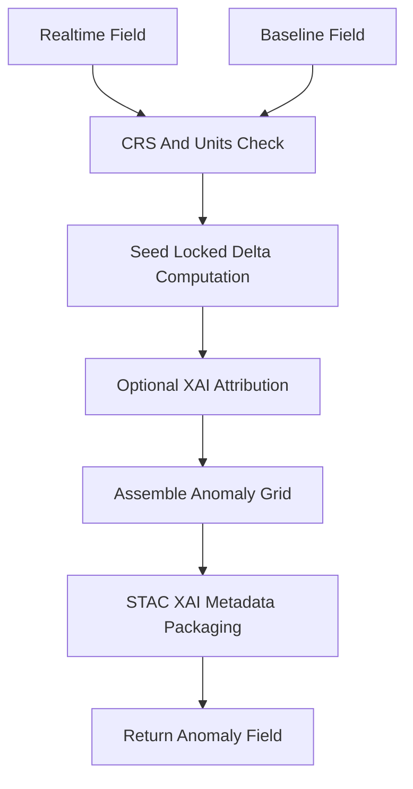

<div align="center">

# 🌡️📉🔍 **Anomaly Difference Model**  
`docs/pipelines/ai/inference/climate/models/anomalies/anomaly-diff-model.md`

**Purpose**  
Define the **difference model** that computes climate anomalies:  
**Δ = Realtime Field − Baseline Field**.  
This is the core anomaly computation used for statewide anomaly maps, hazard driver derivations,  
Story Node v3 climatic narratives, Focus Mode v3 overlays, and all downstream anomaly-aware logic.

</div>

---

## 📘 Overview

The anomaly-diff model produces **signed deviations** from a reference climatology baseline.  
It ensures:

- Deterministic, seed-locked Δ computation  
- Stable anomaly fields across pipeline refresh cycles  
- Support for multiple variable categories (temperature, dewpoint, wind, humidity, precipitation)  
- FAIR+CARE-compliant anomaly distribution  
- Consistent distribution across model-version upgrades  
- XAI-ready anomaly generation for explainability  
- Full PROV-O lineage & STAC-XAI compatibility  

---

## 🧩 Mathematical Definition (ASCII-Safe)

```
delta(x, y, t, v) = realtime(x, y, t, v) - baseline(x, y, v)
```

Where:

- `x, y` = horizontal grid location  
- `t` = timestamp  
- `v` = variable name  
- All fields MUST share CRS + vertical axis + units  

---

## 🗂 Supported Variables

- Temperature anomalies: `t2m`, `t850`, `t700`  
- Dewpoint anomalies: `td2m`  
- Wind anomalies: `u10`, `v10`, upper-level `u*`, `v*`  
- Humidity anomalies  
- Precipitation departure  
- Soil moisture deviation  
- Pressure deviation  

All variables MUST have matching units to baseline fields.

---

## 🧬 Anomaly-Diff Computation Pipeline



---

## 🔍 Input Requirements

### **Realtime Input**
- Source: Downscaled field, native NWP field, or merged HRRR/ERA5  
- CRS: EPSG:4326 or transformable  
- Vertical axis: Defined & compatible  
- Units: MUST match baseline exactly  
- Temporal metadata: ISO 8601  

### **Baseline Input**
- From anomaly-baseline model  
- Must include mean field + optional higher moments  
- Must be validated by CI for completeness  

---

## 📦 Output Structure

Outputs MUST include:

- `anomaly_grid.tif` (COG)  
- `anomaly_metadata.json`  
- `anomaly_summary.json`  
- STAC Item with anomaly metadata  
- Checksums (multihash)  
- FAIR+CARE changes  
- PROV-O lineage block  
- XAI attribution block (if enabled)

---

## 🛡️ CARE + Sovereignty Enforcement

Anomalies must:

- Apply H3 generalization for restricted regions  
- Remove sensitive variable anomalies where required  
- Clearly mark masking or degradation in metadata:  

```json
{
  "care": {
    "masking": "h3-generalized",
    "scope": "public-generalized"
  }
}
```

Failure to comply → CI reject.

---

## 🎛 CI Validation Requirements

CI MUST ensure:

- CRS/units matching  
- Deterministic Δ results  
- PROV-O lineage completeness  
- STAC-XAI block present  
- Baseline metadata valid  
- Seed-lock enforced  
- No missing keys  
- FAIR+CARE attached  

CI failure → ❌ merge blocked.

---

## 🕰 Version History

| Version  | Date       | Notes                                          |
|----------|------------|------------------------------------------------|
| v11.2.2  | 2025-11-28 | Initial anomaly-diff model documentation.       |

---

<div align="center">

### 🔗 Footer  
[⬅ Back to Anomaly Models](../README.md) ·  
[🌡️ Climate Inference Root](../../README.md) ·  
[🏛 Governance](../../../../../standards/governance/ROOT-GOVERNANCE.md)

</div>

