# 🌡️🛠️🤖 **Climate Bias-Correction Models — KFM v11.2.2**  
`docs/pipelines/ai/inference/climate/models/bias-correction/README.md`

**Purpose**  
Define, govern, and validate the models responsible for correcting systematic biases in climate fields for both realtime and batch Climate AI inference, ensuring reproducible, XAI-ready, provenance-rich outputs across the entire KFM pipeline.

---

## 📘 Overview

Bias-correction models adjust **systematic offsets, drifts, and distributional misalignments** between:

- Coarse climate reanalysis (ERA5, HRRR)  
- Downscaled surfaces  
- Observational truths (ASOS, Mesonet, PRISM, NCEI normals)  
- Historical climatology baselines  

These models:

- Reduce structural model error  
- Align distributions (mean, variance, skew, extremes)  
- Support downstream hazard-chain stability  
- Improve anomaly & driver reliability  
- Provide Story Node v3 climate consistency  
- Power Focus Mode v3 climate deviation narratives  
- Publish full STAC-XAI v11 metadata  
- Produce auditable PROV-O lineage  

Bias-correction methods MUST be:

- Deterministic (seed-locked)  
- FAIR+CARE aligned  
- Sovereignty-safe  
- XAI-compatible  
- STAC-XAI v11 compliant  
- CRS + vertical-axis explicit  

---

## 🗂️ Directory Layout (v11.2.2)

    docs/pipelines/ai/inference/climate/models/bias-correction/
        📄 README.md                  # This file
        📄 quantile-mapping.md        # Quantile mapping model card
        📄 regression-correction.md   # Regression & error-model correction
        📄 distribution-correction.md # Multi-moment distribution-based corrections

---

## 🧩 Bias-Correction Model Types

### 📊 Quantile Mapping  
- Corrects entire distribution  
- Robust extreme-value alignment  
- Preferred for precipitation & humidity  

### 📈 Regression-Based Error Model  
- Linear/nonlinear bias regression  
- Multi-variable correction  
- Good for temperature, wind, pressure  

### 🧮 Distribution Adjustment (Multi-Moment)  
- Aligns mean, variance, skewness  
- Stabilizes rare-event tails  
- Supports hazard-driver fidelity  

---

## 🧬 Bias-Correction Pipeline Flow

```mermaid
flowchart TD
    A[Input Field: Realtime or Downscaled] --> B[Bias-Correction Model]
    B --> C[Seed-Locked Correction]
    C --> D[XAI Explanation: SHAP · IG]
    D --> E[STAC-XAI Metadata Packaging]
    E --> F[Telemetry and PROV-O Lineage]
```

<!-- mermaid-end -->

---

## 🎛 Model Requirements

Each model card MUST define:

- Full correction method  
- Variables supported  
- Training datasets & license  
- Deterministic seed-lock parameters  
- CRS + vertical-axis metadata  
- Metrics: RMSE, MAE, bias, corr, distribution fit  
- Energy + carbon telemetry  
- XAI compatibility (SHAP, IG)  
- FAIR+CARE + sovereignty review  
- STAC-XAI asset metadata  
- PROV-O lineage block  

---

## 🧪 CI Validation Requirements

CI MUST check:

- Model-card schema correctness  
- Deterministic reproduction  
- FAIR+CARE + sovereignty compliance  
- XAI fields present  
- CRS + vertical-axis fields present  
- STAC-XAI v11 block  
- PROV-O lineage structure  
- Distributional metrics completeness  

CI failure → 🚫 merge blocked.

---

## 🕰 Version History

| Version | Date       | Notes                                           |
| ------- | ---------- | ----------------------------------------------- |
| v11.2.2 | 2025-11-28 | Initial bias-correction model documentation.    |

---

### 🔗 Footer

[⬅ Back to Climate Models](../README.md) ·  
[🌡️ Climate Pipeline Root](../../README.md) ·  
[🏛 Governance](../../../../../standards/governance/ROOT-GOVERNANCE.md)

