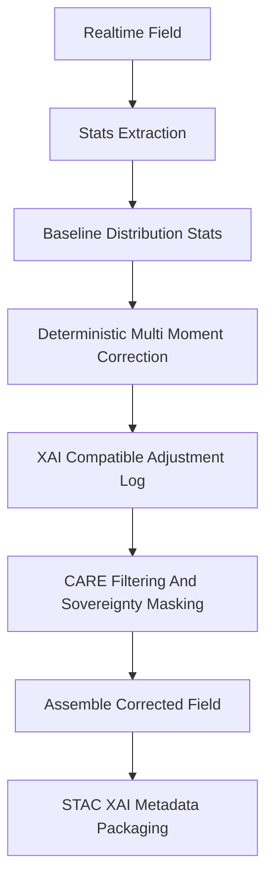

<div align="center">

# 📊🛠️🌡️ **Distribution-Based Bias Correction Model**  
`docs/pipelines/ai/inference/climate/models/bias-correction/distribution-correction.md`

**Purpose**  
Define the **multi-moment distribution-based bias correction model** used to align realtime or  
downscaled climate fields to observed statistical distributions.  
Corrects mean, variance, skew, kurtosis, and higher-order biases to stabilize hazard-chain models,  
ensure XAI interpretability, and deliver FAIR+CARE-compliant, provenance-rich outputs.

</div>

---

## 📘 Overview

Distribution-based correction adjusts **entire statistical moments** rather than only pointwise values.  
It is essential for:

- Stabilizing extreme-value tails (heat extremes, wind gust tendencies, humidity outliers)  
- Improving anomaly and driver accuracy (CAPE, CIN, SRH depend on variance-sensitive fields)  
- Matching climatological distributions (NOAA NCEI normals, PRISM climatology, ERA5-History)  
- Supporting statewide, tile-level, and streaming inference  
- Ensuring deterministic reproducibility and XAI consistency  
- Preparing STAC-XAI-compliant climatological metadata  

It differs from regression or quantile-mapping by directly manipulating **statistical structure**:

```
Corrected = (Realtime - μ_r) * (σ_o / σ_r) + μ_o
```

And optionally:

- Adjust skewness  
- Adjust kurtosis  
- Adjust percentile shape  
- Apply CARE filters to sensitive distributions  

---

## 🧬 Model Architecture



---

## 🧪 Supported Variables (Distribution-Sensitive)

- Temperature (`t2m`, `t850`, `t700`)  
- Dewpoint (`td2m`)  
- Wind (`u10`, `v10`, upper-level wind fields)  
- Relative humidity  
- Precipitation climatological tendency  
- Soil moisture (optional)  
- Surface pressure distributions  

Each variable must include baseline + realtime moments:

```
mean
stddev
variance
skew
kurtosis
percentile_curves (optional)
```

---

## 🧱 Input Requirements

### **Realtime Field**
- CRS: MUST match baseline  
- Vertical axis: explicit & compatible  
- Units: identical  
- Metadata: spatial extent, timestamp  

### **Baseline Distribution**
- Multi-moment stats (at least mean + stddev)  
- Source provenance  
- Time window (e.g., 1991–2020)  

### **Optional Reference Curves**
- Percentile metrics  
- Tail-shape curves  

---

## 🔍 Correction Formula (Expanded)

```
z = (realtime - mean_realtime) / std_realtime

corrected =
    z * std_obs
  + mean_obs
  + skew_adj
  + kurtosis_adj
  + tail_shape_adj(optional)
```

All steps MUST be deterministic under seed-lock.

---

## 🎛 Outputs

- `distribution_corrected_grid.tif` (COG)  
- `distribution_correction_metadata.json`  
- `distribution_correction_summary.json`  
- XAI correction log (moment adjustments, location sensitivities)  
- STAC Item with correction lineage  
- Provenance chain (`prov:used`, `prov:wasGeneratedBy`)  

---

## 🛡️ CARE & Sovereignty Logic

Distribution correction MUST:

- Mask sensitive spatial domains using H3 generalization  
- Avoid revealing protected local climate features  
- Include CARE scope tags in metadata  

Example:

```json
{
  "care": {
    "masking": "h3-generalized",
    "scope": "public-generalized",
    "notes": ["Distribution adjustments performed under sovereignty filters"]
  }
}
```

---

## 🧪 CI Validation Requirements

CI MUST check:

- All moments available for selected variable  
- CRS + vertical consistency  
- Baseline & realtime units identical  
- Deterministic results under fixed seeds  
- Correct field-level metadata  
- Required STAC-XAI metadata blocks  
- PROV lineage validity  
- Integrity of distribution correction logs  

---

## 🕰 Version History

| Version  | Date       | Notes                                                          |
|----------|------------|----------------------------------------------------------------|
| v11.2.2  | 2025-11-28 | Initial distribution-based bias-correction model documentation |

---

<div align="center">

### 🔗 Footer  
[⬅ Back to Bias Correction Models](../README.md) ·  
[🌡️ Climate Inference Root](../../README.md) ·  
[🏛 Governance](../../../../../standards/governance/ROOT-GOVERNANCE.md)

</div>

