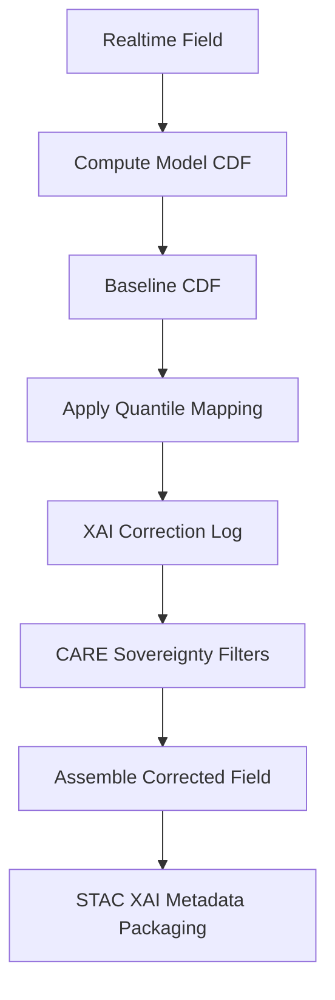

<div align="center">

# 📈📊🌡️ **Quantile Mapping Bias Correction Model**  
`docs/pipelines/ai/inference/climate/models/bias-correction/quantile-mapping.md`

**Purpose**  
Define the **quantile mapping (QM) bias correction model** used to align realtime or downscaled  
climate variables with reference climatological distributions.  
Corrects entire cumulative distribution functions (CDFs), preserves extremes, and stabilizes  
hazard-sensitive variables for AI inference, anomaly generation, and statewide climate analysis.

</div>

---

## 📘 Overview

Quantile mapping (QM) is a **distribution-level correction technique**:

- Adjusts full CDF of a variable  
- Corrects mean, variance, higher-order structure implicitly  
- Preserves distribution shape while removing bias  
- Handles nonlinear distortions  
- Excellent for **precipitation**, **humidity**, and **dewpoint**  
- Performs well in **extremes** (upper/lower tails)  
- Robust for multi-decade climate baselines  

The method uses:

```
corrected = F_obs^{-1}( F_model(x) )
```

Where:

- `F_model` = empirical CDF of model/realtime data  
- `F_obs` = empirical CDF of observations  
- `F_obs^{-1}` = quantile function of observed distribution  

---

## 🧬 Model Architecture



---

## 🗂 Supported Variables

Ideal for variables with **non-Gaussian** distributions:

- Precipitation  
- Dewpoint  
- Relative humidity  
- Soil moisture  
- Temperature extremes  
- Wind gust fields  
- CAPE/CIN preconditioning variables  

Not ideal for:  
- Variables with strict deterministic relationships (e.g., geostrophic wind)  
- Categorical/weather-type variables

---

## 🧱 Inputs Required

### **Realtime Field**
- Temporal metadata  
- CRS: MUST match baseline  
- Vertical axis defined  
- Units consistent  
- Grid resolution stable  

### **Baseline CDF**
- Derived from standardized climatology (e.g., NOAA NCEI, PRISM, ERA5-Historical)  
- Must include:  
  - Sorted sample arrays  
  - Quantile table  
  - Probability mapping LUT  
  - Metadata: license, provenance, CARE tags  

### **Optional Enhancements**
- Tail inflation/deflation  
- Percentile bounding  
- Seasonal quantile tuning (monthly, DOY windows)

---

## 🔍 Correction Formula (ASCII-safe)

```
p = F_model(x)
corrected = F_obs_inverse(p)
```

Where:

- `p` ∈ [0, 1]  
- All CDFs must be monotonic and validated  

---

## 📦 Outputs

Artifacts MUST include:

- `qm_corrected_grid.tif` (COG)  
- `qm_metadata.json`  
- `qm_summary.json`  
- XAI correction log (CDF adjustments)  
- STAC Item with quantile mapping metadata  
- Checksum (multihash)  
- PROV lineage block  

---

## 🛡️ CARE + Sovereignty Constraints

QM MUST:

- Apply H3 masking to sensitive areas  
- Avoid revealing hidden climatological patterns in protected zones  
- Include explicit CARE metadata:

```json
{
  "care": {
    "masking": "h3-generalized",
    "scope": "public-generalized"
  }
}
```

---

## 🧪 CI Validation Requirements

CI MUST check:

- Monotonic CDF arrays  
- No missing quantiles  
- CRS/vertical consistency  
- Deterministic LUT application  
- FAIR+CARE metadata present  
- STAC-XAI fields correct  
- Provenance chain complete  
- Seed-lock stability  

CI failure → ❌ merge blocked.

---

## 🕰 Version History

| Version  | Date       | Notes                                                     |
|----------|------------|-----------------------------------------------------------|
| v11.2.2  | 2025-11-28 | Initial quantile-mapping model documentation.             |

---

<div align="center">

### 🔗 Footer  
[⬅ Back to Bias Correction Models](../README.md) ·  
[🌡️ Climate Inference Root](../../README.md) ·  
[🏛 Governance](../../../../../standards/governance/ROOT-GOVERNANCE.md)

</div>

