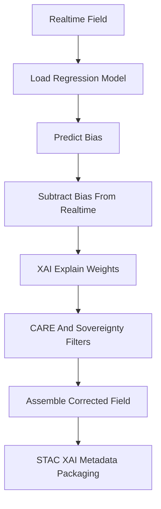

<div align="center">

# 📉📐🌡️ **Regression-Based Bias Correction Model**  
`docs/pipelines/ai/inference/climate/models/bias-correction/regression-correction.md`

**Purpose**  
Define the **regression-based climate bias correction model** used to remove systematic offsets  
and structural error in climate fields prior to anomaly generation, downscaling, and hazard driver computation.  
Supports linear, nonlinear, and multivariate regressors with deterministic, reproducible outputs.

</div>

---

## 📘 Overview

Regression bias correction is a **relationship-based adjustment** technique that models bias as a  
function of one or more predictor variables. Useful for:

- Temperature drift removal  
- Dewpoint nonlinear error  
- Wind component structural biases  
- Predictor-driven corrections (paired variables like u10/v10)  
- Simple and robust behavior for realtime inference  
- Compatible with XAI (weights/coefficients explainability)  
- Integrates seamlessly with anomaly and hazard-driver pipelines  

Compared to quantile mapping or distribution correction, regression is best for correcting  
**systematic and smooth spatial patterns**.

---

## 🧩 Regression Models Supported

- **Univariate linear regression**  
- **Polynomial regression**  
- **Piecewise regression**  
- **Multivariate linear regression** (e.g., correcting t2m using t2m + td2m + u10 + v10)  
- **Generalized additive models** (optional)  
- **Deterministic regressors** only  

All regressors MUST include:

- Coefficients  
- Intercept  
- Variables used  
- Units  
- CRS/vertical axis compatibility  
- Seed-lock configuration  

---

## 🧬 Regression Correction Pipeline



---

## 🔍 Input Requirements

### **Realtime Field**
- Units match correction model  
- Full metadata attached (CRS, time, vertical axis, bbox)  
- Complete variable set if multivariate regression is used  

### **Regression Model**
- MUST include deterministic coefficients  
- MUST specify training dataset + licensing  
- MUST include baseline period if seasonal regression used  
- SHOULD include residuals summary  

---

## 📦 Formula

For univariate linear regression:

```
bias = a * x + b
corrected = x - bias
```

For multivariate:

```
bias = a1*x1 + a2*x2 + ... + an*xn + b
corrected = x_target - bias
```

All regressors MUST be deterministic + seeded.

---

## 🎛 Outputs

- `regression_corrected_grid.tif` (COG)  
- `regression_correction_metadata.json`  
- `regression_weights.json` (for XAI)  
- STAC Item metadata  
- PROV lineage block  
- CARE masking if required  
- XAI attribution summary  

---

## 🛡️ CARE + Sovereignty Enforcement

Regression outputs MUST respect:

- Indigenous sovereignty boundaries  
- Spatial generalization for sensitive zones  
- Variable-level access restrictions  
- CARE scoping annotations in all metadata:

```json
{
  "care": {
    "masking": "h3-generalized",
    "scope": "public-generalized"
  }
}
```

---

## 🧪 CI Validation Requirements

CI MUST verify:

- Deterministic coefficient values  
- Regression model contains no prohibited randomness  
- CRS + vertical axis values match realtime field  
- Required metadata fields exist  
- XAI weights explain graph (feature coefficients) present  
- Distribution of residuals validated  
- PROV lineage included  
- STAC-XAI metadata valid  

CI failure → ❌ merge blocked.

---

## 🕰 Version History

| Version  | Date       | Notes                                                        |
|----------|------------|--------------------------------------------------------------|
| v11.2.2  | 2025-11-28 | Initial regression-based bias correction model documentation |

---

<div align="center">

### 🔗 Footer  
[⬅ Back to Bias Correction Models](../README.md) ·  
[🌡️ Climate Inference Root](../../README.md) ·  
[🏛 Governance](../../../../../standards/governance/ROOT-GOVERNANCE.md)

</div>

