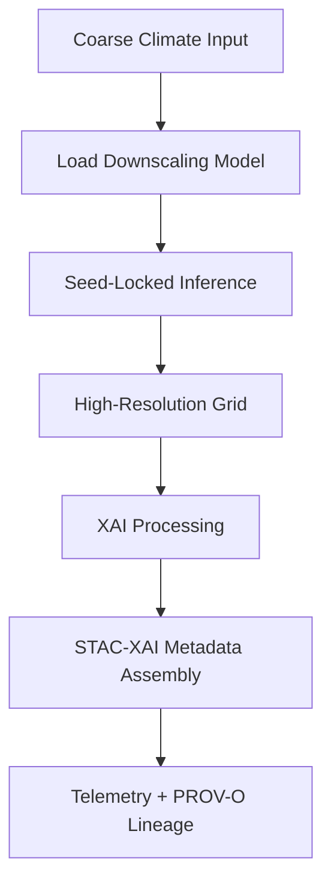

# 🌡️⬇️🤖 **Climate Downscaling Models — KFM v11.2.2**  
`docs/pipelines/ai/inference/climate/models/downscaling/README.md`

**Purpose**  
Define, govern, and validate the downscaling models supporting **Climate AI inference**, producing **high-resolution climate surfaces** integrated across the KFM pipeline, Story Node v3, and Focus Mode v3.

---

## 📘 Overview

Downscaling models transform **coarse atmospheric or land-surface grids** into **fine-scale surfaces** used for statewide realtime and batch inference.

Used in:

- Realtime map tile generation  
- Batch statewide reanalysis  
- Derived hazard drivers (CAPE, CIN, SRH, LLJ)  
- Climate/meteorology-linked Story Nodes  
- Focus Mode v3 dynamic narratives  
- FAIR+CARE-compliant climate provenance  
- STAC-XAI v11 catalog publishing  

All models MUST be:

- 🔒 **Deterministic** (strict seed-lock)  
- 🧠 **XAI-ready** (SHAP, IG, CAM)  
- 🌍 **CRS + vertical axis explicit**  
- 🪶 **Lightweight + reproducible**  
- 📦 **STAC v11 + DCAT v11 compliant**  
- ⚖️ **FAIR+CARE + sovereignty aligned**  

---

## 🗂️ Directory Layout (v11.2.2)

*(Indented block is fully safe — no box break, no parser break)*

    docs/pipelines/ai/inference/climate/models/downscaling/
        📄 README.md                    # This file
        📄 unet-downscaler.md           # U-Net model card
        📄 transformer-downscaler.md    # Transformer model card

---

## 🧩 Model Types

### 🧱 U-Net Downscaler  
- Encoder/decoder  
- Strong spatial fidelity  
- Good for temperature, RH, soil moisture  
- CAM + IG support  
- Seed-locked determinism  

### 🔮 Transformer Downscaler  
- Temporal/context-aware  
- Multivariate downscaling  
- SHAP + IG compatible  
- Stable non-autoregressive tile inference  

---

## 🧬 Downscaling Pipeline Flow

<!-- mermaid-end -->

---

## 🎛 Model Requirements

Cards MUST specify:

- Architecture + hyperparameters  
- Variables (input + output)  
- Preprocessing + normalization  
- Seed-lock parameters  
- CRS (horizontal + vertical)  
- Training datasets + licensing  
- Metrics: RMSE, MAE, bias, corr  
- XAI compatibility (SHAP/IG/CAM)  
- Energy (Wh) + Carbon (gCO₂e) telemetry  
- FAIR+CARE + sovereignty assessment  
- STAC-XAI data asset description  
- Deterministic inference test vector  

---

## 🧪 CI Validation

CI MUST enforce:

- Schema correctness (model card JSON schema)  
- Deterministic reproduction via test vector  
- FAIR+CARE compliance  
- Sovereignty constraints  
- XAI integration fields  
- CRS + vertical metadata  
- STAC-XAI metadata blocks  
- PROV-O lineage  

CI failure → 🚫 merge blocked.

---

## 🕰 Version History

| Version | Date       | Notes                                              |
| ------- | ---------- | -------------------------------------------------- |
| v11.2.2 | 2025-11-28 | Initial release of downscaling model documentation |

---

### 🔗 Footer

[⬅ Back to Climate Models](../README.md) ·  
[🌡️ Climate Pipeline Root](../../README.md) ·  
[🏛 Governance](../../../../../standards/governance/ROOT-GOVERNANCE.md)

