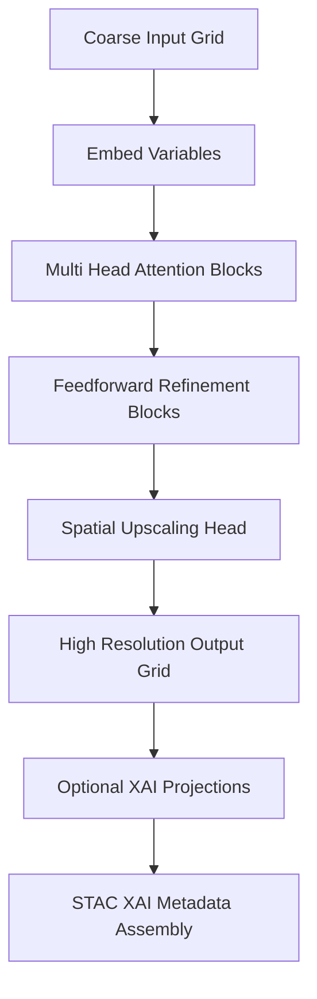

<div align="center">

# 🔮⬇️🌡️ **Transformer Downscaler Model**  
`docs/pipelines/ai/inference/climate/models/downscaling/transformer-downscaler.md`

**Purpose**  
Define the **Transformer-based climate downscaling model** used to produce  
high-resolution climate fields from coarse-resolution inputs.  
Supports multivariate conditioning, sequence-aware temporal embeddings, XAI interpretability,  
hazard-driver consistency, and deterministic reproducibility with full FAIR+CARE metadata.

</div>

---

## 📘 Overview

The transformer downscaler provides **context-rich**, **nonlocal**, **multivariate** refinement of coarse  
climate grids.

Capabilities include:

- Multivariate conditioning (temp, dewpoint, wind, humidity, pressure)  
- Long-range spatial dependencies  
- Optional temporal embedding (previous frames)  
- Stable generalization for regional extremes  
- Reproducible inference under strict seed-lock  
- Explainability support (SHAP, IG)  
- Integration with hazard-driver pipelines (CAPE/CIN/SRH/LLJ)  
- STAC-XAI compliant metadata  

Downscaled outputs must feed seamlessly into anomaly, bias-correction, and driver models.

---

## 🧬 Architecture Overview



---

## 🧱 Model Components

### **1. Embedding Layer**
- Per-variable linear projections  
- Positional encodings (2D or learned)  
- Optional temporal token embeddings  

### **2. Attention Layers**
- Multi-head self-attention  
- Cross-variable attention  
- Regional attention windows (optional)  

### **3. Feedforward Blocks**
- Residual structure  
- Layer normalization  
- GELU activation (preferred)  

### **4. Upscaling Head**
- Pixel shuffle  
- Learned interpolation  
- Local convolution refinement  

Outputs MUST match:

```
target_resolution
target_crs
target_vertical_axis
```

---

## 🧪 Input Requirements

### **Coarse Input**
- Source: ERA5, HRRR, NLDAS, NCEP, or downscaled pre-model  
- CRS: Any transformable to EPSG:4326  
- Units: MUST match fine-resolution targets  
- Variables: Declared in metadata  

### **Training Data**
- Clean multi-year paired datasets  
- Downscaled high-resolution truth (e.g., HRRR → 1 km)  
- Licensing and provenance required  

---

## 📦 Output Specification

Model MUST output:

- `downscaled_grid.tif` (COG)  
- `downscaler_metadata.json`  
- `downscaler_summary.json`  
- STAC Item with XAI & lineage metadata  
- Multihash checksums  
- XAI feature attribution maps (optional)

---

## 🛡️ CARE & Sovereignty Enforcement

Transformer downscalers MUST:

- Apply H3-based generalization over protected areas  
- Remove sensitive high-resolution gradients when restricted  
- Include CARE metadata in outputs:

```json
{
  "care": {
    "masking": "h3-generalized",
    "scope": "public-generalized",
    "notes": ["High resolution downscaling masked in protected zones"]
  }
}
```

---

## 🎛 XAI Integration

Transformer attention maps support:

- SHAP  
- Integrated Gradients  
- Attention rollout  
- CAM-like maps for spatial interpretation  

XAI logs MUST include:

- Input variable contributions  
- Attention-weight summaries  
- Deterministic seeds  
- Model version metadata  

---

## 🧪 CI Validation Requirements

CI MUST validate:

- CRS/units consistency  
- Deterministic inference  
- STAC-XAI blocks present  
- PROV lineage correct  
- XAI metadata complete  
- No missing variables  
- No unseeded randomness in model head  
- CARE filters applied  

Failure → ❌ merge blocked.

---

## 🕰 Version History

| Version  | Date       | Notes                                             |
|----------|------------|---------------------------------------------------|
| v11.2.2  | 2025-11-28 | Initial transformer downscaler model documentation |

---

<div align="center">

### 🔗 Footer  
[⬅ Back to Downscaling Models](../README.md) ·  
[🌡️ Climate Pipeline Root](../../README.md) ·  
[🏛 Governance](../../../../../standards/governance/ROOT-GOVERNANCE.md)

</div>

