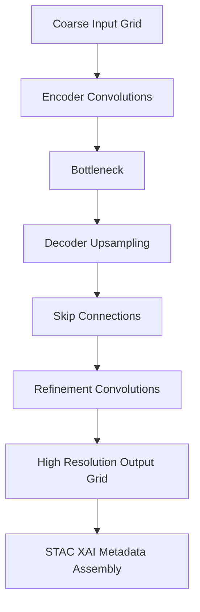

<div align="center">

# 🧱⬇️🌡️ **U-Net Downscaler Model**  
`docs/pipelines/ai/inference/climate/models/downscaling/unet-downscaler.md`

**Purpose**  
Define the **U-Net–based deterministic downscaling model** for generating  
high-resolution climate fields (temperature, dewpoint, wind, humidity, pressure, and more)  
from coarse-resolution reanalysis or NWP inputs.  
Optimized for spatial fidelity, hazard-driver stability, and XAI interpretability.

</div>

---

## 📘 Overview

The U-Net downscaler is a **convolutional encoder–decoder** architecture specialized for:

- High-resolution grid refinement  
- Sharp spatial gradients (fronts, drylines, moisture boundaries)  
- Multivariate channel inputs  
- Local spatial consistency & feature extraction  
- Robust performance for temperature, RH, soil moisture, and surface wind  
- Deterministic inference (strict seed-lock)  
- XAI compatibility (CAM, IG)  
- Full STAC-XAI + FAIR+CARE + PROV-O metadata integration  

It complements the Transformer downscaler by providing **local-detail accuracy**.

---

## 🧬 Architecture Diagram



---

## 🧱 Model Components

### **1. Encoder**
- 2–6 convolutional blocks  
- Downsampling via strided conv or pooling  
- Feature channels: 16 → 32 → 64 → 128 → ...  
- Captures multi-scale patterns  

### **2. Bottleneck**
- Dense convolution blocks  
- Optional attention modules  

### **3. Decoder**
- Transposed convolutions, pixel shuffle, or bilinear upsampling  
- Skip connections to restore detail  

### **4. Refinement Head**
- Final convolution stack  
- Outputs high-resolution grid with target variable set  

---

## 🧪 Input Requirements

The U-Net downscaler requires:

- **Coarse climate inputs**  
  - ERA5, HRRR, NCEP, or NLDAS  
  - Variables: temp, dewpoint, wind, humidity, pressure  
  - CRS: transformable to EPSG:4326  
  - Units: MUST match output  

- **Training dataset**
  - Paired low-res → high-res samples  
  - Horizon: multi-year  
  - Licenses and provenance MUST be declared  

---

## 📦 Output Specification

Downscaled outputs MUST include:

- `unet_downscaled_grid.tif` (COG)  
- `unet_downscaled_metadata.json`  
- `unet_downscaled_summary.json`  
- XAI maps (CAM/IG) optional  
- STAC Item with lineage + checksum  
- Mandatory deterministic seed-lock metadata  

---

## 🛡️ CARE & Sovereignty Enforcement

U-Net downscalers MUST apply:

- H3 masking in protected regions  
- Downsampling or smoothing of sensitive gradients  
- Explicit CARE block in metadata:

```json
{
  "care": {
    "masking": "h3-generalized",
    "scope": "public-generalized",
    "notes": ["High resolution detail masked in sovereignty-protected domains"]
  }
}
```

---

## 🎛 XAI Integration

Supported interpretability modes:

- **Class Activation Maps (CAM)**  
- **Integrated Gradients (IG)**  
- **Feature-sensitivity maps**  

XAI metadata MUST include:

- Seed  
- Model version  
- Variable importances  
- Tile- or grid-level attribution  

---

## 🧪 CI Validation Requirements

CI MUST ensure:

- No unseeded randomness (deterministic inference)  
- CRS + units alignment  
- XAI maps included if enabled  
- STAC-XAI block valid  
- PROV lineage correct  
- Model-card metadata complete  
- Inputs/outputs reproducible  
- CARE masking validated  

Failure → ❌ merge blocked.

---

## 🕰 Version History

| Version  | Date       | Notes                                           |
|----------|------------|------------------------------------------------|
| v11.2.2  | 2025-11-28 | Initial U-Net downscaler model documentation. |

---

<div align="center">

### 🔗 Footer  
[⬅ Back to Downscaling Models](../README.md) ·  
[🌡️ Climate Pipeline Root](../../README.md) ·  
[🏛 Governance](../../../../../standards/governance/ROOT-GOVERNANCE.md)

</div>

