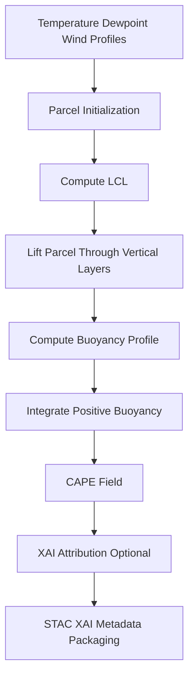

<div align="center">

# ⚡🌡️🧭 **CAPE Driver Model**  
`docs/pipelines/ai/inference/climate/models/drivers/cape-driver.md`

**Purpose**  
Define the **CAPE (Convective Available Potential Energy)** driver model used for realtime and  
batch hazard analyses.  
CAPE quantifies atmospheric instability and is a critical upstream ingredient for severe weather  
prediction, hazard-chain modeling (hail, tornado, downburst), and Story Node v3 / Focus Mode v3  
meteorological narratives.  
Model is deterministic, XAI-ready, FAIR+CARE compliant, and STAC-XAI compatible.

</div>

---

## 📘 Overview

CAPE is computed from buoyant energy integrated over a lifted parcel’s vertical trajectory.  
CAPE driver outputs provide:

- Quantification of **instability magnitude and depth**  
- Inputs for **CIN**, **LFC**, **EL**, **hazard probability chains**  
- High-resolution hazard readiness fields when paired with downscalers  
- Deterministic and reproducible parcel-theory calculations  
- XAI interpretability for instability sources  
- FAIR+CARE and sovereignty-safe hazard projections  

Used by:  
- Downscaling pipelines  
- Realtime severe weather hazard engines  
- Story Node v3 climate context generators  
- Focus Mode dynamic overlays

---

## 🧩 Physical Definition (ASCII-safe)

```
CAPE = ∫ g * ( (T_parcel - T_environment) / T_environment ) dz
      for all positive buoyancy layers
```

Where:

- `g` = gravitational acceleration  
- `T_parcel` = temperature of lifted parcel  
- `T_environment` = environmental temperature  
- Integration performed over layers where buoyancy > 0  

---

## 🧬 CAPE Driver Pipeline



---

## 🧱 Inputs Required

### **Thermodynamic Inputs**
- Temperature profile  
- Dewpoint profile  
- Pressure profile  
- Mixing ratio  
- Optional soil moisture corrections  

### **Wind Inputs (optional for derived instability packs)**
- u- and v-winds  
- Wind shear may condition CAPE-based hazard components  

### **Metadata Requirements**
- CRS (`EPSG:4326`)  
- Vertical axis (`pressure`, `height_agl`, or `model_level`)  
- Units explicitly declared  

### **Temporal Metadata**
- ISO 8601 timestamp  
- Model run time (if NWP-based)  

---

## 📦 Outputs

The CAPE driver MUST produce:

- `cape_grid.tif` (COG)  
- `cape_metadata.json`  
- `cape_summary.json`  
- STAC Item for CAPE driver  
- Checksum (multihash)  
- Optional XAI attribution maps  
- PROV lineage block  

---

## 🔍 XAI Integration

CAPE XAI provides insight on:

- Layer contributions to buoyancy  
- Most influential vertical layers  
- Parcel-path attribution  
- Sensitivity of CAPE to temperature and dewpoint perturbations  

XAI outputs MUST include:

- Feature contributions (temp, dewpoint, pressure by layer)  
- Seed-lock metadata  
- Model version  
- CARE classification tags  

---

## 🛡️ CARE + Sovereignty Enforcement

CAPE outputs MUST:

- Apply H3-based masking for protected regions  
- Avoid releasing hyperlocal hot-spot instability patterns where restricted  
- Attach CARE metadata:

```json
{
  "care": {
    "masking": "h3-generalized",
    "scope": "public-generalized",
    "notes": ["Instability values generalized in sovereignty-protected regions"]
  }
}
```

---

## 🧮 Deterministic Integration Rules

- Integrals MUST be performed via seed-locked deterministic routines  
- No stochastic parcel initialization  
- No random perturbation ensembles  
- Deterministic floating-point order enforced  

---

## 🧪 CI Validation Requirements

CI MUST validate:

- CRS + vertical axis correctness  
- Units consistent across variables  
- No unseeded randomness in buoyancy computation  
- XAI attribution available where enabled  
- Complete PROV lineage  
- STAC-XAI schema compliance  
- Deterministic CAPE fields over repeated inference  
- CARE masking logic triggered appropriately  

Failure → ❌ merge blocked.

---

## 🕰 Version History

| Version  | Date       | Notes                                   |
|----------|------------|-----------------------------------------|
| v11.2.2  | 2025-11-28 | Initial CAPE driver model documentation |

---

<div align="center">

### 🔗 Footer  
[⬅ Back to Driver Models](../README.md) ·  
[🌡️ Climate Inference Root](../../README.md) ·  
[🏛 Governance](../../../../../standards/governance/ROOT-GOVERNANCE.md)

</div>

