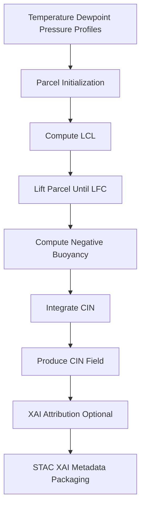

<div align="center">

# 🧲🌡️📉 **CIN Driver Model**  
`docs/pipelines/ai/inference/climate/models/drivers/cin-driver.md`

**Purpose**  
Define the **CIN (Convective Inhibition)** driver model that quantifies suppressive energy  
required to lift a parcel to its LFC (Level of Free Convection).  
CIN represents resistance to convection and plays a crucial role in severe weather forecasting,  
hazard-chain modeling, and Focus Mode v3 atmospheric narratives.

</div>

---

## 📘 Overview

CIN measures **negative buoyant energy** preventing surface parcels from freely rising.  
Its magnitude influences:

- Thunderstorm initiation timing  
- Dryline/capping strength  
- Tornado and large hail potential  
- Hazard-chain model branching (CAPE–CIN interaction)  
- Realtime and batch regional severe-weather risk maps  
- Story Node v3 meteorological context  

Properties:

- Deterministic parcel-theory calculation  
- XAI-ready (layer-by-layer suppression attribution)  
- FAIR+CARE-compliant  
- STAC-XAI compatible  

---

## 🧩 Physical Definition (ASCII-safe)

```
CIN = ∫ g * ( (T_parcel - T_environment) / T_environment ) dz
      where buoyancy < 0 before LFC
```

Where:

- `g` = gravitational acceleration  
- `T_parcel` = lifted parcel temperature  
- `T_environment` = environmental temperature  
- Integration over **negative buoyancy** layers until LFC  

---

## 🧬 CIN Driver Pipeline



---

## 🧱 Inputs Required

### **Thermodynamic Inputs**
- Temperature profile  
- Dewpoint profile  
- Pressure profile  
- Mixing ratio  
- Soil moisture (optional, for parcel source correction)  

### **Metadata**
- CRS: `EPSG:4326`  
- Vertical axis: `pressure`, `height_agl`, or model-level index  
- Units explicitly declared  
- ISO 8601 timestamp  

### **Optional Wind Conditioning**
CIN can be included in instability packs with shear and LLJ layers.

---

## 📦 Outputs

The CIN driver MUST output:

- `cin_grid.tif` (COG)  
- `cin_metadata.json`  
- `cin_summary.json`  
- STAC Item (CIN driver asset)  
- Checksum (multihash)  
- Optional XAI attribution grids  
- PROV lineage block  

---

## 🔍 XAI Integration

CIN XAI reveals:

- Suppression layers in the vertical profile  
- Sensitivity to dewpoint depressions  
- Inversion strength attribution  
- Pressure-layer contributions  
- Parcel-path explainability  

Must include:

- Seed-lock metadata  
- Model version  
- CARE scope  
- Layer-by-layer attribution arrays  

---

## 🛡️ CARE + Sovereignty Enforcement

CIN outputs MUST:

- Apply H3-based spatial masking for protected regions  
- Avoid conveying hyperlocal suppression gradients in sovereignty zones  
- Attach CARE block:

```json
{
  "care": {
    "masking": "h3-generalized",
    "scope": "public-generalized",
    "notes": ["CIN values generalized within sovereignty-limited domains"]
  }
}
```

---

## 🧮 Deterministic Integration Rules

- No stochastic parcel initialization allowed  
- No perturbation sampling  
- Floating-point summation order fixed  
- Strict reproducibility across runs  

---

## 🧪 CI Validation Requirements

CI MUST ensure:

- CRS + vertical axis consistency  
- Units validity  
- Seed-lock enforced  
- XAI metadata complete  
- STAC-XAI metadata correct  
- Complete PROV lineage  
- Correct enforcement of CARE masking  
- Deterministic integration over negative buoyancy layers  

Failure → ❌ merge blocked.

---

## 🕰 Version History

| Version  | Date       | Notes                                  |
|----------|------------|----------------------------------------|
| v11.2.2  | 2025-11-28 | Initial CIN driver model documentation |

---

<div align="center">

### 🔗 Footer  
[⬅ Back to Driver Models](../README.md) ·  
[🌡️ Climate Inference Root](../../README.md) ·  
[🏛 Governance](../../../../../standards/governance/ROOT-GOVERNANCE.md)

</div>

