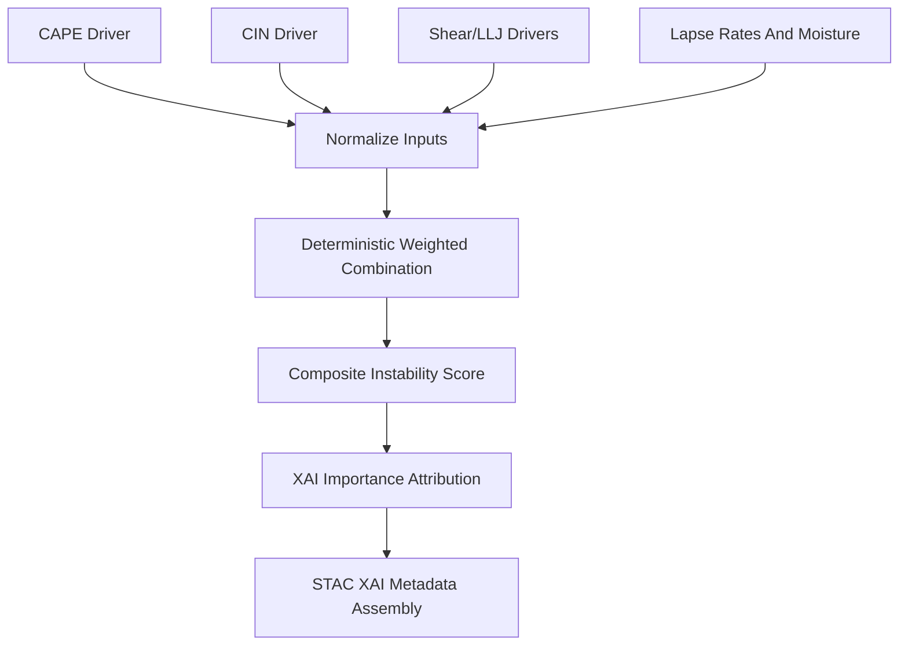

<div align="center">

# 🌪️📦⚡ **Instability Pack — Composite Hazard Driver**  
`docs/pipelines/ai/inference/climate/models/drivers/instability-pack.md`

**Purpose**  
Define the **Instability Pack** — a composite hazard-driver model combining CAPE, CIN, shear,  
low-level jet (LLJ), lapse rates, and other severe-weather ingredients into a unified signal.  
This pack powers hazard probability chains, downstream severe-weather models, and Story Node v3  
meteorological narratives.  
All computations MUST be deterministic, XAI-compatible, and FAIR+CARE-governed.

</div>

---

## 📘 Overview

The Instability Pack blends multiple atmospheric instability drivers into a coherent, interpretable  
representation of severe-weather potential.

Primary components:

- **CAPE** (positive buoyant energy)  
- **CIN** (inhibiting energy)  
- **Shear** (0–1 km, 0–3 km, bulk, deep-layer)  
- **Low-Level Jet (LLJ)**  
- **Lapse rates** (surface–3 km, 700–500 mb)  
- **Moisture transport vectors**  
- **Dewpoint depression fields**  
- **Lift indicators** (optional)  

Uses seed-locked deterministic algebraic combination and scaled normalization.

---

## 🧩 Instability Pack Pipeline



---

## 🧬 Normalization & Fusion

Each driver is normalized to prevent dominance:

```
cape_norm = CAPE / cape_scale
cin_norm  = CIN / cin_scale      (note CIN negative → normalization preserves sign)
shear_norm = shear / shear_scale
llj_norm   = llj / llj_scale
lr_norm    = lapse_rate / lr_scale
```

Composite score:

```
instability = w1*cape_norm + w2*(-cin_norm) + w3*shear_norm
            + w4*llj_norm + w5*lr_norm + w6*moisture_norm
```

Where:

- `w1...w6` are deterministic weights  
- All components MUST include metadata with units, CRS, vertical axes  

---

## 🧱 Inputs Required

### **Core Drivers**
- CAPE  
- CIN  
- Shear  
- LLJ  
- Lapse rates  

### **Secondary Drivers (Optional)**
- Moisture flux convergence  
- Dewpoint depressions  
- Surface lift indices  

### **Metadata**
- CRS: `EPSG:4326`  
- Vertical axis explicitly defined  
- Units included for all drivers  
- ISO 8601 timestamps  

### **Seed-Lock**
- Required for deterministic composite generation  
- Ensures reproducibility across refresh cycles  

---

## 📦 Outputs

The Instability Pack MUST produce:

- `instability_grid.tif`  
- `instability_metadata.json`  
- `instability_summary.json`  
- XAI attribution map  
- STAC Item for composite instability  
- Checksums (multihash)  
- Full PROV lineage block  

---

## 🔍 XAI Integration

XAI MUST provide:

- Contributions of CAPE, CIN, shear, LLJ, lapse rates  
- Sensitivity to changes in humidity or moisture transport  
- Explanation weights (w1–w6)  
- Temporal narrative (driver evolution)  

XAI metadata MUST include:

- Deterministic seeds  
- Model version  
- CARE scope  

---

## 🛡️ CARE + Sovereignty Enforcement

Composite instability MUST:

- Mask protected spatial regions  
- Smooth hyperlocal hot spots in sovereignty-limited domains  
- Attach explicit CARE metadata:

```json
{
  "care": {
    "masking": "h3-generalized",
    "scope": "public-generalized",
    "notes": ["Composite instability generalized within protected regions"]
  }
}
```

---

## 🧪 CI Validation Requirements

CI MUST check:

- Deterministic combination rules  
- Presence + validity of all base driver metadata  
- CRS + units consistency  
- STAC-XAI compliance  
- PROV-O lineage completeness  
- Proper CARE masking  
- Missing-field detection  

Failure → ❌ merge blocked.

---

## 🕰 Version History

| Version  | Date       | Notes                                                  |
|----------|------------|--------------------------------------------------------|
| v11.2.2  | 2025-11-28 | Initial instability pack hazard driver documentation   |

---

<div align="center">

### 🔗 Footer  
[⬅ Back to Driver Models](../README.md) ·  
[🌡️ Climate Inference Root](../../README.md) ·  
[🏛 Governance](../../../../../standards/governance/ROOT-GOVERNANCE.md)

</div>

