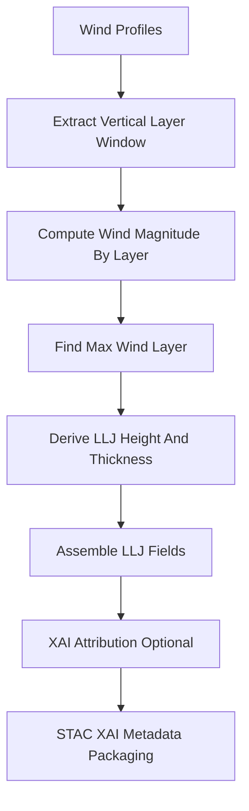

<div align="center">

# 🛫🌬️📈 **Low-Level Jet (LLJ) Driver Model**  
`docs/pipelines/ai/inference/climate/models/drivers/llj-driver.md`

**Purpose**  
Define the **Low-Level Jet (LLJ) driver model**, which computes the presence, strength, height,  
and structure of nocturnal jets and low-level wind maxima.  
LLJ fields support severe-weather hazard pipelines, moisture transport diagnostics, wind energy  
applications, and Story Node v3 / Focus Mode v3 meteorological narratives.  
All LLJ outputs MUST be deterministic, XAI-ready, FAIR+CARE aligned, and STAC-XAI compliant.

</div>

---

## 📘 Overview

The Low-Level Jet is a **localized wind speed maximum** typically between **200–1500 m AGL**,  
often strongest at night.  
LLJs influence:

- **Moisture transport** into storm environments  
- **CAPE replenishment** overnight  
- **Storm-relative helicity** and tornado potential  
- **Wind energy forecasts**  
- **Hazard-driver interaction** (CAPE × LLJ × shear)

The LLJ driver identifies:

- Jet magnitude  
- Jet height (AGL)  
- Jet thickness  
- Jet direction  
- Jet coherence  
- Derived LLJ composites for hazard models  

---

## 🧩 LLJ Physical Definition (ASCII-safe)

```
LLJ_magnitude = max( sqrt(u(z)^2 + v(z)^2) )  over z in [z_min, z_max]

LLJ_height = z_at_max_wind

LLJ_thickness = vertical_extent where wind >= threshold_fraction * LLJ_magnitude
```

Typical bounds:

- `z_min` = 100–200 m  
- `z_max` = 1500 m  

---

## 🧬 LLJ Driver Pipeline



---

## 🧱 Inputs Required

### **Required Wind Inputs**
- u-wind profiles  
- v-wind profiles  
- Vertical pressure or height levels  
- Units: m s^-1  
- CRS + vertical-axis metadata  

### **Optional Inputs**
- Temperature/dewpoint (for stability-aware LLJ diagnostics)  
- Surface friction estimators  

### **Metadata Requirements**
- ISO 8601 timestamp  
- Model version  
- Grid spatial resolution  

---

## 📦 Outputs

LLJ driver MUST produce:

- `llj_grid.tif` (COG; LLJ magnitude)  
- `llj_height_grid.tif` (optional)  
- `llj_thickness_grid.tif` (optional)  
- `llj_metadata.json`  
- `llj_summary.json`  
- STAC Item with LLJ driver metadata  
- Multihash checksums  
- PROV lineage  
- CARE metadata block  

---

## 🔍 XAI Integration

XAI MUST provide:

- Height-wise sensitivity analysis  
- Contribution of vertical gradients  
- Explanation of shear + LLJ interplay  
- Deterministic seed metadata  
- LLJ feature-importance attribution  

Supported techniques:

- Integrated Gradients  
- Gradient × Input  
- CAM-style vertical maps  

---

## 🛡️ CARE + Sovereignty Enforcement

LLJ outputs MUST:

- Apply H3 masking when LLJ maxima appear in sovereignty-restricted regions  
- Reduce spatial precision of jet maxima in sensitive domains  
- Include CARE metadata:

```json
{
  "care": {
    "masking": "h3-generalized",
    "scope": "public-generalized",
    "notes": ["LLJ maxima generalized inside sovereignty-protected areas"]
  }
}
```

---

## 🧪 Deterministic Requirements

- No stochastic peak-detection  
- No random thresholds  
- Seed-locked floating-point operations  
- Strictly deterministic vertical scanning  

---

## 🧪 CI Validation Requirements

CI MUST ensure:

- Complete wind-profile coverage  
- CRS + vertical axis validity  
- LLJ maxima computed deterministically  
- XAI metadata required fields present  
- STAC-XAI metadata schema compliance  
- PROV lineage included  
- CARE filtering logic active  
- No missing or empty layers  

Failure → ❌ merge blocked.

---

## 🕰 Version History

| Version  | Date       | Notes                                   |
|----------|------------|-----------------------------------------|
| v11.2.2  | 2025-11-28 | Initial LLJ driver model documentation |

---

<div align="center">

### 🔗 Footer  
[⬅ Back to Driver Models](../README.md) ·  
[🌡️ Climate Inference Root](../../README.md) ·  
[🏛 Governance](../../../../../standards/governance/ROOT-GOVERNANCE.md)

</div>

