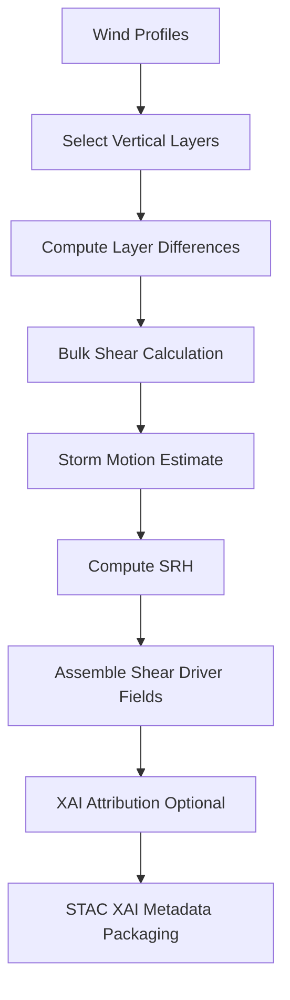

<div align="center">

# 🌬️📈🌀 **Shear Driver Model**  
`docs/pipelines/ai/inference/climate/models/drivers/shear-driver.md`

**Purpose**  
Define the **Wind Shear Driver Model**, responsible for computing multi-layer shear and  
storm-relative kinematic fields used in severe weather forecasting, hazard-chain modeling,  
and Story Node v3 atmospheric narratives.  
Model follows deterministic, reproducible computation and strict FAIR+CARE governance.

</div>

---

## 📘 Overview

Wind shear refers to the **change in wind speed and/or direction with height**.  
Shear strongly influences storm organization, tornado potential, hail threat, and convective mode.

The shear driver computes:

- **Bulk shear** (0–1 km, 0–3 km, 0–6 km)  
- **Deep-layer shear**  
- **Directional shear**  
- **Storm-relative helicity** (SRH)  
- **Shear vectors** (magnitude + direction)  
- **Derived hazard ingredients** for instability packs  

Capabilities:

- Deterministic & seed-locked  
- CRS + vertical-axis strict  
- XAI explainability (layer contributions, vector alignment)  
- STAC-XAI + PROV-O lineage  
- FAIR+CARE filtering for sovereignty-sensitive regions  

---

## 🧩 Physical Definitions (ASCII-safe)

### **Bulk Shear Magnitude**

```
Shear = sqrt( (u_top - u_bot)^2 + (v_top - v_bot)^2 )
```

### **Storm-Relative Helicity (SRH)**

```
SRH = ∫ (V - C) • (k × dV/dz) dz
```

Where:

- `V` = wind vector  
- `C` = storm motion vector (fixed algorithm or Bunkers)  
- `k` = vertical unit vector  

---

## 🧬 Shear Driver Pipeline



---

## 🧱 Inputs Required

### **Wind Inputs**
- u-wind, v-wind profiles  
- Pressure or height level metadata  
- Units consistent (m s^-1)  
- CRS + vertical-axis declared  

### **Optional Inputs**
- Storm motion predictors (Bunkers)  
- Temperature/humidity (for thermal-wind relations)  

### **Metadata Requirements**
- ISO 8601 timestamp  
- Spatial resolution  
- Model version  

---

## 📦 Outputs

Shear driver MUST output:

- `shear_grid.tif` (COG)  
- `shear_metadata.json`  
- `shear_summary.json`  
- SRH grids (optional)  
- STAC Item with hazard-driver metadata  
- Multihash checksums  
- PROV lineage block  
- CARE compliance flags  

---

## 🔍 XAI Integration

XAI MUST show:

- Layer-wise contributions to bulk shear  
- Sensitivity to direction changes  
- SRH contribution profiles  
- Deterministic seed information  
- Model version linking  

Supported XAI techniques:

- Integrated Gradients  
- Layerwise relevance propagation  
- CAM-like spatial vector fields  

---

## 🛡️ CARE + Sovereignty Enforcement

Shear outputs MUST:

- Apply H3-based masking where sovereignty policy dictates  
- Reduce granularity of shear maxima in restricted zones  
- Attach CARE metadata:

```json
{
  "care": {
    "masking": "h3-generalized",
    "scope": "public-generalized",
    "notes": ["High-risk kinematic fields generalized in protected domains"]
  }
}
```

---

## 🧪 CI Validation Requirements

CI MUST validate:

- Vertical-axis consistency  
- Units match expected (m s^-1)  
- CRS valid  
- No missing wind levels  
- Deterministic shear + SRH outputs  
- Complete STAC-XAI metadata  
- PROV lineage present  
- CARE filter applied  

Failure → ❌ merge blocked.

---

## 🕰 Version History

| Version  | Date       | Notes                                   |
|----------|------------|-----------------------------------------|
| v11.2.2  | 2025-11-28 | Initial shear driver model documentation |

---

<div align="center">

### 🔗 Footer  
[⬅ Back to Driver Models](../README.md) ·  
[🌡️ Climate Inference Root](../../README.md) ·  
[🏛 Governance](../../../../../standards/governance/ROOT-GOVERNANCE.md)

</div>

