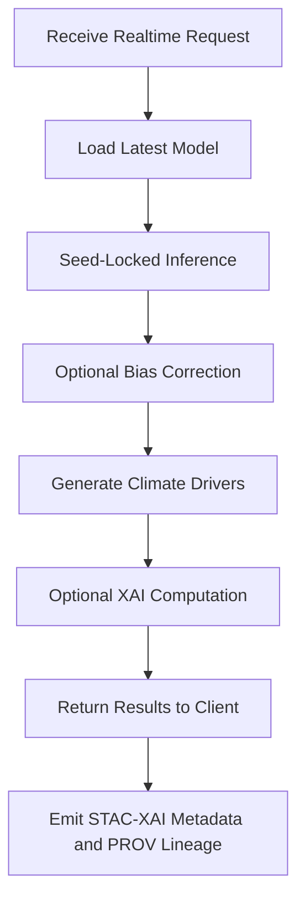

# 🌡️⚡🤖 **Climate AI Realtime Inference Pipelines — KFM v11.2.2**  
`docs/pipelines/ai/inference/climate/realtime/README.md`

**Purpose:**  
Define the **realtime climate inference subsystem** for the Kansas Frontier Matrix, enabling streaming + on-demand AI-powered climate predictions (downscaled fields, anomalies, hazard-linked drivers) with deterministic seeds, **STAC-XAI semantics**, **FAIR+CARE safeguards**, and full **PROV-O lineage** for governance.

---

## 📘 Overview

The realtime climate inference engine provides **low-latency**, **governed**, and **deterministic** AI climate predictions.

Supported capabilities:

- ⚡ Streaming API inference (WebSockets, SSE, gRPC)  
- 🌡️ Instant downscaled climate variable predictions  
- 📉 Realtime anomaly evaluation  
- 💨 Hazard-linked climate driver inference (CAPE, SRH, LLJ, lapse rates, etc.)  
- 🗺️ Small-tile spatial predictions (if enabled)  
- 🧩 SHAP/IG/CAM/spatial attribution explainability on-demand  
- 🔗 STAC-XAI + JSON-LD explainability bundling  
- 🛡️ CARE + sovereignty masking  
- 📜 PROV-O lineage for every inference session  

Realtime inference supports:

- Focus Mode v3 live climate overlays  
- Story Node climate event generation  
- Hazard pipeline upstream dependencies  
- Research-grade reproducibility  

---

## ⚡ Realtime Inference Modes

### 1. **On-Demand REST/GraphQL Inference**
For clients requesting specific:
- Times  
- Variables  
- Geographic bounding boxes  

Outputs include:
- Downscaled values  
- Drivers  
- SHAP/IG attribution (optional)  
- JSON-LD semantics  

### 2. **Streaming (SSE / WebSocket / gRPC)**
Continuous climate predictions for:
- Dashboards  
- Hazard nowcasting  
- Monitoring pipelines  

### 3. **Tile-Based Realtime Predictions**
Small GeoParquet tiles for:
- Focus Mode v3  
- MapLibre interactive layers  

### 4. **Realtime Explainability**
Optional XAI inference on-demand:
- SHAP local  
- IG local  
- CAMs  
- Spatial attribution mini-rasters  

---

## 🏗️ Realtime Architecture (GitHub-Safe Mermaid)

---

## 🧩 Realtime Features (v11.2.2)

- Deterministic inference across runs  
- Model version pinning  
- Strict input validation (CRS, vertical datum, time windows)  
- CARE + Sovereignty filtering  
- Optional rate-limited XAI calls  
- OpenTelemetry spans with climate-specific fields  
- Automatic STAC-XAI item generation for persistent outputs  

---

## 🗂 Directory Layout (v11.2.2)

    docs/pipelines/ai/inference/climate/realtime/
    ├── 📄 README.md                                  # This file
    │
    ├── ⚡ realtime_inference_server.py                # Main inference server
    ├── 📄 server-config.yaml                          # Ports, model versions, throttles
    │
    ├── 📁 handlers/                                   # API handlers
    │   ├── 📄 rest_handler.py
    │   ├── 📄 websocket_handler.py
    │   └── 📄 grpc_handler.py
    │
    ├── 📁 xai/                                        # On-demand explainability
    │   ├── 📄 shap.py
    │   ├── 📄 ig.py
    │   ├── 📄 cams.py
    │   └── 📄 spatial.py
    │
    ├── 📁 stac/                                       # Optional STAC item writer
    │   ├── 📄 README.md
    │   └── 📄 stac_writer.py
    │
    └── 📁 telemetry/
        ├── 📄 README.md
        └── 📄 realtime-otel-config.yaml

---

## 📡 STAC-XAI Requirements

Realtime inference can write STAC Items when configured.

All generated Items MUST contain:

- `kfm:explainability:method`  
- `kfm:explainability:{local|spatial}`  
- `kfm:model_version`  
- `kfm:input_items`  
- CRS + vertical metadata  
- CARE + sovereignty metadata  
- PROV-O lineage entries  
- `checksum:multihash` if persisted  

---

## 🧾 PROV-O Lineage Requirements

Each inference session MUST include:

- `prov:wasGeneratedBy` (session UUID)  
- `prov:used` (input sets, model version)  
- `prov:generatedAtTime`  
- `prov:Agent` (model + software ID)  

Optional:
- `prov:wasDerivedFrom` for multimodal XAI  

---

## 🔐 FAIR+CARE & Sovereignty Rules

Realtime predictions must:

- Apply H3 spatial generalization for sensitive locations  
- Include CARE metadata in all JSON-LD bundles  
- Respect tribal sovereignty directives  
- Use non-speculative, governance-approved climate language  
- Enforce Data Contract v3 restrictions  

Realtime *XAI* must mask sensitive geographic inference.

---

## 🧪 CI & Validation Rules

Realtime pipeline code MUST pass:

- Deterministic inference tests  
- XAI correctness tests  
- CARE + sovereignty linting  
- STAC-XAI metadata validation  
- JSON-LD schema validation  
- OpenTelemetry trace schema validation  
- Throughput + latency performance thresholds  
- Model version pin checks  

Failures → ❌ merge blocked.

---

## 🕰 Version History

| Version | Date       | Notes                                                              |
|---------|------------|--------------------------------------------------------------------|
| v11.2.2 | 2025-11-28 | Initial realtime climate inference documentation (KFM v11.2.2)      |

---

### 🔗 Footer  
[⬅ Back to Climate Inference](../README.md) · [🧠 AI Pipeline Layer](../../../README.md) · [🏛 Governance](../../../../standards/governance/ROOT-GOVERNANCE.md)

