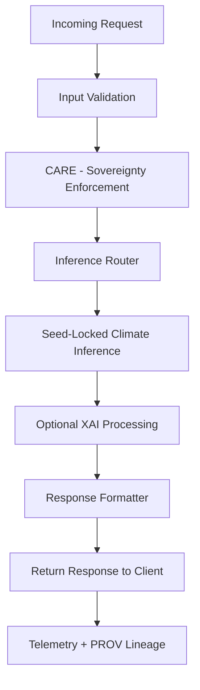

# 🌡️⚡📞 **Climate AI Realtime Inference — API Handlers**  
`docs/pipelines/ai/inference/climate/realtime/handlers/README.md`

**Purpose:**  
Define the **API handler layer** for realtime climate inference.  
This includes REST, WebSocket, and gRPC handlers that process user requests, validate inputs, route inference calls, attach FAIR+CARE safeguards, and return deterministic XAI-aware climate predictions.

---

## 📘 Overview

The realtime handler subsystem provides:

- High-performance request processing  
- Deterministic routing to inference engines  
- XAI-aware output packaging  
- STAC-XAI metadata binding  
- CARE + sovereignty enforcement  
- Input validation (CRS, vertical, variable sets, time windows)  
- Safe streaming and backpressure mechanisms  
- Story Node + Focus Mode integration hooks  

Handlers sit between clients and the realtime inference engine.

---

## 🔌 Handler Types

### 1. 🌐 REST Handler (`rest_handler.py`)
Supports:
- `/infer`
- `/drivers`
- `/explain/local`
- `/explain/spatial`
- `/health`

Responsibilities:
- Parse & validate request payload  
- Check CRS/vertical axis  
- Enforce rate limits  
- Apply CARE + sovereignty filters  
- Route to inference engine  
- Serialize JSON-LD or array responses  
- Emit OTel spans + PROV lineage  

---

### 2. 🔗 WebSocket Handler (`websocket_handler.py`)
Provides streaming inference via:

- WebSockets  
- SSE-like continuous mode if allowed  

Responsibilities:
- Maintain persistent session  
- Stream climate predictions/tiles  
- Push XAI deltas on-demand  
- Enforce CARE masking for spatial data  
- Track session-level PROV lineage  
- Throttle based on client capability  

---

### 3. 🛰️ gRPC Handler (`grpc_handler.py`)
Optimized for:

- High-throughput data ingestion  
- Internal KFM service-to-service communication  
- Hazard pipeline dependencies  

Responsibilities:
- Strict protobuf schema validation  
- Deterministic binary responses  
- Built-in observability hooks  
- CARE-transparent messaging  
- Full STAC-XAI integration metadata  

---

## 🧭 Handler Architecture (Mermaid-Safe)

---

## 🧪 Input Validation Requirements

Handlers MUST validate:

- `variable_set`  
- Time windows (ISO-8601)  
- CRS (`proj:epsg`) + vertical axis  
- Bounding boxes or grid indices  
- Model version compatibility  
- Request shape + required fields  
- CARE violation patterns  
- Sovereignty protection requirements  

Invalid requests → **reject with structured error**.

---

## 🔐 FAIR+CARE Safeguards

Handlers MUST enforce:

- H3 spatial masking  
- Removal of sensitive geospatial context  
- CARE scope tagging  
- Non-speculative climate language  
- Data Contract v3 compliance  
- Community governance constraints  

---

## 🧩 XAI Integration

Handlers may activate on-demand XAI:

- SHAP local  
- IG local  
- CAM spatial  
- Spatial attribution  
- Narrative driver extraction  

All results MUST:

- Be wrapped in JSON-LD  
- Include `kfm:model_version`, `kfm:input_items`, `checksum:multihash`  
- Include CARE + sovereignty annotations  
- Attach PROV lineage  

---

## 🧪 CI & Test Requirements

Tests MUST cover:

- REST/WS/gRPC routing  
- Input validation  
- CRS + vertical checks  
- Rate limiting  
- Backpressure + session control  
- XAI correctness  
- CARE + sovereignty enforcement  
- PROV + STAC-XAI metadata  
- Telemetry span coverage  
- Deterministic outputs under seed lock  

---

## 🕰 Version History

| Version  | Date       | Notes                                                              |
|----------|------------|--------------------------------------------------------------------|
| v11.2.2  | 2025-11-28 | Initial realtime handler subsystem for Climate AI Inference v11.2.2 |

---

### 🔗 Footer  
[⬅ Back to Realtime Inference](../README.md) · [🌡️ Climate Inference Root](../../README.md) · [🏛 Governance](../../../../standards/governance/ROOT-GOVERNANCE.md)

