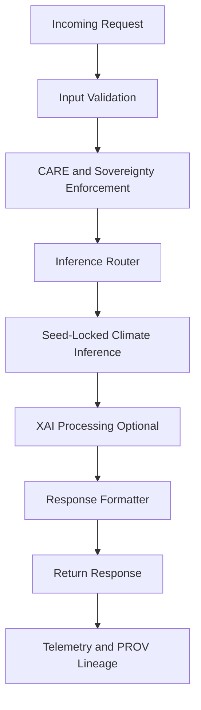

# 🌡️⚡📞 **Climate AI Realtime Inference — API Handlers**  
`docs/pipelines/ai/inference/climate/realtime/handlers/README.md`

**Purpose**  
Define the API handler layer for realtime climate inference.  
REST, WebSocket, and gRPC handlers validate inputs, enforce FAIR+CARE, route inference calls, apply sovereignty masking, and return deterministic XAI-aware climate predictions.

---

## 🗂️ Directory Layout (v11.2.2)

    docs/pipelines/ai/inference/climate/realtime/handlers/
        📄 README.md                     # This file
        📄 rest-handler.md               # REST API handler
        📄 websocket-handler.md          # WebSocket streaming handler
        📄 grpc-handler.md               # gRPC binary protocol handler
        📄 input-validation.md           # CRS, vertical, variables, windows, schema checks
        📄 xai-handlers.md               # On-demand XAI processors
        📄 care-governance.md            # CARE + sovereignty enforcement module
        📄 prov-xai.md                   # PROV-O lineage assembly helpers
        📄 stac-xai.md                   # STAC-XAI metadata packing
        📄 rate-limiters.md              # Rate limits, throttling, backpressure logic
        📄 authz.md                      # AuthZ + token scopes for climate inference
        📄 streaming-handlers.md         # Streaming patterns (SSE-style, multiplexing)

---

## 📘 Overview

The realtime handler subsystem provides:

- High-throughput request processing  
- Deterministic routing to inference engines  
- XAI-aware output packaging  
- STAC-XAI metadata construction  
- CARE + sovereignty enforcement  
- CRS + vertical axis validation  
- Safe streaming + backpressure controls  
- Hooks for Story Node v3 and Focus Mode v3  

Handlers function as the secure boundary between clients and the Climate AI inference layer.

---

## 🔌 Handler Types

### 1. 🌐 REST Handler (`rest_handler.py`)
Supports:
- `/infer`
- `/drivers`
- `/explain/local`
- `/explain/spatial`
- `/health`

Responsibilities:
- Parse + validate payload  
- Check CRS + vertical axis  
- Enforce rate limits  
- Apply CARE + sovereignty filters  
- Route to inference engine  
- Serialize JSON-LD, arrays, tiles  
- Emit OTel spans + PROV lineage  

---

### 2. 🔗 WebSocket Handler (`websocket_handler.py`)
Provides:

- Persistent streaming inference  
- SSE-like continuous mode (if allowed)  
- On-demand XAI deltas  

Responsibilities:
- Maintain session state  
- Stream predictions, tiles, drivers  
- Enforce CARE spatial masking  
- Track session-level PROV lineage  
- Apply backpressure + throttling  

---

### 3. 🛰️ gRPC Handler (`grpc_handler.py`)
Optimized for:

- Internal service-to-service calls  
- High-throughput ingestion  
- Hazard pipeline dependencies  

Responsibilities:
- Validate protobuf schemas  
- Deterministic binary responses  
- Built-in observability instrumentation  
- STAC-XAI metadata embedding  
- CARE-compliant message routing  

---

## 🧭 Handler Architecture (Mermaid-Safe)

---

## 🧪 Input Validation Requirements

Handlers MUST validate:

- Variables requested  
- Time windows (ISO-8601)  
- CRS (`proj:epsg`)  
- Vertical axis definition  
- Bounding boxes or grid indices  
- Model version compatibility  
- Required fields present  
- CARE compliance  
- Sovereignty restrictions  

Invalid requests → reject with structured error.

---

## 🔐 FAIR+CARE Safeguards

Handlers enforce:

- H3 spatial masking  
- Removal of sensitive geospatial detail  
- CARE scoping tags  
- Non-speculative climate language  
- Data Contract v3 compliance  
- Sovereignty protection policies  

---

## 🧩 XAI Integration

On-demand XAI capabilities:

- SHAP  
- IG  
- CAM  
- Spatial attribution  
- Narrative driver extraction  

Every XAI response MUST include:

- JSON-LD wrapper  
- `kfm:model_version`  
- `kfm:input_items`  
- Multihash checksums  
- CARE + sovereignty tags  
- PROV-O lineage  

---

## 🧪 CI & Testing Requirements

Tests MUST cover:

- REST/WS/gRPC routing  
- Input validation  
- CRS + vertical checks  
- Rate limiting + throttling  
- Streaming backpressure  
- XAI correctness  
- CARE + sovereignty enforcement  
- STAC-XAI metadata  
- PROV lineage  
- Deterministic outputs  

---

## 🕰 Version History

| Version  | Date       | Notes                                                              |
|----------|------------|--------------------------------------------------------------------|
| v11.2.2  | 2025-11-28 | Initial realtime handler subsystem for Climate AI Inference v11.2.2 |

---

### 🔗 Footer  
[⬅ Back to Realtime Inference](../README.md) ·  
[🌡️ Climate Inference Root](../../README.md) ·  
[🏛 Governance](../../../../standards/governance/ROOT-GOVERNANCE.md)

