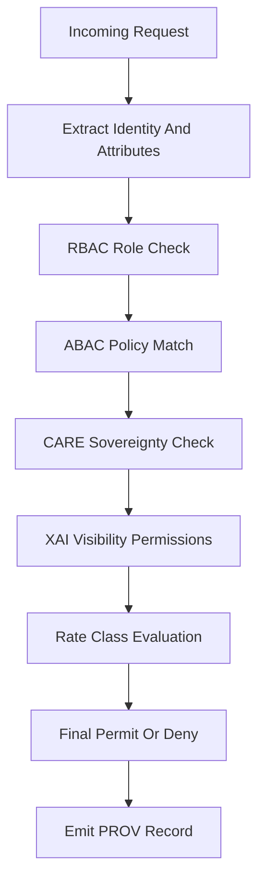

# 🌡️🛡️🔐 **Climate AI Realtime Inference — Authorization Layer (AuthZ)**  
`docs/pipelines/ai/inference/climate/realtime/handlers/authz.md`

**Purpose:**  
Define the **authorization policy engine** governing realtime climate inference requests.  
Enforces **RBAC + ABAC**, FAIR+CARE protections, sovereignty rules, dataset-level permissions,  
and XAI visibility constraints for REST, WebSocket, and gRPC handlers.

---

## 📘 Overview

The Authorization Layer (AuthZ) is the **policy gatekeeper** for the realtime inference system:

- Enforces **who** can access **which models**, **which variables**, and **which resolutions**  
- Applies **CARE & sovereignty rules** to mask or deny sensitive geospatial outputs  
- Validates **scope of use**, **rate class**, and **policy tier**  
- Binds **per-endpoint policies** to **realtime handlers**  
- Governs **access to XAI explanations**, including spatial attribution  
- Ensures **dataset licensing**, **temporal access windows**, and **model-version permissions**

AuthZ runs *before* the inference router, providing deterministic, audited policy decisions.

---

## 🗂️ Directory Layout (v11.2.2)

    docs/pipelines/ai/inference/climate/realtime/handlers/
        📄 README.md
        📄 rest-handler.md
        📄 websocket-handler.md
        📄 grpc-handler.md
        📄 input-validation.md
        📄 xai-handlers.md
        📄 care-governance.md
        📄 prov-xai.md
        📄 stac-xai.md
        📄 rate-limiters.md
        📄 authz.md                # ← This file

---

## 🧩 AuthZ Policy Layers

### 1. 🧑‍🤝‍🧑 RBAC (Role-Based Access Control)
Roles defined at system level:

- `public`
- `research-basic`
- `research-advanced`
- `internal-ops`
- `admin-governance`
- `restricted-tribal-sovereign` (special class requiring CARE filtering)

### 2. 🧬 ABAC (Attribute-Based Access Control)
Attributes enforced:

- `variable_set`  
- `resolution`  
- `model_version`  
- `geographic_scope`  
- `temporal_scope`  
- `requester_affiliation`  
- `license_type`  
- `xai_mode`  
- `rate_class`

### 3. 🪶 Sovereignty & CARE Enforcement  
Rules triggered when:

- Requests intersect **tribal boundaries**  
- Spatial resolution exceeds allowed threshold  
- XAI attribution could expose sensitive locations  
- Model output intersects protected ecological zones

---

## 🔐 Authorization Flow (Mermaid-Safe)

---

## 🎛 Policy Enforcement Rules

AuthZ MUST enforce:

- Temporal constraints (e.g., only allow recent models for certain roles)  
- Model-version access classes  
- Spatial masking for sensitive zones  
- Resolution downgrading  
- XAI mode gating (SHAP / IG / CAM allowed only for permitted roles)  
- WebSocket session-level caps  
- gRPC binary-stream authorization at message boundaries  

---

## 🧪 CI Validation Requirements

CI must validate:

- Deterministic policy evaluation  
- Policy table schema validity  
- No unbounded privileges  
- No bypass of CARE or sovereignty filters  
- All decisions logged with PROV-O lineage  
- All rules version-pinned and hashed  

---

## 🧠 XAI Authorization

XAI exposure requires:

- Allowed user role  
- Allowed variable set  
- Spatial extent approval  
- CARE compliance check  
- Sovereignty masks applied  
- Stamped provenance on every XAI asset  

Failure at any stage → XAI disabled for the response.

---

## 🕰 Version History

| Version  | Date       | Notes                                          |
|----------|------------|------------------------------------------------|
| v11.2.2  | 2025-11-28 | Initial AuthZ subsystem documentation.         |

---

### 🔗 Footer  
[⬅ Back to Handlers](../README.md) ·  
[🌡️ Climate Inference Root](../../README.md) ·  
[🏛 Governance](../../../../standards/governance/ROOT-GOVERNANCE.md)

