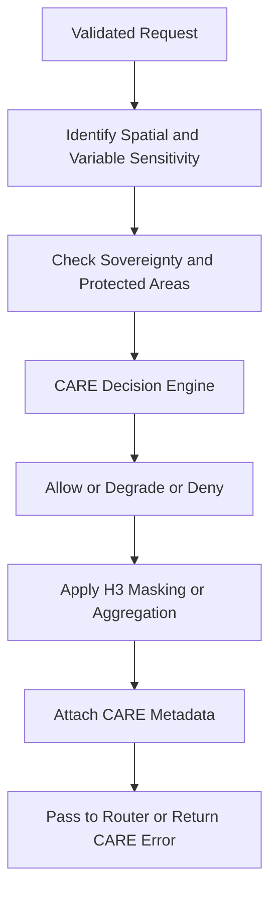

<div align="center">

# 🛡️🌍🤝 **CARE Governance Handler for Climate AI Realtime Pipeline**  
`docs/pipelines/ai/inference/climate/realtime/handlers/care-governance.md`

**Purpose**  
Define the FAIR+CARE, sovereignty, and ethical enforcement layer applied to all realtime Climate AI inference requests and responses.  
This subsystem protects sensitive geospatial domains, applies H3-based generalization, ensures data contract compliance, triggers CARE denials/degradations, and annotates all responses with CARE metadata.

</div>

---

## 📘 Role in the Realtime Pipeline

The CARE Governance Handler acts as the **ethical firewall** between the inference engine and the user.

It ensures:

- Ethical + equitable treatment of climate data
- Protection of Indigenous regions and sensitive geographies
- Safety for climate-driven narratives (non-speculative)
- Compliance with CARE principles  
  - **C**ollective Benefit  
  - **A**uthority to Control  
  - **R**esponsibility  
  - **E**thics  
- Enforcement of the **Indigenous Data Protection Policy**
- Enforcement of **Data Contract v3**
- Masking/generalization rules for sensitive spatial outputs
- FAIR traceability & provenance of ethical decisions

All inference and XAI traffic flows through this layer.

---

## 🧭 CARE Governance Flow (Mermaid-Safe)



---

## 🗺️ Protected Regions and Sovereignty Enforcement

The handler MUST check if:

- Request domain intersects Indigenous lands  
- Requested variables (e.g., soil moisture, land cover) elevate sensitivity  
- Time window spans culturally sensitive periods  
- Resolution is too fine for protected contexts  
- Spatial domain exceeds allowed thresholds for sensitive zones  

Outcomes:

### **1. Allow**
Request is safe → inference or XAI proceeds normally.

### **2. Degrade**
System must:
- Generalize using **H3** (e.g., from resolution 9 → 4)
- Reduce spatial precision
- Aggregate climate fields
- Clip bounding boxes

### **3. Deny**
Return structured error:

```json
{
  "error": {
    "code": "CARE_POLICY_VIOLATION",
    "message": "Requested domain intersects protected region",
    "details": {
      "policy": "INDIGENOUS-DATA-PROTECTION"
    }
  }
}
```

---

## 🧑‍⚖️ Data Contract v3 Compliance

The CARE layer enforces Data Contract v3:

- Variable access rules  
- Maximum domain sizes  
- Token-level permissions  
- Model-version access restrictions  
- Safety constraints for XAI overlays  
- Allowed geographic extents based on user identity or token class  
- Narrative safety (no hallucinated or speculative hazard claims)

---

## 🧬 H3-Based Spatial Masking

All sensitive responses MUST be spatially transformed via:

- H3 rasterization  
- Grid generalization  
- Aggregated statistics  
- Removal or obfuscation of tile edges  
- Lowering of vertical-axis resolution  

This ensures spatial privacy and sovereignty-compliant geospatial data.

---

## 🧩 CARE Metadata Block (JSON-LD)

Every response MUST include:

```json
{
  "care": {
    "masking": "h3-generalized",
    "scope": "public-generalized",
    "notes": [
      "Sensitive area detection applied",
      "Resolution reduced due to sovereignty policy"
    ]
  }
}
```

The CARE handler **must annotate**:

- masked/unmasked status  
- scoping  
- internal decision path (allow / degrade / deny)  
- link to applied policies  

---

## 🔐 Narrative Safety for Story Nodes & Focus Mode

XAI or inference outputs powering:

- Focus Mode climate narratives  
- Story Node v3 climate segments  

MUST be:

- Non-speculative  
- Grounded in data with provenance  
- CARE-safe  
- Respectful of cultural interpretation boundaries  

If narrative risk exists → **degrade** or **deny**.

---

## 📊 Telemetry & PROV Integration

The CARE governance layer MUST emit:

- CARE decision in PROV (`prov:wasInfluencedBy`)  
- Ethical policy references  
- Sovereignty context IDs  
- Masking level  
- Lookup source for protected areas  
- Complete decision trace for auditing  

Example PROV snippet:

```json
{
  "prov": {
    "wasInfluencedBy": "urn:kfm:care:decision:abcd",
    "used": ["urn:kfm:policy:indigenous-data-protection"],
    "agent": "urn:kfm:service:care-governance"
  }
}
```

---

## 🧪 Testing and CI Requirements

CI MUST verify:

- All endpoints call CARE validation before inference/XAI  
- H3 masking functions deterministically  
- CARE metadata block exists on all responses  
- Sovereignty policy is triggered on sensitive regions  
- Error paths for `deny` produce correct JSON structures  
- Data Contract v3 rules are consistently applied  
- Narrative safety checks are not bypassed  

Testing MUST include:

- Protected-area requests (should **deny**)  
- Borderline spatial domains (should **degrade**)  
- Safe domains (should **allow**)  
- Variable sensitivity combinations  
- XAI-specific CARE enforcement  
- Rate-limit triggers for excessive requests in sensitive regions  

---

## 🕰 Version History

| Version  | Date       | Notes                                                |
|----------|------------|------------------------------------------------------|
| v11.2.2  | 2025-11-28 | Initial CARE governance specification for v11.2.2.   |

---

<div align="center">

### 🔗 Footer  
[⬅ Back to Handlers](README.md) ·  
[🌡️ Realtime Inference Root](../README.md) ·  
[🏛 Governance](../../../../standards/governance/ROOT-GOVERNANCE.md)

</div>

