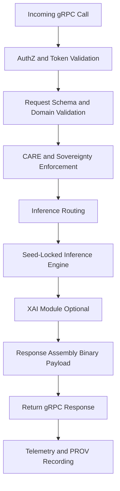

<div align="center">

# 🛰️📡📞 **Climate AI Realtime gRPC Handler**  
`docs/pipelines/ai/inference/climate/realtime/handlers/grpc-handler.md`

**Purpose**  
Specify the gRPC binary handler for realtime Climate AI inference.  
This handler exposes strongly-typed, high-throughput RPCs for internal KFM services and hazard pipelines, enforcing FAIR+CARE and sovereignty policies, routing to inference and XAI services, and emitting deterministic, provenance-rich responses.

</div>

---

## 📘 Role in the Realtime Stack

The gRPC handler is the **preferred interface for internal service-to-service communications**, including:

- Climate inference microservices  
- Hazard driver pipelines  
- Batch-to-realtime bridge services  
- Focus Mode and Story Node backend helpers  

It is optimized for:

- Low latency and high throughput  
- Compact binary messages  
- Strong contracts via protobuf IDLs  
- Integrated observability (OpenTelemetry)  
- PROV and STAC-XAI metadata propagation  

gRPC is **not** exposed directly to untrusted external clients; it is used inside the trusted KFM service mesh or via API gateway translation.

---

## 🧾 Protobuf Service Overview

Example service definition sketch (conceptual):

```proto
service ClimateRealtime {
  rpc Infer(ClimateInferRequest) returns (ClimateInferResponse);
  rpc Drivers(ClimateDriverRequest) returns (ClimateDriverResponse);
  rpc ExplainLocal(LocalExplainRequest) returns (LocalExplainResponse);
  rpc ExplainSpatial(SpatialExplainRequest) returns (SpatialExplainResponse);
  rpc Health(HealthRequest) returns (HealthResponse);
}
```

Key messages MUST include:

- Model identifiers and versions  
- Time and spatial domain fields (with CRS)  
- Variable lists or driver lists  
- CARE + sovereignty hints (e.g., policy contexts)  
- Telemetry and PROV correlation IDs  

---

## 🧷 Core RPCs

### 1. `Infer`

**Use:** Core climate field inference over gRPC.

**Key fields (request):**

- `repeated string variables`  
- `Timestamp time`  
- `Domain domain` (CRS, bbox or grid spec)  
- `ModelSelector model`  
- `InferenceOptions options` (seed, XAI toggle)  

**Key fields (response):**

- `ModelMetadata model_metadata` (version, variant)  
- `Domain domain` (echoed)  
- `map<string, FieldData> data`  
- `Checksum checksum` (multihash)  
- `ProvMetadata prov`  
- `CareMetadata care`  

---

### 2. `Drivers`

**Use:** Driver fields (e.g. CAPE, CIN, shear).

Identical envelope to `Infer`, but:

- `repeated string drivers` instead of generic `variables`  
- `data` map keyed by driver names  

---

### 3. `ExplainLocal`

**Use:** Local XAI attribution for a location and variable.

Request includes:

- `string variable`  
- `Timestamp time`  
- `Point location` (lat, lon)  
- `string method` (e.g. `"shap"` or `"ig"`)  

Response includes:

- `Attribution` structure (feature contributions)  
- `ProvMetadata`  
- `CareMetadata`  

---

### 4. `ExplainSpatial`

**Use:** Spatial XAI overlays across a small domain.

Request:

- Similar to `Infer` + XAI-specific options  

Response:

- Attribution fields (e.g. heatmaps, CAM-like arrays)  
- Metadata, PROV, and CARE tags  

---

### 5. `Health`

**Use:** gRPC-level health probe.

Simplified request/response:

- `status` (`OK`, `DEGRADED`, `UNAVAILABLE`)  
- `version`  
- Optional diagnostics  

---

## 🧭 gRPC Handler Flow



---

## 🧪 Validation and Contract Rules

The gRPC handler MUST:

- Validate all incoming messages against the protobuf schema  
- Reject unknown or deprecated fields (unless explicitly tolerated)  
- Enforce strict type checking (e.g. required vs optional fields)  
- Validate time ranges and domain boundaries  
- Verify `model.id` and `model.version` are supported  
- Confirm variables or drivers are within allowlists  

On validation failure, return appropriate gRPC status codes (e.g. `INVALID_ARGUMENT`, `PERMISSION_DENIED`) with details.

---

## 🔐 FAIR+CARE and Sovereignty Enforcement

The handler MUST:

- Apply the same H3-based generalization policies as REST/WS  
- Respect `sovereignty_policy` flags propagated in the call context  
- Attach CARE metadata to responses (scopes, masking notes)  
- Return `PERMISSION_DENIED` or `FAILED_PRECONDITION` when requests violate CARE/sovereignty policies  

Example error mapping:

- Policy violation → `PERMISSION_DENIED` with an error detail describing the CARE policy and region affected.  

---

## 🧩 XAI Integration over gRPC

XAI behavior via gRPC:

- Local and spatial explanation services accessible through dedicated RPCs  
- Model version, input STAC Items, and checksums embedded in outputs  
- Attribution data packaged in efficient binary structures (e.g. repeated arrays, tiled grids)  

Handler responsibilities:

- Route XAI RPCs to XAI microservice or module  
- Populate `ProvMetadata` (activities, agents, used inputs)  
- Populate `CareMetadata` for each XAI response  
- Ensure responses are deterministic under fixed seed  

---

## 📊 Observability, Rate Limits, and Backpressure

gRPC handler MUST:

- Emit OpenTelemetry spans and metrics for each RPC  
- Record per-method latency, errors, and resource consumption  
- Support rate limits based on service accounts or client IDs  
- Propagate correlation IDs for upstream/downstream tracing  

Backpressure is typically handled at the L4/L7 infrastructure level, but the handler MUST:

- Respect configured concurrency limits  
- Short-circuit calls when upstream inference services are overloaded (returning `UNAVAILABLE` or `RESOURCE_EXHAUSTED`)  

---

## 🧪 Testing and CI Requirements

Test suites MUST validate:

- Protobuf compilation and schema integrity  
- Request validation rules  
- CRS and vertical-axis handling  
- CARE and sovereignty enforcement paths  
- Successful and failing RPC calls per method  
- XAI RPC output structure and metadata  
- PROV and STAC-XAI metadata population  
- Deterministic responses under known seeds  

CI MUST fail if:

- Protobuf definitions change without corresponding documentation updates  
- CARE or sovereignty checks are bypassed in any RPC path  
- Required metadata (PROV, CARE, STAC-XAI) is absent in handler logic  

---

## 🕰 Version History

| Version  | Date       | Notes                                                |
|----------|------------|------------------------------------------------------|
| v11.2.2  | 2025-11-28 | Initial gRPC handler specification for v11.2.2.      |

---

<div align="center">

### 🔗 Footer  
[⬅ Back to Handlers](README.md) ·  
[🌡️ Realtime Inference Root](../README.md) ·  
[🏛 Governance](../../../../standards/governance/ROOT-GOVERNANCE.md)

</div>

