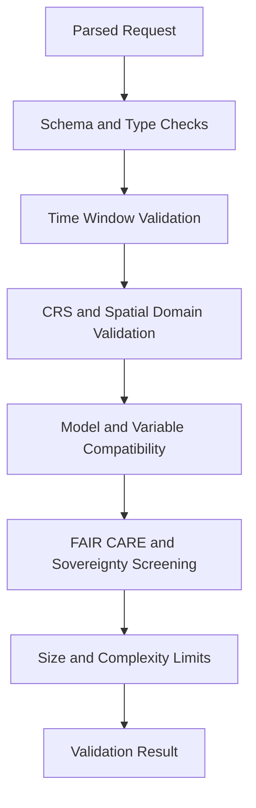

<div align="center">

# ✅📏🌡️ **Climate AI Realtime Input Validation**  
`docs/pipelines/ai/inference/climate/realtime/handlers/input-validation.md`

**Purpose**  
Define the **validation rules and checks** that all realtime Climate AI requests must pass before reaching inference or XAI engines, including schema validation, CRS and vertical axis enforcement, model compatibility checks, FAIR+CARE and sovereignty gates, and size/time-window constraints.

</div>

---

## 📘 Role in the Realtime Stack

Input validation is the **first gate** after a request is parsed by a handler (REST, WebSocket, or gRPC).

It ensures:

- Requests are **well-formed** and **schema-correct**  
- Spatial and temporal domains are **supported and safe**  
- Variable and driver lists are **authorized and compatible**  
- Model IDs and versions are **valid and deployed**  
- Requests conform to **FAIR+CARE + sovereignty** requirements  
- Potential misuse or overload is blocked early (size limits, rate hints)  

If validation fails, **no inference or XAI call is executed**.

---

## 🔍 Validation Layers

Validation is conceptually layered:

1. **Syntax and Schema Validation**  
2. **Temporal Validation**  
3. **Spatial and CRS / Vertical Validation**  
4. **Model and Variable Compatibility Checks**  
5. **FAIR+CARE and Sovereignty Checks**  
6. **Size and Complexity Constraints**  

Only requests passing **all layers** proceed to the router.

---

## 1️⃣ Syntax and Schema Validation

Handled via JSON schema or protobuf descriptors depending on the transport:

- **REST/WS**:  
  - JSON body validated against endpoint-specific JSON schemas  
  - Reject unknown top-level fields unless explicitly allowed  
  - Enforce type correctness (string, number, array, object)  

- **gRPC**:  
  - Protobuf-generated stubs ensure structural correctness  
  - Unknown or deprecated fields rejected or ignored per IDL policy  

Examples of invalid conditions:

- Missing required fields (`variables`, `time`, `domain`, `model`)  
- Wrong types (e.g. `"variables": "t2m"` instead of array)  
- Mixed data types within arrays  

---

## 2️⃣ Temporal Validation

Rules:

- `time` MUST be ISO-8601 (`YYYY-MM-DDTHH:MM:SSZ` preferred)  
- Past/future bounds configurable:  
  - Maximum backfill window (e.g., last N hours or days)  
  - Maximum forward window for nowcasting/forecasting  
- For streaming (WebSocket), `time_mode` rules:  
  - `realtime`: allowed  
  - `historical` or `forecast`: only if configured  

Invalid temporal requests MUST produce an error indicating:

- Out-of-range time  
- Unsupported time mode  

---

## 3️⃣ Spatial + CRS and Vertical Axis Validation

All spatial domains MUST:

- Declare CRS (e.g., `"crs": "EPSG:4326"` for REST; `Domain.crs` for gRPC)  
- Provide domain shape:  
  - `bbox` in geographic coordinates, or  
  - grid indices compatible with model definition  

Validation checks:

- CRS is recognized and supported by the pipeline  
- If CRS ≠ `EPSG:4326`, reprojection must be supported or request rejected  
- BBox bounds within configured geographic limits (e.g. Kansas extent or authorized region)  
- BBox area beneath configured maximum to avoid compute and privacy issues  
- Vertical axis:  
  - If specified, validated against known vertical references (e.g. `pressure_level`, `height_agl`)  
  - Consistent with requested variables  

On failure, handler MUST emit a structured error referencing `domain` or `crs`.

---

## 4️⃣ Model and Variable Compatibility Checks

Validation includes:

- `model.id` is registered and active  
- `model.version` is recognized and not deprecated or blocked  
- `model.variant` (if provided) is allowed for the requested endpoint  

Variable checks:

- All `variables` or `drivers` in the request MUST be in allowlists per model/endpoint  
- Some variables may require pairing (e.g. `u10` and `v10` together)  
- XAI endpoints MAY restrict which variables can be explained  

Invalid combinations result in an `INVALID_REQUEST` error with details listing unsupported fields.

---

## 5️⃣ FAIR+CARE and Sovereignty Checks

Input validation integrates early-stage **FAIR+CARE and sovereignty** screening:

- Domain intersection with **protected or sensitive regions**  
- Variable types combined with domain size that could expose sensitive information  
- Requests flagged by Data Contract v3 policies  

Outcomes:

- **Allow**: proceed to inference/XAI; mark request with CARE scope  
- **Degrade**: adjust response (e.g. lower spatial resolution, aggregated outputs)  
- **Deny**: reject early with explicit CARE violation error  

These outcomes are encoded in an internal validation result (e.g., `allow`, `degrade`, `deny`) consumed downstream by handlers and routers.

---

## 6️⃣ Size and Complexity Constraints

To protect system stability and privacy:

- Maximum number of variables per request  
- Maximum spatial coverage (e.g. total grid cells)  
- Maximum frequency for streaming subscriptions  
- Maximum concurrent active requests per API key or token  

If limits are exceeded:

- Single request: rejected with `INVALID_REQUEST` + detail  
- Streaming: subscription rejected or downgraded  

---

## 🧭 Validation Flow (Mermaid-Safe)



---

## 🧪 Error Model

Validation failures MUST return **structured errors** with:

- `code` — machine-readable code (e.g. `INVALID_REQUEST`, `CARE_POLICY_VIOLATION`)  
- `message` — human-readable explanation  
- `details` — object showing which field or rule was violated  

Example:

```json
{
  "error": {
    "code": "INVALID_REQUEST",
    "message": "Requested bbox exceeds allowed region",
    "details": {
      "field": "domain.bbox",
      "limit": "kansas-extent"
    }
  }
}
```

---

## 🧪 Testing and CI Requirements

Test suites MUST cover:

- Schema validation for all supported endpoint payloads  
- Temporal bounds and invalid time formats  
- CRS and bbox checks, including reprojection or rejection paths  
- Vertical axis validation  
- Model and variable compatibility rules  
- CARE and sovereignty gating (allow, degrade, deny)  
- Size and complexity threshold enforcement  

CI MUST fail if:

- Validation schemas drift without documentation updates  
- Any endpoint bypasses central validation logic  
- CARE or sovereignty gates are missing from critical paths  

---

## 🕰 Version History

| Version  | Date       | Notes                                             |
|----------|------------|---------------------------------------------------|
| v11.2.2  | 2025-11-28 | Initial input validation specification for v11.2.2 |

---

<div align="center">

### 🔗 Footer  
[⬅ Back to Handlers](README.md) ·  
[🌡️ Realtime Inference Root](../README.md) ·  
[🏛 Governance](../../../../standards/governance/ROOT-GOVERNANCE.md)

</div>

