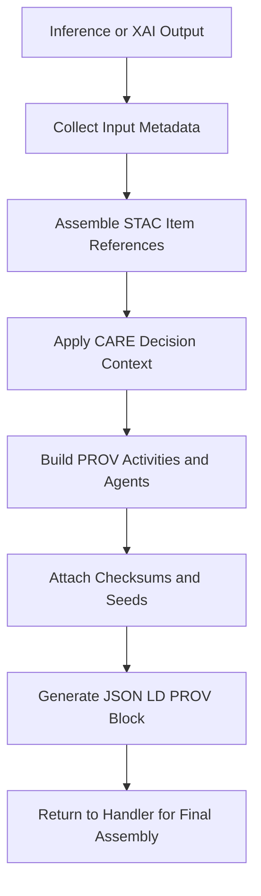

<div align="center">

# 🧩📜🤖 **Climate AI Realtime PROV-XAI Handler**  
`docs/pipelines/ai/inference/climate/realtime/handlers/prov-xai.md`

**Purpose**  
Define the provenance assembly subsystem responsible for creating **PROV-O compliant lineage** for all XAI computations in the realtime Climate AI pipeline.  
This includes inference lineage, XAI activity lineage, CARE-influenced decisions, and STAC-XAI linkages for transparent, auditable, and deterministic explainability.

</div>

---

## 📘 Overview

The PROV-XAI subsystem creates **structured provenance metadata** describing:

- Which input data was used  
- Which models and versions ran  
- Which XAI method produced the attribution  
- Which CARE governance decisions influenced the result  
- How the inference/XAI chain connects to upstream STAC Items  
- Deterministic seeds and parameters used  
- Which services (agents) performed the operations  

This metadata is added to:

- REST responses  
- WebSocket frames  
- gRPC binary responses  

and feeds:

- FAIR audit logs  
- Story Node v3 generation  
- Focus Mode v3 “explain the explanation” views  
- Internal compliance and reproducibility audits  

---

## 🧭 PROV-XAI Architecture (Mermaid-Safe)



---

## 🧩 Provenance Objects

### **Entities (`prov:Entity`)**
Include:

- Input STAC Items  
- Model versions + variants  
- Derived climate fields  
- XAI attribution arrays  
- Bounding boxes / CRS metadata  
- CARE decisions (as “influencing entities”)  

Example:

```json
{
  "prov:Entity": {
    "input_item_1": {
      "type": "stac:Item",
      "href": "https://…/stac/item-uuid"
    }
  }
}
```

---

### **Activities (`prov:Activity`)**
Represent:

- Inference run  
- XAI computation  
- CARE evaluation steps  
- Masking/generalization application  

Example:

```json
{
  "prov:Activity": {
    "urn:kfm:activity:xai:abcd": {
      "startedAtTime": "2025-06-03T12:00:00Z",
      "endedAtTime": "2025-06-03T12:00:00Z",
      "kfm:seed": 42,
      "kfm:xai_method": "shap"
    }
  }
}
```

---

### **Agents (`prov:Agent`)**
Represent:

- Climate inference service  
- XAI service  
- CARE governance engine  
- KFM API layer  

Example:

```json
{
  "prov:Agent": {
    "urn:kfm:service:climate-realtime-api": {
      "type": "SoftwareAgent",
      "version": "v11.2.2"
    }
  }
}
```

---

## 🔗 Provenance Relationships

Each XAI output MUST include:

- `prov:wasGeneratedBy` → XAI activity  
- `prov:used` → STAC Items, inference fields, CARE decisions  
- `prov:wasInfluencedBy` → CARE governance entity  
- `prov:wasAssociatedWith` → XAI agent  

Example:

```json
{
  "prov": {
    "wasGeneratedBy": "urn:kfm:activity:xai:abcd",
    "used": [
      "urn:kfm:data:stac:item-uuid-1",
      "urn:kfm:data:stac:item-uuid-2"
    ],
    "wasInfluencedBy": "urn:kfm:care:decision:qwerty",
    "agent": "urn:kfm:service:climate-xai-engine"
  }
}
```

---

## 🔒 Determinism, Seeds, and Checksum Requirements

The handler MUST embed:

- `seed`: integer used for deterministic attribution  
- `checksum.multihash`: multihash of model inputs  
- `checksum.xai`: hash of the XAI output array  
- `checksum.activity`: hash of activity metadata  

All checksums MUST use **multihash SHA-256**.

---

## 🌍 CARE-Aware Provenance

CARE governance decisions MUST appear in PROV via:

- `prov:wasInfluencedBy`  
- `prov:used` referencing CARE decision entities  

Example CARE provenance entity:

```json
{
  "prov:Entity": {
    "urn:kfm:care:decision:qwerty": {
      "masking_level": "h3-generalized",
      "policy": "INDIGENOUS-DATA-PROTECTION",
      "scope": "public-generalized"
    }
  }
}
```

---

## 📦 STAC-XAI Integration

PROV-XAI MUST integrate with STAC-XAI:

- Reference upstream STAC Items  
- Record variable lists  
- Record bounding boxes + CRS  
- Reference XAI-derived assets like CAM fields  

XAI outputs become STAC Assets:

```json
{
  "stac": {
    "assets": {
      "xai_heatmap": {
        "href": "s3://…/xai/heatmap.tif",
        "type": "image/tiff",
        "roles": ["xai", "explanation"]
      }
    }
  }
}
```

---

## 🧪 Testing and CI Requirements

CI MUST ensure:

- All handlers attach valid PROV blocks  
- Missing provenance triggers CI failure  
- XAI activities always include seeds + timestamps  
- All CARE decisions appear in provenance  
- STAC-XAI integration fields are correct  
- JSON-LD passes schema validation  

Tests MUST include:

- Local XAI provenance  
- Spatial XAI provenance  
- CARE-impacted provenance  
- Multi-STAC input provenance  
- Checksum reproducibility tests  

---

## 🕰 Version History

| Version  | Date       | Notes                                                |
|----------|------------|------------------------------------------------------|
| v11.2.2  | 2025-11-28 | Initial PROV-XAI handler specification for v11.2.2   |

---

<div align="center">

### 🔗 Footer  
[⬅ Back to Handlers](README.md) ·  
[🌡️ Realtime Inference Root](../README.md) ·  
[🏛 Governance](../../../../standards/governance/ROOT-GOVERNANCE.md)

</div>

