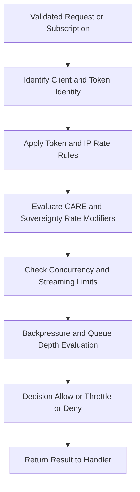

<div align="center">

# 🚦📉🌡️ **Climate AI Realtime Rate Limiters**  
`docs/pipelines/ai/inference/climate/realtime/handlers/rate-limiters.md`

**Purpose**  
Define the realtime throughput and rate-limiting subsystem for Climate AI inference.  
This layer governs request frequency, session throughput, backpressure, token quotas, CARE-governed rate constraints, and abuse-prevention logic across REST, WebSocket, and gRPC handlers.

</div>

---

## 📘 Role in the Realtime Stack

Rate limiting is essential for:

- Protecting realtime inference clusters  
- Ensuring equitable use under FAIR+CARE  
- Safeguarding sovereignty-sensitive areas  
- Preserving determinism and latency guarantees  
- Preventing abusive or runaway client behavior  
- Controlling XAI-heavy workloads  
- Supporting SLA-driven performance  

Rate limiters sit **before inference routing** and **after input validation**, enforcing both **global** and **per-client** limits.

---

## 🚦 Types of Rate Limits

### 1️⃣ **Token-Level Limits**
Applied per API key or OAuth token:

- Max requests per minute  
- Max concurrent streaming sessions  
- XAI-specific per-minute limits  
- Domain-size adjusted quotas (larger spatial domains = higher cost)  

### 2️⃣ **IP-Level Limits**
Applied to unauthenticated or semi-authenticated users:

- Burst limits  
- Sustained limits  
- Auto-ban windows for abusive patterns  

### 3️⃣ **Session-Level Limits (WebSocket)**
Includes:

- Max subscriptions per session  
- Max outbound frames per second  
- Max active XAI streams  
- Session duration caps  

### 4️⃣ **Sovereignty + CARE Limits**
Requests or sessions involving sensitive geographic regions may receive:

- **Lower maximum rate**  
- **Reduced concurrency**  
- **Forced degradations**  
- **Full denials when required**

Example:  
Latitude/longitude intersecting protected regions → slower rate floor + boosted CARE scrutiny.

---

## 🧭 Rate Limiter Flow (Mermaid-Safe)



---

## 📉 Backpressure Handling

Rate-limiters enforce backpressure when:

- Outbound queue grows too fast  
- Inference cluster reaches scheduled compute limits  
- XAI engine hits latency SLA thresholds  

Strategies:

- Slowdown signals (REST: headers; WS: control frames; gRPC: status codes)  
- Reduced-resolution payloads  
- Dropping non-critical frames (WebSocket only)  
- Pacing outgoing frames based on client readiness  

---

## 🔐 CARE-Aware Governance

Rate limiting MUST integrate CARE rules:

- Sensitive domains → lower rate ceilings  
- Requests over Indigenous lands → extra scrutiny  
- Variables considered sensitive → rate multipliers (soil moisture, landcover, etc.)  
- XAI over sensitive regions → higher cost or denial  
- Policy violations → account throttling or immediate denial  

Example CARE-influenced throttle:

```json
{
  "error": {
    "code": "CARE_THROTTLED",
    "message": "Request throttled due to sensitive geography",
    "details": {
      "policy": "INDIGENOUS-DATA-PROTECTION",
      "action": "throttle"
    }
  }
}
```

---

## ⏱️ Deterministic Rate Behavior

To satisfy reproducible inference requirements:

- Throttle algorithms MUST be deterministic under identical conditions  
- Same token + same domain + same variables → same rate decision  
- Seed-based XAI requests respect seed-lock determinism  
- Random jitter MUST be **pseudo-random** and reproducible  

---

## 📦 Rate Limit Metadata Returned to Clients

REST:

```json
{
  "rate_limit": {
    "allowed": 30,
    "remaining": 12,
    "reset_seconds": 52
  }
}
```

WebSocket:

```json
{
  "type": "control",
  "code": "RATE_LIMIT",
  "allowed_fps": 2
}
```

gRPC:

- Returned via metadata trailers  
- Must include:  
  - `x-rate-limit`  
  - `x-rate-remaining`  
  - `x-rate-reset`  

---

## 🧪 Testing and CI Requirements

CI MUST verify:

- Enforcement of all rate tiers (token/IP/session/CARE)  
- Deterministic rate-limit outcomes under repeated runs  
- Backpressure events propagated to handlers  
- XAI-heavy scenarios trigger correct rate-multipliers  
- CARE policies properly lower rate ceilings  
- Sovereignty violations produce immediate denial  
- REST/WS/gRPC metadata consistently populated  
- No bypass path exists for high-frequency abusive clients  

Test cases MUST cover:

- Burst traffic  
- Sustained load  
- Multi-stream WebSocket scenarios  
- gRPC high-throughput pipelines  
- CARE-sensitive region requests  
- XAI stress tests  

---

## 🕰 Version History

| Version  | Date       | Notes                                                   |
|----------|------------|---------------------------------------------------------|
| v11.2.2  | 2025-11-28 | Initial rate-limiting subsystem specification.          |

---

<div align="center">

### 🔗 Footer  
[⬅ Back to Handlers](README.md) ·  
[🌡️ Realtime Inference Root](../README.md) ·  
[🏛 Governance](../../../../standards/governance/ROOT-GOVERNANCE.md)

</div>

