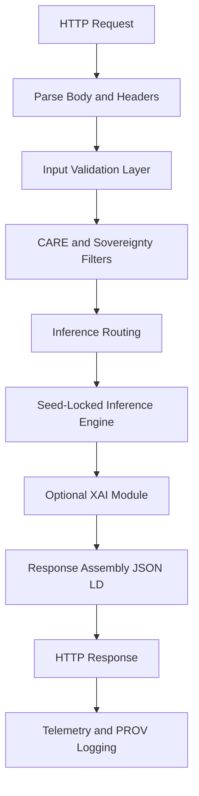

<div align="center">

# 🌐📡📞 **Climate AI Realtime REST Handler**  
`docs/pipelines/ai/inference/climate/realtime/handlers/rest-handler.md`

**Purpose**  
Specify the REST API handler for realtime Climate AI inference.  
This handler parses HTTP requests, validates inputs, enforces FAIR+CARE and sovereignty rules, routes to the inference engine, optionally triggers XAI, and returns deterministic, provenance-rich responses.

</div>

---

## 📘 Role in the Realtime Stack

The REST handler is the **primary external entrypoint** for:

- Synchronous Climate AI inference  
- Hazard driver requests  
- On-demand local XAI calls  
- Health and readiness checks  

It sits at the **edge of the realtime pipeline**, coordinating:

- Input schema validation  
- Variable set, time window, CRS, vertical axis checks  
- Rate limiting and authz  
- CARE + sovereignty masking  
- Routing to inference microservices  
- STAC-XAI + PROV-O metadata assembly  
- Telemetry emission (OpenTelemetry spans and metrics)  

---

## 📡 REST Endpoints

### 🔥 `POST /infer`

**Use:** Core climate field inference.

**Request body (JSON):**

```json
{
  "variables": ["t2m", "td2m", "u10", "v10"],
  "time": "2025-06-03T00:00:00Z",
  "domain": {
    "crs": "EPSG:4326",
    "bbox": [-101.0, 36.9, -94.6, 40.1]
  },
  "model": {
    "id": "kfm-climate-v11.2.2",
    "variant": "downscaled-hrrr"
  },
  "options": {
    "seed": 42,
    "xai": false
  }
}
```

**Response (JSON-LD sketch):**

```json
{
  "@context": "https://schemas.kfm.dev/climate-infer-v1.jsonld",
  "kfm:model_version": "kfm-climate-v11.2.2",
  "kfm:input_items": ["stac-item-uuid-1", "stac-item-uuid-2"],
  "geometry": {
    "type": "Polygon",
    "coordinates": [...]
  },
  "crs": "EPSG:4326",
  "time": "2025-06-03T00:00:00Z",
  "variables": ["t2m", "td2m", "u10", "v10"],
  "data": {
    "t2m": {...},
    "td2m": {...},
    "u10": {...},
    "v10": {...}
  },
  "checksum": {
    "multihash": "1220abcd..."
  },
  "prov": {
    "wasGeneratedBy": "urn:kfm:activity:infer:abcd",
    "used": ["urn:kfm:data:stac:..."],
    "agent": "urn:kfm:service:climate-realtime-api"
  },
  "care": {
    "masking": "h3-generalized",
    "notes": ["Aggregated for sensitive areas"]
  }
}
```

---

### 📈 `POST /drivers`

**Use:** Derived climate drivers (CAPE, CIN, shear, etc.).

- Same envelope as `/infer`, but `variables` refers to **driver names** (e.g. `"cape"`, `"cin"`, `"srh_0_3km"`).  
- Response structure mirrors `/infer`, with `data` containing driver grids or tiles.

---

### 🧠 `POST /explain/local`

**Use:** Local XAI attribution for a single grid point or small region.

**Request body:**

```json
{
  "variable": "t2m",
  "time": "2025-06-03T00:00:00Z",
  "location": {
    "lat": 38.5,
    "lon": -98.3
  },
  "model": {
    "id": "kfm-climate-v11.2.2"
  },
  "method": "shap"
}
```

**Response:**  
XAI contributions per input variable, wrapped in JSON-LD with PROV and CARE annotations.

---

### 🗺️ `POST /explain/spatial`

**Use:** Spatial XAI (e.g., CAM-like fields or SHAP overlays) over a small domain.

- Same base schema as `/infer` plus `"xai": true`.  
- Response includes a `xai` object with spatial attribution fields (e.g. heatmaps).

---

### ❤️‍🩹 `GET /health`

**Use:** Shallow health check.

**Response:**  

```json
{
  "status": "ok",
  "runtime": "climate-realtime-api",
  "version": "v11.2.2"
}
```

---

## 🧭 REST Handler Control Flow



---

## 🧪 Input Validation Rules

REST handler MUST enforce:

- **Schema correctness**  
  - Required fields present: `variables`, `time`, `domain`, `model`  
  - No unknown top-level keys unless explicitly whitelisted  

- **Time validation**  
  - ISO-8601 format  
  - Within permitted time horizon (no unsupported backfill or far-future times)  

- **Spatial domain**  
  - CRS declared (`EPSG:4326` preferred)  
  - `bbox` or `grid` definitions consistent and within Kansas (or authorized region)  
  - Domain size below configured maximum (to protect compute and privacy)  

- **Model selection**  
  - `model.id` recognized and active  
  - `model.variant` allowed for this endpoint  

- **Variables**  
  - Variables in allowlist for each endpoint (`/infer`, `/drivers`, `/explain/*`)  

Invalid requests MUST return a structured error:

```json
{
  "error": {
    "code": "INVALID_REQUEST",
    "message": "Time window exceeds allowed horizon",
    "details": {
      "field": "time"
    }
  }
}
```

---

## 🔐 FAIR+CARE and Sovereignty Logic

The REST handler MUST:

- Apply **H3-based generalization** for sensitive regions  
- Avoid exposing fine-grained values over sensitive sites (configurable)  
- Mark responses with CARE-related metadata (e.g. `"care":{"scope":"public-generalized"}`)  
- Respect `sovereignty_policy` configuration:  
  - Deny or degrade responses where policies are violated  
  - Return explicit CARE error if request conflicts with Indigenous data protection rules  

Example CARE violation response:

```json
{
  "error": {
    "code": "CARE_POLICY_VIOLATION",
    "message": "Requested domain intersects protected area",
    "details": {
      "policy": "INDIGENOUS-DATA-PROTECTION"
    }
  }
}
```

---

## 🧩 XAI Integration Details

XAI is **opt-in** via:

- `/explain/local`  
- `/explain/spatial`  
- `/infer` or `/drivers` with `"options":{"xai":true}`  

Handler responsibilities:

- Route XAI requests to dedicated XAI service or in-process module  
- Attach `kfm:model_version`, `kfm:input_items`  
- Compute and embed checksums (`checksum.multihash`)  
- Include explicit CARE + sovereignty tags  
- Record PROV activity IDs for XAI runs  

---

## 🚦 Rate Limiting and AuthZ

REST handler MUST implement:

- Per-API-key and per-IP rate limits  
- Burst and sustained thresholds (configurable)  
- Backoff headers (e.g., `Retry-After`)  
- AuthZ via bearer token or API key  
- Scope-based checks (e.g., `scope:climate:read`, `scope:xai:read`)  

Unauthorized access MUST return:

```json
{
  "error": {
    "code": "UNAUTHORIZED",
    "message": "Missing or invalid token"
  }
}
```

---

## 🧪 Testing and CI Requirements

CI and test suites MUST cover:

- Request and response schema validation  
- CRS and vertical-axis rule enforcement  
- CARE and sovereignty rule paths (allow, degrade, deny)  
- Rate limiting and error paths  
- XAI success and failure scenarios  
- PROV and STAC-XAI metadata presence  
- Deterministic responses under fixed seed  

---

## 🕰 Version History

| Version  | Date       | Notes                                           |
|----------|------------|-------------------------------------------------|
| v11.2.2  | 2025-11-28 | Initial REST handler specification for v11.2.2. |

---

<div align="center">

### 🔗 Footer  
[⬅ Back to Handlers](README.md) ·  
[🌡️ Realtime Inference Root](../README.md) ·  
[🏛 Governance](../../../../standards/governance/ROOT-GOVERNANCE.md)

</div>

