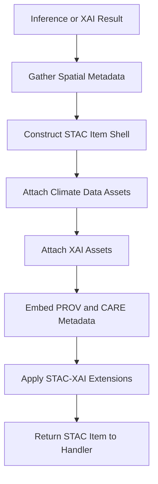

<div align="center">

# 🗂️🤖📊 **Climate AI Realtime STAC-XAI Handler**  
`docs/pipelines/ai/inference/climate/realtime/handlers/stac-xai.md`

**Purpose**  
Define the subsystem that constructs **STAC 1.0 + XAI metadata** for all realtime Climate AI inference and XAI outputs.  
This handler integrates inference/XAI products with STAC Items, STAC Collections, STAC-XAI extensions, provenance metadata, CARE governance decisions, and deterministic seed-lock fields to support FAIR, reproducible climate intelligence.

</div>

---

## 📘 Overview

The STAC-XAI handler builds STAC metadata for all:

- Inference outputs (climate fields)  
- Driver outputs (CAPE, CIN, shear, LLJ, etc.)  
- XAI outputs (SHAP fields, spatial attributions, CAM-like overlays)  

It ensures:

- STAC Items follow **STAC 1.0.0**
- XAI assets follow **KFM-STAC v11** extension definitions  
- Assets are declared with `roles: ["data", "xai"]`  
- CRS + bbox are explicitly provided  
- Timestamps and seed-locks are included  
- PROV-O metadata is linked via JSON-LD  
- CARE + sovereignty metadata are embedded  

Outputs are consumable by:

- Map viewers  
- Story Node v3 generators  
- Focus Mode v3 explainability overlays  
- Internal hazard pipelines  
- Downstream ETL and archival subsystems  

---

## 🧭 STAC-XAI Assembly Flow (Mermaid-Safe)



---

## 🗂️ Required STAC-XAI Fields

Each STAC Item MUST include:

### **1. Core STAC Fields**
- `stac_version: "1.0.0"`  
- `id` (UUID or ULID)  
- `type: "Feature"`  
- `geometry` (GeoJSON)  
- `bbox`  
- `properties.datetime`  

### **2. STAC-XAI Extensions**
Under `properties`:

- `xai:method` (“shap”, “ig”, “cam”...)  
- `xai:variable`  
- `xai:seed`  
- `xai:attribution_uri` or inline attribution  
- `xai:resolution`  
- `xai:explainability_level` (local/spatial/narrative)  

### **3. CRS Metadata**
- `proj:epsg`  
- `proj:wkt` (optional)  

### **4. Climate Metadata**
- `kfm:model_version`  
- `kfm:variables` or `kfm:drivers`  
- `kfm:input_items` (list of STAC item refs)  
- `kfm:vertical_axis`  

### **5. CARE Fields**
- `care:masking`  
- `care:scope`  
- `care:notes[]`  

### **6. PROV Metadata**
Integrated via JSON-LD context or embedded provenance object:

- `prov:wasGeneratedBy`  
- `prov:used`  
- `prov:wasInfluencedBy`  
- `prov:agent`  

---

## 🧩 Asset Definitions (Data + XAI)

Example asset section:

```json
{
  "assets": {
    "t2m": {
      "href": "s3://bucket/tiles/t2m.tif",
      "type": "image/tiff",
      "roles": ["data"]
    },
    "shap_t2m": {
      "href": "s3://bucket/xai/t2m_shap.tif",
      "type": "image/tiff",
      "roles": ["xai", "explanation"]
    }
  }
}
```

Rules:

- **Data assets** → `roles: ["data"]`  
- **XAI assets** → `roles: ["xai", "explanation"]`  
- Assets MUST include a deterministic multihash checksum  

---

## 📦 STAC Collections and Namespacing

STAC-XAI handler MUST:

- Group related inference and XAI items under STAC Collections  
- Provide collection-level metadata:  
  - Spatial extent  
  - Temporal extent  
  - Model versions covered  
  - Variables/Drivers included  
- Add STAC-XAI extensions to collection metadata  

Collections MUST be versioned deterministically using:

```
kfm-stac-collection-<model-version>-<date>
```

---

## 🔍 Example STAC-XAI Item (JSON Sketch)

```json
{
  "stac_version": "1.0.0",
  "type": "Feature",
  "id": "xai-item-1234",
  "geometry": {...},
  "bbox": [...],
  "properties": {
    "datetime": "2025-06-03T00:00:00Z",
    "proj:epsg": 4326,
    "xai:method": "shap",
    "xai:variable": "t2m",
    "xai:explainability_level": "local",
    "kfm:model_version": "kfm-climate-v11.2.2",
    "care:masking": "h3-generalized",
    "care:scope": "public-generalized"
  },
  "assets": {
    "data": {
      "href": "s3://bucket/tiles/t2m.tif",
      "type": "image/tiff",
      "roles": ["data"]
    },
    "xai_map": {
      "href": "s3://bucket/xai/t2m_shap.tif",
      "type": "image/tiff",
      "roles": ["xai", "explanation"]
    }
  },
  "prov": {
    "wasGeneratedBy": "urn:kfm:activity:xai:abcd",
    "used": ["urn:kfm:stac:item-qwerty"],
    "agent": "urn:kfm:service:climate-xai-engine"
  }
}
```

---

## 🧪 CI & Validation Requirements

CI MUST validate:

- STAC Item passes STAC 1.0 schema  
- All `xai:*` fields present for XAI items  
- Deterministic IDs + hashes  
- All assets contain `roles` and `type`  
- CARE and PROV metadata blocks present  
- CRS fields valid  
- STAC-XAI collection manifests exist and follow naming rules  
- JSON-LD extension bindings valid  

Failures MUST block merge.

---

## 🕰 Version History

| Version  | Date       | Notes                                    |
|----------|------------|------------------------------------------|
| v11.2.2  | 2025-11-28 | Initial STAC-XAI handler documentation.  |

---

<div align="center">

### 🔗 Footer  
[⬅ Back to Handlers](README.md) ·  
[🌡️ Realtime Inference Root](../README.md) ·  
[🏛 Governance](../../../../standards/governance/ROOT-GOVERNANCE.md)

</div>

