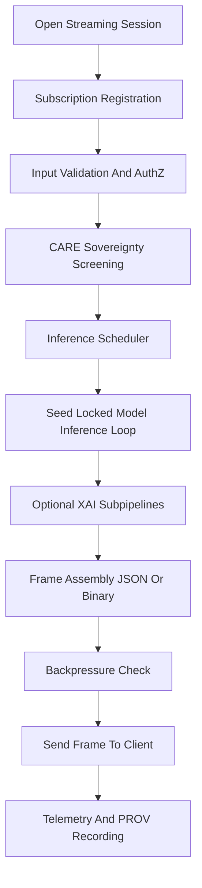

<div align="center">

# 📡🌡️🔁 **Climate AI Realtime Streaming Handlers**  
`docs/pipelines/ai/inference/climate/realtime/handlers/streaming-handlers.md`

**Purpose**  
Define the streaming subsystem for realtime Climate AI inference, supporting SSE streams,  
multiplexed multi-variable channels, driver feeds, XAI overlays, backpressure control,  
FAIR+CARE masking, and sovereign-safe realtime updates across REST/WS/gRPC pipelines.

</div>

---

## 🗂️ Directory Layout (v11.2.2)

    docs/pipelines/ai/inference/climate/realtime/handlers/
        📄 README.md
        📄 rest-handler.md
        📄 websocket-handler.md
        📄 grpc-handler.md
        📄 input-validation.md
        📄 xai-handlers.md
        📄 care-governance.md
        📄 prov-xai.md
        📄 stac-xai.md
        📄 rate-limiters.md
        📄 authz.md
        📄 streaming-handlers.md      # ← This file

---

## 📘 Overview

The **Streaming Handler Layer** provides low-latency, deterministic delivery of:

- 🌡️ Climate field updates (temperature, dewpoint, wind, RH, etc.)  
- ⚡ Derived hazard drivers (CAPE, CIN, SRH, LLJ, lapse rates)  
- 🧠 XAI streams (SHAP grids, CAM overlays, spatial attributions)  
- 🗺️ Tile-based incremental map updates  
- 🔁 Multiplexed channels for simultaneous subscriptions  
- 🛡️ CARE-aware, sovereignty-filtered outputs  
- 📉 Backpressure-controlled delivery with fairness guarantees  

Streaming integrates tightly with REST, WebSocket, and gRPC, but implements additional logic  
for **interval pacing**, **session health**, **queue depth** enforcement, and **multi-stream load shedding**.

---

## 🧭 Streaming Architecture (Mermaid-Safe)



---

## 🔌 Supported Streaming Modes

### 1️⃣ **SSE (Server-Sent Events)**  
- Lightweight HTTP-based stream  
- Ideal for dashboards, low-frequency tile updates  
- Supports **delta streaming** (only changed fields)  
- CARE-masked JSON frames

### 2️⃣ **Multiplexed WebSocket Channels**  
- Multi-topic streaming using per-channel identifiers  
- Channels: `fields`, `drivers`, `xai`, `tiles`  
- Supports **priority classes** (drivers > fields > tiles)  
- Allows frame dropping under heavy load (non-critical streams only)

### 3️⃣ **gRPC Streaming**  
- Deterministic binary pipeline for high-throughput internal services  
- Bidirectional streaming for hazard chains  
- Native backpressure  
- Uses protobuf-defined `StreamFrame` messages

---

## 📦 Frame Schema Requirements

Each frame MUST contain:

```
{
  "id": "<subscription-id>",
  "time": "<iso-8601>",
  "crs": "EPSG:4326",
  "variables": [...],
  "drivers": [...],
  "xai": { ... },
  "care": {
    "masking": "h3-generalized",
    "scope": "public-stream"
  },
  "prov": {
    "activity": "urn:kfm:activity:stream:xxxx",
    "agent": "urn:kfm:service:climate-stream",
    "used": ["stac-item-uuid"]
  },
  "checksum": {
    "multihash": "1220abcd..."
  }
}
```

All frames MUST be **seed-locked deterministic** and **lineage-complete**.

---

## 🛡️ CARE + Sovereignty Enforcement

Streaming channels MUST apply:

- H3 generalization on sensitive regions  
- Resolution downgrading for protected zones  
- Denial of XAI for sovereignty-restricted inputs  
- Explicit `care:*` metadata in every frame  
- Transparent policy reasoning in PROV logs  

Requests requiring enforceable denial must send a final control frame:

```json
{
  "type": "error",
  "code": "CARE_POLICY_VIOLATION",
  "message": "Streaming request denied for protected region"
}
```

---

## 🚦 Backpressure Mechanics

Streaming handlers MUST provide:

- Queue depth monitors  
- Priority-aware frame dropping  
- Interval softening (dynamic interval expansion)  
- WebSocket `RATE_LIMIT` controls  
- SSE pacing adjustments  
- gRPC backpressure honoring via flow-control  

---

## 🧪 CI & Testing Requirements

Tests MUST cover:

- Subscription lifecycle (open → update loop → close)  
- CARE + sovereignty gate correctness  
- Multi-channel routing and load handling  
- Deterministic frames under seed-lock  
- SSE edge cases (network jitter, broken pipes)  
- WebSocket multiplexing collisions  
- gRPC backpressure correctness  
- Complete PROV frames for all streaming types  
- STAC-XAI asset linking for spatial outputs  

CI MUST fail if:

- Any streaming mode bypasses CARE filters  
- Frame schema missing required metadata  
- Backpressure thresholds not enforced  
- Determinism is violated  

---

## 🕰 Version History

| Version  | Date       | Notes                                           |
|----------|------------|-------------------------------------------------|
| v11.2.2  | 2025-11-28 | Initial streaming handler subsystem document.   |

---

<div align="center">

### 🔗 Footer  
[⬅ Back to Handlers](README.md) ·  
[🌡️ Realtime Inference Root](../README.md) ·  
[🏛 Governance](../../../../standards/governance/ROOT-GOVERNANCE.md)

</div>

