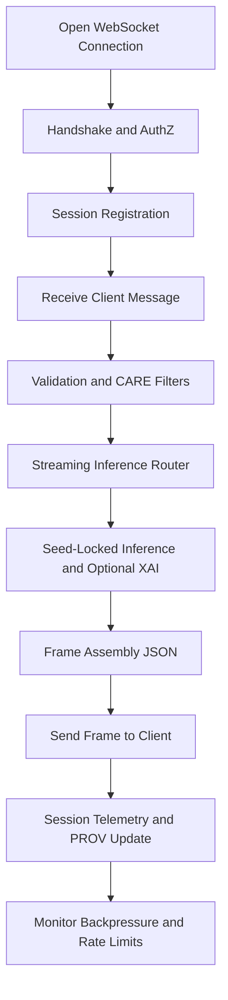

<div align="center">

# 🔗📡📞 **Climate AI Realtime WebSocket Handler**  
`docs/pipelines/ai/inference/climate/realtime/handlers/websocket-handler.md`

**Purpose**  
Specify the WebSocket streaming handler for realtime Climate AI inference.  
This handler manages persistent connections, validates streaming requests, enforces FAIR+CARE and sovereignty rules, routes streaming inference and XAI flows, and emits deterministic, provenance-rich messages.

</div>

---

## 📘 Role in the Realtime Stack

The WebSocket handler provides **persistent, bidirectional streaming** for:

- Live climate field updates  
- Streaming hazard driver fields  
- On-demand spatial XAI overlays  
- Continuous tiles for Story Nodes and Focus Mode views  

It is designed for:

- Long-lived client sessions (dashboards, map viewers, analyst consoles)  
- Low-latency push of new inference outputs  
- Efficient backpressure and rate control  
- Rich telemetry + PROV-O lineage at session granularity  

The handler coordinates:

- WebSocket handshake, authz, and session setup  
- Streaming-level input validation and CARE enforcement  
- Routing to inference and XAI subservices  
- Session-scoped STAC-XAI metadata and PROV-O activities  
- Session metrics (duration, message counts, drops, errors)  

---

## 🌐 WebSocket Endpoint

### URL

- `wss://{host}/ws/climate`

### Subprotocols (example)

- `kfm.climate.v11.stream`  
- `kfm.climate.v11.xai`  

Clients MAY request a specific subprotocol; server negotiates the one supported.

---

## 📨 Message Types

All messages are **JSON** frames within the WebSocket.

### 1. Client → Server: `subscribe`

Used to subscribe to one or more data streams.

```json
{
  "type": "subscribe",
  "id": "sub-001",
  "stream": "climate.fields",
  "variables": ["t2m", "td2m"],
  "time_mode": "realtime",
  "domain": {
    "crs": "EPSG:4326",
    "bbox": [-101.0, 36.9, -94.6, 40.1]
  },
  "options": {
    "interval_seconds": 60,
    "seed": 42
  }
}
```

### 2. Client → Server: `subscribe_drivers`

```json
{
  "type": "subscribe_drivers",
  "id": "sub-drivers-001",
  "stream": "climate.drivers",
  "drivers": ["cape", "cin", "srh_0_3km"],
  "time_mode": "realtime",
  "domain": {
    "crs": "EPSG:4326",
    "bbox": [-100.0, 37.0, -96.0, 39.5]
  },
  "options": {
    "interval_seconds": 300
  }
}
```

### 3. Client → Server: `subscribe_xai`

```json
{
  "type": "subscribe_xai",
  "id": "sub-xai-001",
  "stream": "climate.xai.spatial",
  "variable": "t2m",
  "method": "shap",
  "time": "2025-06-03T00:00:00Z",
  "domain": {
    "crs": "EPSG:4326",
    "bbox": [-98.5, 38.0, -97.5, 39.0]
  }
}
```

### 4. Client → Server: `unsubscribe`

```json
{
  "type": "unsubscribe",
  "id": "sub-001"
}
```

### 5. Server → Client: `data`

Streaming payload for climate fields or drivers.

```json
{
  "type": "data",
  "id": "sub-001",
  "time": "2025-06-03T00:00:00Z",
  "variables": ["t2m", "td2m"],
  "data": {
    "t2m": {...},
    "td2m": {...}
  },
  "stac": {
    "items": ["stac-item-uuid-1"]
  },
  "checksums": {
    "multihash": "1220abcd..."
  },
  "prov": {
    "activity": "urn:kfm:activity:ws:infer:abcd",
    "used": ["urn:kfm:data:stac:..."],
    "agent": "urn:kfm:service:climate-ws-api"
  },
  "care": {
    "masking": "h3-generalized",
    "scope": "public-stream"
  }
}
```

### 6. Server → Client: `xai`

XAI overlay payload.

```json
{
  "type": "xai",
  "id": "sub-xai-001",
  "time": "2025-06-03T00:00:00Z",
  "variable": "t2m",
  "method": "shap",
  "attribution": {
    "features": ["t2m", "td2m", "u10", "v10"],
    "contributions": [...]
  },
  "prov": {
    "activity": "urn:kfm:activity:ws:xai:efgh"
  },
  "care": {
    "scope": "public-generalized"
  }
}
```

### 7. Server → Client: `error`

```json
{
  "type": "error",
  "ref": "sub-001",
  "code": "INVALID_REQUEST",
  "message": "Variables or domain not allowed",
  "details": {
    "field": "variables"
  }
}
```

---

## 🧭 WebSocket Handler Flow



---

## 🧪 Validation and Session Rules

The WebSocket handler MUST enforce:

- Initial **authz** check on connection:  
  - Valid API key or bearer token  
  - Required scopes for streaming, drivers, XAI  

- Per-subscription validation:  
  - Schema correctness for `subscribe*` messages  
  - Variable and driver allowlists  
  - Domain constraints (CRS, bbox size, vertical axis)  
  - Time-mode permissions (`realtime`, limited look-back, etc.)  

- Session caps and limits:  
  - Max concurrent subscriptions per session  
  - Max message rate per session  
  - Max payload size  

Invalid subscriptions MUST produce an `error` frame and may result in subscription rejection or session closure if persistent.

---

## 🔐 FAIR+CARE and Sovereignty Safeguards

The WebSocket handler MUST:

- Apply H3-based generalization for sensitive locations  
- Reduce spatial precision over protected regions  
- Tag all frames with CARE metadata (`scope`, `masking`, `notes`)  
- Enforce sovereignty policies as defined in `sovereignty_policy`  
  - Deny or downsample streams intersecting protected areas  
  - Emit explicit CARE violation errors where applicable  

Example CARE violation frame:

```json
{
  "type": "error",
  "code": "CARE_POLICY_VIOLATION",
  "message": "Requested streaming region intersects protected area",
  "details": {
    "policy": "INDIGENOUS-DATA-PROTECTION"
  }
}
```

---

## 🧩 XAI Streaming Integration

XAI support over WebSocket includes:

- Periodic spatial attributions (e.g. XAI overlays synced with data frames)  
- On-demand local XAI for specific coordinates or tiles  
- Multi-frame narratives for Focus Mode and Story Nodes  

WebSocket handler responsibilities:

- Route XAI subscribe messages to XAI services  
- Attach `kfm:model_version`, `kfm:input_items`, and checksums  
- Ensure all XAI frames include PROV and CARE tags  
- Enforce any XAI-specific rate limits and privacy rules  

---

## 🚦 Backpressure, Rate Limiting, and Close Semantics

The handler MUST:

- Monitor outbound queue sizes per session  
- Apply backpressure:  
  - Drop frames in a controlled way or  
  - Reduce frequency / resolution  
- Enforce configured rate limits per session and per token  
- Close or downgrade sessions that constantly exceed limits  

On closure, send a final control frame:

```json
{
  "type": "control",
  "code": "SESSION_CLOSED",
  "reason": "Rate limit exceeded"
}
```

---

## 🧪 Testing and CI Requirements

Test coverage MUST include:

- Connection setup and teardown  
- AuthZ success and failure paths  
- Subscription validation for fields, domain, time, variables  
- CARE and sovereignty rule paths (allow, degrade, reject)  
- Streaming of climate fields and drivers at configured intervals  
- XAI streaming frames for `/subscribe_xai`  
- Backpressure and rate-limiting scenarios  
- PROV and STAC-XAI metadata presence on data frames  
- Deterministic data frames under fixed seed  

CI MUST fail if:

- Message schemas drift from spec  
- CARE or sovereignty checks are missing in critical paths  
- Telemetry or PROV fields are absent in data frames  
- Streaming becomes non-deterministic under seed lock  

---

## 🕰 Version History

| Version  | Date       | Notes                                               |
|----------|------------|-----------------------------------------------------|
| v11.2.2  | 2025-11-28 | Initial WebSocket handler specification for v11.2.2 |

---

<div align="center">

### 🔗 Footer  
[⬅ Back to Handlers](README.md) ·  
[🌡️ Realtime Inference Root](../README.md) ·  
[🏛 Governance](../../../../standards/governance/ROOT-GOVERNANCE.md)

</div>

