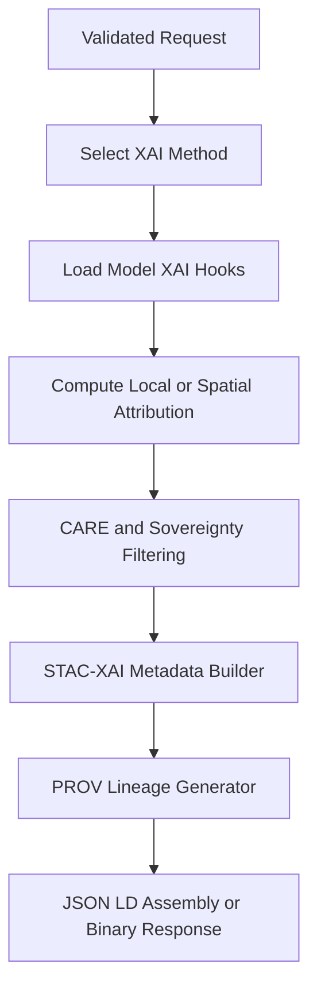

<div align="center">

# 🧠📊🌡️ **Climate AI Realtime XAI Handlers**  
`docs/pipelines/ai/inference/climate/realtime/handlers/xai-handlers.md`

**Purpose**  
Specify the XAI (Explainable AI) handlers supporting realtime Climate AI inference.  
These handlers compute local and spatial attributions (SHAP, IG, CAM), enforce FAIR+CARE rules, and integrate XAI outputs into JSON-LD + STAC-XAI + PROV-O structures for REST, WebSocket, and gRPC transports.

</div>

---

## 📘 Role in the Realtime Stack

XAI handlers serve as **specialized subcomponents** invoked by:

- REST (`/explain/local`, `/explain/spatial`)  
- WebSocket (`subscribe_xai`)  
- gRPC (`ExplainLocal`, `ExplainSpatial`)  

They operate **after input validation** and **before response assembly**, producing:

- Local feature attributions  
- Spatial heatmaps  
- Narrative driver insights (for Story Node v3)  
- STAC-XAI and PROV metadata  
- CARE-compliant interpretations  

---

## 🔍 XAI Modes Supported

### 1️⃣ Local XAI (Point-Based)

Computes attributions for a **single point**:

- SHAP value vector  
- Integrated Gradients attribution  
- Minimal CAM (if spatial shading available)  

Triggered via:

- `POST /explain/local`  
- gRPC `ExplainLocal`  
- WebSocket `subscribe_xai` (point mode)  

---

### 2️⃣ Spatial XAI (Domain-Based)

Computes XAI over a **small bounding box**:

- SHAP spatial fields  
- CAM-like maps  
- Gradient-based spatial overlays  

Triggered via:

- `POST /explain/spatial`  
- gRPC `ExplainSpatial`  
- WebSocket `subscribe_xai` (spatial mode)  

---

### 3️⃣ Narrative XAI (Driver Context)

Extracts **human-readable explanations** suitable for:

- Story Node v3  
- Focus Mode v3  
- Climate-driven narrative overlays  

Narrative XAI synthesizes:

- Top contributing drivers  
- Dominant instabilities  
- Outlier patterns in the input vector  
- Temporal trends influencing a variable  

---

## 🔬 XAI Handler Architecture



---

## 📦 XAI Output Schema (JSON-LD)

Every XAI output MUST include:

- `@context` — XAI JSON-LD context  
- `kfm:model_version`  
- `kfm:input_items` (STAC Items upstream of inference)  
- `checksum.multihash`  
- `prov` — PROV-O compliant:  
  - `wasGeneratedBy`  
  - `used`  
  - `agent`  
- `care` — CARE metadata:  
  - `masking`  
  - `scope`  
  - `notes`  

Example (local XAI):

```json
{
  "@context": "https://schemas.kfm.dev/xai-v1.jsonld",
  "variable": "t2m",
  "method": "shap",
  "attribution": {
    "features": ["t2m", "td2m", "u10", "v10"],
    "contributions": [1.2, -0.4, 0.1, 0.3]
  },
  "checksum": {
    "multihash": "1220abcd..."
  },
  "prov": {
    "wasGeneratedBy": "urn:kfm:activity:xai:abcd",
    "used": ["urn:kfm:data:stac:..."],
    "agent": "urn:kfm:service:climate-realtime-api"
  },
  "care": {
    "masking": "h3-generalized",
    "scope": "public-generalized"
  }
}
```

---

## 🛡️ CARE + Sovereignty Enforcement

XAI results MUST:

- Mask sensitive areas using H3 generalization  
- Avoid exposing precise model internals that reveal sensitive geospatial data  
- Apply CARE scoping labels on all outputs  
- Respect Indigenous sovereignty zones defined in `sovereignty_policy`  
- Provide **explicit CARE violation errors** when XAI cannot be performed safely  

Example CARE violation:

```json
{
  "error": {
    "code": "CARE_POLICY_VIOLATION",
    "message": "Requested XAI domain intersects protected area",
    "details": {
      "policy": "INDIGENOUS-DATA-PROTECTION"
    }
  }
}
```

---

## 🚦 Performance, Seed-Lock, and Stability Requirements

XAI handlers MUST:

- Use deterministic seed-lock for reproducible attributions  
- Support tile-level batching for spatial XAI  
- Use optimized backends (GPU/CPU configurable)  
- Adhere to realtime latency thresholds (configurable SLA)  

Failure to meet SLA MUST result in:

- Downgraded XAI (reduced resolution) or  
- Fallback to narrative-only XAI  

---

## 🧪 Testing and CI Requirements

CI MUST verify:

- XAI method selection correctness  
- Deterministic local and spatial results  
- CARE + sovereignty enforcement  
- STAC-XAI metadata correctness  
- PROV lineage generation  
- JSON-LD validation  
- Seed-lock stability  
- Fail-fast behavior when domain or variables are invalid  

Test suites MUST include:

- SHAP tests  
- Integrated Gradients tests  
- CAM spatial maps  
- Edge-case domains (tiny and large)  
- Protected-area XAI denial  

---

## 🕰 Version History

| Version  | Date       | Notes                                      |
|----------|------------|--------------------------------------------|
| v11.2.2  | 2025-11-28 | Initial XAI handler specification for v11.2.2 |

---

<div align="center">

### 🔗 Footer  
[⬅ Back to Handlers](README.md) ·  
[🌡️ Realtime Inference Root](../README.md) ·  
[🏛 Governance](../../../../standards/governance/ROOT-GOVERNANCE.md)

</div>

