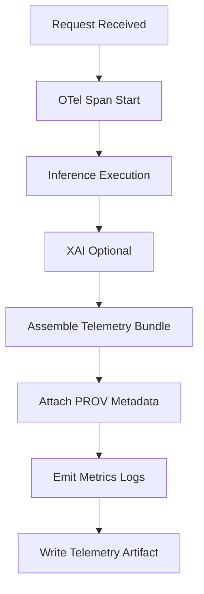

<div align="center">

# 📊🌡️⚡ **Climate Realtime Telemetry Examples**  
`docs/pipelines/ai/inference/climate/realtime/telemetry/examples/README.md`

**Purpose**  
Provide canonical examples of **OpenTelemetry (OTel)** spans, metrics, logs, and **PROV-O lineage**  
records for realtime Climate AI inference.  
Used to validate pipeline observability, determinism, FAIR+CARE compliance, energy/carbon accounting,  
and XAI interpretability telemetry for REST/WebSocket/gRPC handlers.

</div>

---

## 🗂️ Directory Layout (v11.2.2)

    docs/pipelines/ai/inference/climate/realtime/telemetry/examples/
        📄 README.md                     # This file
        📄 example-span.json             # OTel span example
        📄 example-provenance.json       # PROV-O lineage example
        📄 example-xai-telemetry.json    # XAI attribution telemetry
        📄 example-energy.json           # Energy/Wh telemetry bundle
        📄 example-carbon.json           # Carbon/gCO2e telemetry bundle

---

## 📘 Overview

Realtime Climate AI inference must generate **complete, deterministic telemetry**, including:

- **OTel spans** for inference lifecycle  
- **Metrics** (latency, inference time, XAI time, memory, GPU utilization)  
- **Event logs** for validation failures, CARE denials, throttling events  
- **Energy + carbon bundles** (Wh + gCO₂e per inference)  
- **STAC-linked asset telemetry**  
- **PROV-O lineage** for inference → XAI → streaming chains  
- **Seed-lock indicators** ensuring determinism  
- **CARE flags** in telemetry for protected-region enforcement  

All examples here are **synthetic but schema-valid**.

---

## 🧭 Telemetry Lifecycle (Mermaid-Safe)



---

## 🟦 Example: OTel Span (Inference)

```json
{
  "trace_id": "0af7651916cd43dd8448eb211c80319c",
  "span_id": "b9c7c989f97918e1",
  "name": "climate.inference.execute",
  "attributes": {
    "kfm.seed": 42,
    "kfm.model_version": "kfm-climate-v11.2.2",
    "kfm.variables": ["t2m","td2m","u10","v10"],
    "kfm.crs": "EPSG:4326",
    "kfm.care.scope": "public-generalized",
    "kfm.sovereignty.action": "allow",
    "system": "climate-realtime-api"
  },
  "duration_ms": 87.2,
  "status": "OK"
}
```

---

## 🟩 Example: PROV-O Lineage

```json
{
  "prov": {
    "wasGeneratedBy": "urn:kfm:activity:infer:abcd1234",
    "used": [
      "urn:kfm:data:stac:item-123",
      "urn:kfm:data:stac:item-456"
    ],
    "wasInfluencedBy": "urn:kfm:care:decision:h3mask-001",
    "agent": "urn:kfm:service:climate-realtime-api"
  }
}
```

---

## 🟧 Example: XAI Telemetry

```json
{
  "xai": {
    "method": "shap",
    "variable": "t2m",
    "duration_ms": 29.4,
    "attribution_checksum": "1220abcd...",
    "care.scope": "public-generalized",
    "prov.activity": "urn:kfm:activity:xai:efgh5678"
  }
}
```

---

## 🔋 Example: Energy Telemetry (Wh)

```json
{
  "energy_wh": {
    "inference_wh": 0.044,
    "xai_wh": 0.012,
    "total_wh": 0.056
  }
}
```

---

## 🌍 Example: Carbon Telemetry (gCO₂e)

```json
{
  "carbon_gco2e": {
    "inference_g": 0.21,
    "xai_g": 0.09,
    "total_g": 0.30
  }
}
```

---

## 🧪 CI Validation Requirements

CI MUST validate:

- Telemetry schema correctness (OTel + PROV-O + FAIR+CARE + STAC extensions)  
- Deterministic telemetry under seed-lock  
- No missing fields in required bundles (energy, carbon, CARE flags, provenance)  
- All example artifacts in this directory pass JSON Schema validation  
- No prohibited keys (per KFM-PDC v11)  
- All examples include minimal CARE metadata  

Any violation → CI blocks merge.

---

## 🕰 Version History

| Version  | Date       | Notes                                              |
|----------|------------|----------------------------------------------------|
| v11.2.2  | 2025-11-28 | Initial telemetry examples for Climate RT v11.2.2  |

---

<div align="center">

### 🔗 Footer  
[⬅ Back to Telemetry](../README.md) ·  
[🌡️ Realtime Inference Root](../../README.md) ·  
[🏛 Governance](../../../../../standards/governance/ROOT-GOVERNANCE.md)

</div>

