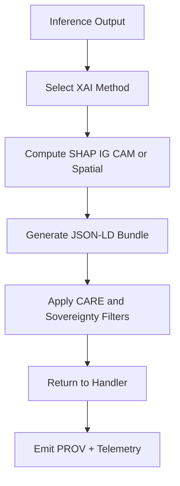

# 🌡️⚡🧠📄 **Realtime Climate XAI Layer — KFM v11.2.2**  
`docs/pipelines/ai/inference/climate/realtime/xai/README.md`

**Purpose:**  
Provide the **realtime explainability subsystem** for Climate AI Inference, supporting **SHAP**, **Integrated Gradients**, **CAMs**, and **Spatial Attribution**, producing **JSON-LD explainability bundles**, **STAC-XAI metadata**, and **PROV-O lineage** for live climate predictions in KFM.

---

## 📘 Overview

The Climate Realtime XAI module provides **on-demand**, **low-latency**, and **deterministic** explainability for:

- 🌡️ Downscaled climate variables  
- 💧 Climate anomaly / drift detections  
- 💨 Hazard-linked climate drivers  
- ❄️ Snowpack / freeze-thaw predictions  
- 🔮 Any AI-generated climate inference  

Realtime XAI supports:

- **Focus Mode v3** (map-aware climate reasoning)  
- **Story Node v3** (narrative-ready semantic evidence)  
- **Governance dashboards** (FAIR+CARE compliance)  
- **Realtime API responses** (REST, WebSocket, gRPC)

Compute intensity varies — handlers may throttle or queue XAI requests.

---

## 🗂 Directory Layout (v11.2.2)

    docs/pipelines/ai/inference/climate/realtime/xai/
    ├── 📄 README.md                     # This file
    │
    ├── 📄 shap.py                       # SHAP local explainability
    ├── 📄 ig.py                         # Integrated Gradients local explainability
    ├── 📄 cams.py                       # CAM spatial attribution
    └── 📄 spatial.py                    # Realtime spatial-attribution mini-rasters/tiles

---

## 🤖 XAI Methods Supported

### 1. 🔍 SHAP Local (Event-Level Attribution)
- Per-query attribution  
- Feature-importance vectors  
- Deterministic under seed lock  
- JSON-LD semantic driver mapping  
- CARE-protected output  

### 2. 🧬 Integrated Gradients (IG Local)
- Gradient-based explainability  
- Suitable for deeper climate inference models  
- Produces semantic driver lists  
- Supports H3-masked spatial metadata  

### 3. 🛰️ CAMs (Class Activation Maps)
- Spatial relevance for CNN/Transformer climate models  
- Optional COG/GeoParquet mini-tile outputs  
- Downsampled for realtime constraints  
- Always H3-generalized  

### 4. 🗺️ Spatial Attribution (Raster/Tile Micro-Surfaces)
- Lightweight spatial surfaces  
- Useful for Focus Mode v3 contextual visualizations  
- Optional multiscale tiles  
- Full governance enforcement  

All of the above support:

- JSON-LD export  
- XAI driver taxonomy  
- STAC-XAI compliance  
- PROV-O lineage  
- CARE & sovereignty metadata  

---

## 🧬 JSON-LD Outputs (Realtime)

Each explainability call (SHAP, IG, CAM, Spatial) must emit:

- **JSON-LD bundle** with:
  - `@context` (KFM-XAI + PROV-O)  
  - `xai:drivers`  
  - `xai:hazard_links` (if used for hazard drivers)  
  - `xai:spatial_context` (H3 generalized)  
  - `care:*` metadata  
  - `sovereignty:*` flags  
  - `kfm:model_version`  
  - `kfm:input_items`  
  - `checksum:multihash`  
  - `prov:*` lineage  

---

## 🧭 Realtime XAI Flow (GitHub-Safe Mermaid)

---

## 🔐 FAIR+CARE & Sovereignty Requirements

Realtime XAI MUST:

- Apply H3 spatial masking  
- Avoid sensitive geographic inference  
- Provide CARE scope + notes  
- Include sovereignty flags  
- Follow Data Contract v3  
- Ensure all climate narratives remain non-speculative  

---

## 📡 STAC-XAI Requirements

If realtime outputs are persisted:

- Must embed `kfm:explainability:{local|spatial}`  
- Must include JSON-LD linkage fields  
- Must include CRS + vertical axis metadata  
- Must register in STAC Collection if configured  

---

## 🧪 CI Requirements

Realtime XAI code MUST pass:

- Deterministic attribution test  
- JSON-LD schema validation  
- STAC-XAI metadata validation  
- CARE + sovereignty lint checks  
- CRS + vertical validation (if spatial)  
- PROV lineage completeness  
- Performance thresholds (latency under configured limit)

---

## 🕰 Version History

| Version  | Date       | Notes                                                           |
|----------|------------|-----------------------------------------------------------------|
| v11.2.2  | 2025-11-28 | Initial realtime XAI specification (SHAP, IG, CAM, Spatial)     |

---

### 🔗 Footer  
[⬅ Back to Realtime Inference](../README.md) • [🌡️ Climate Inference Root](../../README.md) • [🏛 Governance](../../../../../standards/governance/ROOT-GOVERNANCE.md)

