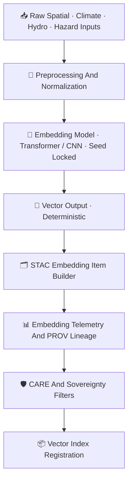

<div align="center">

# 🔡🧠📡 **Embeddings AI Inference Pipeline — KFM v11.2.2 (MAX MODE)**  
`docs/pipelines/ai/inference/embeddings/README.md`

**Purpose**  
Define the unified **Embeddings Inference System** for KFM, generating  
deterministic, sovereignty-safe, FAIR+CARE-compliant **geospatial, climate, hydrology,  
hazard, and narrative embeddings** used across:

🗺️ **Vector Search**  
🌡️ **Climate Model Similarity**  
💧 **Hydrology Pattern Retrieval**  
🌪️ **Hazard Analog Detection**  
🧠 **Story Node v3 Embedding Models**  
🎯 **Focus Mode v3 Contextual Embeddings**  
📦 **STAC-linked embedding catalogs**  

</div>

---

## 📘🔡🧬 **Overview — What Are KFM Embeddings?**

Embeddings here refer to **semantic, geospatial, or physical-representation vectors**  
that encode:

- 🗺️ Spatial signatures (terrain, landcover, watershed, H3 neighborhoods)  
- 🌡️ Climate envelopes (temp/RH/wind/pressure snapshots)  
- 💧 Hydrological states (soil moisture, runoff, streamflow patterns)  
- 🌊 Hazard fingerprints (flood/hail/tornado/heat/winter profiles)  
- 📜 Historical & narrative semantics (KFM Story Nodes)  
- 🧠 Multi-modal fusion vectors (text + geospatial + climate)  

These vectors enable **fast similarity search**, **multi-hazard analog retrieval**,  
**context-aware inference**, and **dynamic Focus Mode experiences**.

Embeddings MUST be:

- Deterministic  
- Seed-locked  
- FAIR+CARE-governed  
- Sovereignty-safe  
- STAC-linked  
- PROV-O traceable  
- XAI-compatible  

---

## 🗂️📁🔡 **Directory Layout**

```
docs/pipelines/ai/inference/embeddings/
    📄 README.md                          # ← This file
    📄 spatial-embeddings.md               # Geospatial/H3 embeddings
    📄 climate-embeddings.md               # Climate field embeddings
    📄 hydrology-embeddings.md             # Hydro/watershed vector models
    📄 hazard-embeddings.md                # Multi-hazard latent representations
    📄 narrative-embeddings.md             # Story Node v3 embedding models
    📄 index/                              # Vector index structures
        📄 README.md
        📄 faiss-index.md
        📄 hnsw-index.md
    📁 telemetry/                          # OTel, PROV, XAI, energy/carbon bundles
        📄 README.md
```

---

## 🧬🔡📡 **Embeddings Pipeline Architecture**



---

## 🌍🗺️📌 **Types of Embeddings Produced**

### 1️⃣ 🗺️ Geospatial Embeddings  
Encode spatial context:

- Terrain slope & relief  
- Landcover classes  
- Watershed membership  
- H3 spatial fingerprints  

### 2️⃣ 🌡️ Climate Embeddings  
Represent:

- Temperature fields  
- Dewpoint/RH  
- Winds  
- Pressure layers  
- Downscaled climate states  

### 3️⃣ 💧 Hydrology Embeddings  
Capture:

- Soil moisture patterns  
- Streamflow regimes  
- Runoff signatures  
- Flood precursors  
- Drought morphology  

### 4️⃣ 🌪️🌊🔥 Hazard Embeddings  
High-dimensional hazard fingerprints:

- Tornado/hail analogs  
- Flood + rise-rate patterns  
- Fire-weather states  
- Heat/winter extremes  

### 5️⃣ 🧠 Narrative Embeddings  
For Story Node v3:

- Place-based historical vectors  
- Climate–culture–landscape embeddings  
- Temporal semantic encodings  

---

## 💡🔍🧠 **XAI for Embeddings**

Embeddings MUST expose:

- Variable contribution scores  
- CAM overlays for geospatial tokens  
- Attention maps (Transformer-based models)  
- Deterministic XAI for reproducibility  
- STAC-XAI compliant metadata  

Example:

```json
{
  "xai": {
    "importance": {
      "temp": 0.22,
      "soil_moisture": 0.18,
      "wind": 0.12,
      "terrain": 0.30,
      "hazard_signal": 0.18
    },
    "seed": 42
  }
}
```

---

## 🛡️⚖️🧭 **FAIR+CARE + Sovereignty Compliance**

Embeddings MUST:

- Generalize protected areas  
- Remove sensitive watershed signatures  
- Mask tribal/historic sites  
- Avoid revealing culturally sensitive hazard patterns  
- Carry full CARE metadata:

```json
{
  "care": {
    "masking": "h3-generalized",
    "scope": "public-generalized",
    "notes": ["Embedding vector generalized to respect sovereignty boundaries"]
  }
}
```

---

## 📦🧾📡 **Outputs**

Each embedding run MUST produce:

- `<domain>_embedding_vector.npy` or parquet  
- `<domain>_embedding_metadata.json`  
- `<domain>_embedding_summary.json`  
- STAC Item referencing inputs + outputs  
- PROV-O lineage  
- CARE block  
- Deterministic seed indicators  
- Energy & carbon telemetry

---

## 🧪📏🔬 **CI Validation Requirements**

CI MUST validate:

- Deterministic vector generation  
- CRS + units for spatial embeddings  
- STAC-XAI compliance  
- PROV lineage completeness  
- CARE metadata correctness  
- No sensitive region leakage  
- Index reproducibility  
- Energy & carbon logs present  

Failure → ❌ block merge.

---

## 🕰️📜 **Version History**

| Version  | Date       | Notes                                             |
|----------|------------|---------------------------------------------------|
| v11.2.2  | 2025-11-28 | Initial Embeddings Inference Pipeline (MAX MODE)  |

---

<div align="center">

### 🔗 Footer  
[🧠 Back to AI Pipelines](../README.md) ·  
[📡 Embedding Indexes](./index/README.md) ·  
[🏛 Governance](../../../standards/governance/ROOT-GOVERNANCE.md)

</div>

