<div align="center">

# 🌡️🔡🧠 **Climate Embeddings Model — KFM v11.2.2 (MAX MODE)**  
`docs/pipelines/ai/inference/embeddings/climate-embeddings.md`

**Purpose**  
Define the deterministic, FAIR+CARE-governed **Climate Embeddings Model**, which generates  
high-dimensional **climate state vectors** from downscaled fields:  
**temperature 🌞**, **dewpoint 💧**, **humidity 🌫️**, **winds 🌬️**, **pressure 🌀**,  
**cloud fields ☁️**, **CAPE/CIN ⚡**, and more — enabling climate similarity search,  
hazard precursors, Focus Mode embeddings, and Story Node v3 climate narratives.

</div>

---

## 🌞📘🌡️ **Overview — Climate Embeddings**

Climate embeddings compress multi-variable climate fields into stable vectors capturing:

- Spatial climate structure  
- Thermodynamic state  
- Moisture availability  
- Wind shear + flow regime  
- Pressure pattern fingerprints  
- Stability fields (CAPE/CIN)  
- Downscaled climate anomalies  
- Temporal climate evolution  

These vectors power:

- Climate analog search  
- Hazard precursor matching  
- Cross-modal Story Node linking  
- Focus Mode climate narrative grounding  
- Climate regime clustering and classification  

They MUST be:

- Deterministic  
- Seed-locked  
- Reproducible  
- FAIR+CARE compliant  
- Sovereignty safe  
- XAI-ready  

---

## 🧬🌡️🔡 **Climate Embeddings Pipeline (Mermaid-Safe)**

```mermaid
flowchart TD
    A[🌞 Temp Dewpoint Wind Pressure Fields] --> B[🧽 Normalize And Standardize Inputs]
    B --> C[🧠 Embedding Model Transformer Or CNN]
    C --> D[🔡 Embedding Vector Output Seed Locked]
    D --> E[🗂️ STAC Climate Embedding Item Builder]
    E --> F[📜 PROV Lineage And Telemetry]
    F --> G[🛡️ CARE Sovereignty Filters]
    G --> H[📦 Register Climate Embeddings In Vector Index]
```



---

## 🌡️💧🌬️🌀 **Input Requirements**

Climate embeddings ingest **downscaled + bias-corrected** fields:

### 1️⃣ 🌞 Temperature  
- 2 m, 850 mb, 500 mb  
- Absolute + anomaly channels

### 2️⃣ 💧 Dewpoint / Humidity  
- 2 m dewpoint  
- RH fields  
- Vapor pressure metrics

### 3️⃣ 🌬️ Winds  
- U/V components at multiple levels  
- Wind gust (optional)

### 4️⃣ 🌀 Pressure  
- MSLP  
- Mid-level pressure fields  
- Pressure anomalies  

### 5️⃣ ⚡ Stability Fields  
- CAPE, CIN  
- LCL/LFC, EL  
- Lapse rates

### 6️⃣ ☁️ Cloud Fields (Optional)  
- Cloud-top height  
- Cloud water/ice path  

### Metadata  
All MUST include:  
- CRS, units, timestamps  
- STAC references  
- FAIR+CARE classification  
- PROV chain links  

---

## 🔡🧮🌡️ **Embedding Process (ASCII-Safe)**

Core transformation:

```
embedding = f( normalized_climate_tensor ; model_version, seed )
```

Where:

- `f` = deterministic neural encoder  
- All randomness removed or seed-controlled  
- Output is a **fixed-length vector** (e.g., 128–2048 dims)  

---

## 📦🌡️📊 **Outputs**

Climate Embeddings Model MUST generate:

- `climate_embedding_vector.npy` or `.parquet`  
- `climate_embedding_metadata.json`  
- `climate_embedding_summary.json`  
- Optional CAM/attention overlays for XAI  
- Complete STAC-XAI Item  
- PROV lineage  
- CARE masking  
- Deterministic seed metadata  

---

## 💡🧠🌡️ **XAI Integration**

XAI MUST explain:

- Contributions: temp, dewpoint, wind, pressure, stability  
- Attention maps over climate fields  
- Feature importance vectors  
- Sensitivity to anomalies  
- Geographic attribution  
- STAC-XAI asset references  
- Deterministic seed tracking  

Example importance vector:

```json
{
  "xai": {
    "importance": {
      "temperature": 0.31,
      "dewpoint": 0.22,
      "winds": 0.18,
      "pressure": 0.15,
      "stability": 0.14
    },
    "seed": 42
  }
}
```

---

## 🛡️⚖️🌎 **FAIR+CARE + Sovereignty Enforcement**

Climate embeddings MUST NOT encode:

- Sensitive tribal land atmospheric signals  
- Hyperlocal climate-driven risk features  
- Protected ecological microclimates  

Apply:

```json
{
  "care": {
    "masking": "h3-climate-generalized",
    "scope": "public-generalized",
    "notes": ["Climate embeddings generalized inside sovereignty-protected regions"]
  }
}
```

---

## 🔒⚙️🧪 **Determinism Requirements**

- No random initializations  
- Seed-lock on all embedding paths  
- Fixed floating-point order  
- Stable normalization  
- Reproducible across hardware  

---

## 🧪📏🔬 **CI Validation Requirements**

CI MUST ensure:

- Deterministic vector outputs  
- Complete PROV lineage  
- Correct STAC-XAI metadata  
- CARE block present  
- No leakage of sensitive geospatial signals  
- Schema validation passes for metadata  
- Energy & carbon telemetry present  

Failure → ❌ CI BLOCKED.

---

## 🕰️📜 **Version History**

| Version  | Date       | Notes                                             |
|----------|------------|---------------------------------------------------|
| v11.2.2  | 2025-11-28 | Initial Climate Embeddings Model (MAX MODE)       |

---

<div align="center">

### 🔗 Footer  
[🔡 Back to Embeddings Pipeline](./README.md) ·  
[🌡️ Climate Models](../../climate/README.md) ·  
[🏛 Governance](../../../../../standards/governance/ROOT-GOVERNANCE.md)

</div>

