<div align="center">

# 🌪️🔥🌊🌡️❄️🔡 **Hazard Embeddings Model — KFM v11.2.2 (MAX MODE)**  
`docs/pipelines/ai/inference/embeddings/hazard-embeddings.md`

**Purpose**  
Define the **Hazard Embeddings Model**, generating deterministic, FAIR+CARE–governed, sovereignty-safe  
vector representations of **tornado 🌪️**, **hail 🌨️**, **flood 🌊**, **fire-weather 🔥**, **heat 🌡️**,  
and **winter ❄️** hazard states.  
These embeddings support **hazard similarity search**, **multi-hazard analog retrieval**, **cross-domain  
hazard reasoning**, **Focus Mode**, and **Story Node v3 hazard narratives**.

</div>

---

## 🌪️📘🔥 **Overview — Hazard Embeddings**

Hazard embeddings distill multiple physical hazard layers into fixed-length vectors that encode:

- Thermodynamic precursors  
- Kinematic fields  
- Moisture and stability signals  
- Hydrology + runoff + flood precursors  
- Fire dryness + wind + VPD  
- Heat stress + WBGT + radiation  
- Winter thermal structure + freezing rain + wind chill  
- Multi-hazard state fingerprints  

These embeddings allow:

- 🌀 Hazard analog search across decades  
- 📈 Event clustering and multi-hazard pattern recognition  
- 🔥 Identifying similar precursor environments to historical outbreaks  
- 🌪️ Cross-hazard similarity (e.g., storm → hail → flood transitions)  
- 🧠 Multi-modal hazard awareness for AI agents  

All embeddings MUST be deterministic and sovereignty-safe.

---

## 🧬🌪️🔥 **Hazard Embeddings Pipeline (Mermaid-Safe)**

```mermaid
flowchart TD
    A[🌡️ Climate Hazard Inputs] --> B[🧽 Hazard Normalization Layer]
    B --> C[🧠 Embedding Encoder Hazard Transformer]
    C --> D[🔡 Hazard Vector Output Seed Locked]
    D --> E[🗂️ STAC Hazard Embedding Item Builder]
    E --> F[📜 PROV Lineage And Telemetry]
    F --> G[🛡️ CARE Sovereignty Filter]
    G --> H[📦 Register Hazard Embedding In Vector Index]
```



---

## 🌪️🌨️🌊🔥🌡️❄️ **Input Requirements**

Each hazard embedding run MAY include:

### 🌪️ Tornado Inputs  
- SRH, CAPE, CIN, shear, LLJ, dryline metrics  
- LCL height, storm motion  

### 🌨️ Hail Inputs  
- Updraft proxy  
- Freezing-level height  
- Lapse rates  
- CAPE  

### 🌊 Flood Inputs  
- Runoff, soil saturation  
- Streamflow rise  
- Flow accumulation  
- Precip burst  

### 🔥 Fire-Weather Inputs  
- VPD, RH, wind, fuel dryness, slope  

### 🌡️ Heat Inputs  
- Heat index, WBGT  
- Humidity stress  
- Radiation load  

### ❄️ Winter Inputs  
- Snowfall, freezing rain  
- Ice accretion  
- Wind chill  
- Wet bulb temperature  

### Metadata  
All MUST include:

- CRS  
- Units  
- Time metadata  
- FAIR+CARE classification  
- Sovereignty and PROV lineage markers  
- STAC references  

---

## 🔡🧮🌪️ **Embedding Process (ASCII-Safe)**

```
hazard_embedding = f( hazard_tensor ; model_version, seed )
```

Where:

- `f` is a **deterministic neural embedding encoder**  
- Input tensors are **normalized** and **sovereignty-masked**  
- Output is a **fixed-length hazard vector** (e.g., 256–2048 dims)  

---

## 📦🌪️📊 **Outputs**

The Hazard Embeddings Model MUST generate:

- `hazard_embedding_vector.npy` or `.parquet`  
- `hazard_embedding_metadata.json`  
- `hazard_embedding_summary.json`  
- Optional CAM/attention overlays  
- STAC-XAI embedding Item  
- PROV-O lineage block  
- CARE metadata block  
- Deterministic seed metadata  

---

## 💡🧠🌪️ **XAI for Hazard Embeddings**

XAI MUST reveal:

- Contribution of CAPE, CIN, shear, LLJ  
- Hail or tornado signature drivers  
- Flood/hydrology pattern signals  
- Fire dryness + wind synergy  
- Heat vs humidity vs radiation drivers  
- Winter thermodynamic structure  
- Spatial CAM overlays (if available)  
- Attention maps for hazard sequences  
- Deterministic importance vectors  

Example:

```json
{
  "xai": {
    "importance": {
      "cape": 0.22,
      "shear": 0.18,
      "soil_moisture": 0.15,
      "vpd": 0.11,
      "heat_index": 0.09,
      "snowfall": 0.10,
      "storm_motion": 0.15
    },
    "seed": 42
  }
}
```

---

## 🛡️⚖️🧭 **FAIR+CARE + Sovereignty Enforcement**

Hazard embeddings MUST:

- Remove sensitive hazard trends within tribal boundaries  
- Mask hyperlocal hazard structures from sovereignty-protected areas  
- Downsample CAM overlays  
- Include explicit CARE metadata:

```json
{
  "care": {
    "masking": "h3-hazard-generalized",
    "scope": "public-generalized",
    "notes": ["Hazard embeddings generalized in sovereignty-protected territories"]
  }
}
```

---

## 🔒⚙️🧪 **Determinism Requirements**

- Seed-lock for every embedding run  
- No stochastic components  
- Fixed ordering of hazard normalization  
- Stable floating-point ops  
- Reproducible vector generation  

---

## 🧪📏🔬 **CI Validation Requirements**

CI MUST confirm:

- Deterministic vector generation  
- Correct CRS + units  
- XAI metadata present  
- PROV lineage complete  
- Correct STAC-XAI embedding asset  
- CARE + sovereignty block present  
- No leakage of sensitive areas  
- Telemetry (OTel + carbon + energy) attached  

Failure → ❌ CI BLOCK.

---

## 🕰️📜 **Version History**

| Version  | Date       | Notes                                               |
|----------|------------|-----------------------------------------------------|
| v11.2.2  | 2025-11-28 | Initial Hazard Embeddings Model (MAX MODE)          |

---

<div align="center">

### 🔗 Footer  
[🔡 Back to Embeddings Pipeline](./README.md) ·  
[🌪️ Hazard Models](../../hazards/README.md) ·  
[🏛 Governance](../../../../../standards/governance/ROOT-GOVERNANCE.md)

</div>

