<div align="center">

# 💧🔡🧠 **Hydrology Embeddings Model — KFM v11.2.2 (MAX MODE)**  
`docs/pipelines/ai/inference/embeddings/hydrology-embeddings.md`

**Purpose**  
Define the deterministic, FAIR+CARE-compliant, sovereignty-protected  
**Hydrology Embeddings Model**, generating latent vectors representing:

🌧️ **Runoff**  
🪴 **Soil Moisture**  
🌊 **Streamflow**  
⚠️ **Flood Risk Precursors**  
🏜️ **Drought Signatures (SPI/SPEI/SSI)**  
🌀 **Watershed State Fingerprints**  

Supports hydrology similarity search, anomaly pattern recognition, hazard chaining,  
Story Node v3 hydrology narratives, and Focus Mode v3 watershed intelligence.

</div>

---

## 💧📘🔡 **Overview — Hydrology Embeddings**

Hydrology embeddings compress spatial + temporal hydrological states into stable vector  
representations that capture:

- Soil moisture structure  
- Saturation & infiltration regime  
- Runoff response to rainfall  
- Streamflow morphology  
- Flood precursors: RRHI, ΔQ/Δt rise rate  
- Watershed flow hierarchy  
- Drought morphology (multi-timescale SPI/SPEI/SSI)  
- Terrain + wetness index interactions  
- Climate–hydrology coupling signals  

These vectors enable:

- Watershed analog search  
- Regime classification  
- Downstream hazard-driver matching  
- Hydrology-aware narrative generation  
- Multi-decade hydrology retrieval  

---

## 🧬💧🔡 **Hydrology Embeddings Pipeline (Mermaid-Safe)**

```mermaid
flowchart TD
    A[🌧️ Runoff · Soil Moisture · Streamflow Inputs] --> B[🧽 Hydrology Normalization Layer]
    B --> C[🧠 Embedding Encoder · Hydro Transformer]
    C --> D[🔡 Hydro Embedding Vector Output · Seed Locked]
    D --> E[🗂️ STAC Hydrology Embedding Item Builder]
    E --> F[📜 PROV Lineage And Telemetry]
    F --> G[🛡️ CARE Sovereignty Filters]
    G --> H[📦 Register Hydrology Embeddings In Vector Index]
```



---

## 🌧️🪴🌊 **Input Requirements**

Hydrology embeddings ingest the following **seed-locked, STAC-linked, FAIR+CARE-compliant** fields:

### 1️⃣ 🌧️ Runoff  
- Runoff depth  
- Rapid Runoff Hazard Index (RRHI)  
- Infiltration parameters  

### 2️⃣ 🪴 Soil Moisture  
- Absolute + anomaly fields  
- Saturation index  
- Water-balance components  

### 3️⃣ 🌊 Streamflow  
- Discharge (Q)  
- Rise rate (ΔQ/Δt)  
- Routing topology  

### 4️⃣ 🗺️ Terrain + Watershed  
- DEM slope  
- Flow direction  
- TWI  
- Watershed membership  

### 5️⃣ 🏜️ Drought Signatures  
- SPI  
- SPEI  
- SSI  
- Multi-scale windows  

Metadata MUST include:

- CRS  
- Units  
- ISO timestamps  
- FAIR+CARE labels  
- Sovereignty constraints  
- PROV lineage  

---

## 🔡🧮💧 **Embedding Process (ASCII-Safe)**

```
hydro_embedding = f( hydrology_tensor ; model_version, seed )
```

Where:

- `f` = deterministic encoder model  
- Inputs undergo **normalization**, **masking**, **sovereignty filtering**  
- Output = **fixed-length vector** (e.g., 256–2048 dims)

---

## 📦💧📊 **Outputs**

Hydrology embeddings MUST produce:

- `hydrology_embedding_vector.npy` or `.parquet`  
- `hydrology_embedding_metadata.json`  
- `hydrology_embedding_summary.json`  
- CAM/attention overlays (optional)  
- STAC-XAI Hydrology Embedding Item  
- PROV-O lineage block  
- CARE metadata block  
- Deterministic seed metadata  

---

## 💡🧠💧 **XAI for Hydrology Embeddings**

XAI MUST explain contributions:

- Soil moisture structure  
- Runoff sensitivity  
- Streamflow rise-rate factors  
- Drought multi-scale weights  
- Terrain & watershed topology  
- Hazard-hydro coupling  
- CAM overlays for spatial components  
- Attention maps for sequence/context models  

Example:

```json
{
  "xai": {
    "importance": {
      "soil_moisture": 0.29,
      "runoff": 0.22,
      "streamflow": 0.18,
      "drought": 0.15,
      "terrain": 0.16
    },
    "seed": 42
  }
}
```

---

## 🛡️⚖️🧭 **FAIR+CARE + Sovereignty Enforcement**

Hydrology embeddings MUST:

- Mask sensitive hydrology signals in sovereignty-protected watersheds  
- Generalize hyperlocal flow-risk patterns  
- Protect culturally sensitive hydrological regions  

CARE block:

```json
{
  "care": {
    "masking": "h3-hydro-generalized",
    "scope": "public-generalized",
    "notes": ["Hydrology embedding generalized in sovereignty-protected basin"]
  }
}
```

---

## 🔒⚙️🧪 **Determinism Requirements**

- Fully seed-locked  
- No probabilistic modeling  
- Deterministic DEM + routing transforms  
- Stable floating-point ops  
- Reproducible normalization  

---

## 🧪📏🔬 **CI Validation Requirements**

CI MUST verify:

- Deterministic embeddings  
- Correct CRS/units  
- XAI metadata present  
- STAC-XAI compliance  
- PROV lineage complete  
- CARE metadata included  
- No sensitive watershed leakage  
- Telemetry recorded (OTel + energy + carbon)  

Failure → ❌ merge blocked.

---

## 🕰️📜 **Version History**

| Version  | Date       | Notes                                              |
|----------|------------|----------------------------------------------------|
| v11.2.2  | 2025-11-28 | Initial Hydrology Embeddings Model (MAX MODE)      |

---

<div align="center">

### 🔗 Footer  
[🔡 Back to Embeddings Pipeline](./README.md) ·  
[💧 Hydrology AI](../../hydrology/README.md) ·  
[🏛 Governance](../../../../../standards/governance/ROOT-GOVERNANCE.md)

</div>

