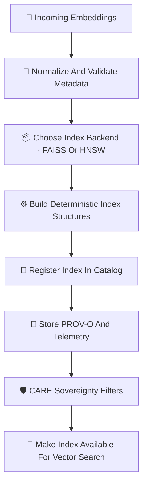

<div align="center">

# 📦🔡⚡ **Embedding Index Infrastructure — KFM v11.2.2 (MAX MODE)**  
`docs/pipelines/ai/inference/embeddings/index/README.md`

**Purpose**  
Define the deterministic, FAIR+CARE-governed, sovereignty-aware **vector index subsystem**  
for embedding search across:

🗺️ **Spatial embeddings**,  
🌡️ **Climate embeddings**,  
💧 **Hydrology embeddings**,  
🌪️🔥🌊❄️ **Hazard embeddings**,  
📚 **Narrative embeddings**,  
🎯 **Focus Mode embedding pools**,  
and **Story Node v3 multimodal vectors**.

Supports FAISS 🧠, HNSW ⚙️, and future ANN backends.

</div>

---

## 📦🧠🔡 **Directory Layout (MAX MODE)**

```
docs/pipelines/ai/inference/embeddings/index/
    📄 README.md                # ← This file
    📄 faiss-index.md           # FAISS-powered vector index
    📄 hnsw-index.md            # HNSW / ANN index
```

---

## 🧬📡🔍 **Index Pipeline Architecture (Mermaid-Safe)**



---

## 🔡🧠⚙️ **Supported Index Types**

### 1️⃣ 🧠 FAISS Index  
Ideal for:

- High-dimensional climate/hazard vectors  
- Large-scale ANN search  
- Real-time Focus Mode queries  

Uses:

- Deterministic IVFPQ / FlatL2  
- Seed-locked training  
- STAC-index linking  

### 2️⃣ ⚙️ HNSW Index  
Ideal for:

- Spatial embeddings  
- Narrative embeddings  
- Neighborhood-preserving queries  

Uses:

- Deterministic HNSW graph construction  
- Depth-limited search for sovereignty zones  

---

## 📘📦🔡 **Index Metadata**

Each index MUST include:

- Index type (FAISS, HNSW)  
- Model version  
- Embedding domain  
- Dimensionality  
- CRS (for spatial embeddings)  
- CARE metadata  
- STAC links  
- PROV lineage  

Example:

```json
{
  "index": {
    "backend": "faiss",
    "dim": 512,
    "domain": "hazard",
    "seed": 42
  }
}
```

---

## 💡🧠📈 **XAI for Vector Indexing**

Explainability is required for:

- Why certain vectors cluster  
- Which embedding dimensions influence nearest neighbors  
- Cluster balance across geospatial/hazard domains  
- Care masking effects on vector neighborhoods  

XAI MUST include:

- Distance distribution stats  
- Cluster attribution summaries  
- Neighbor impact diagrams  
- Seed metadata for deterministic reproducibility  

---

## 🛡️⚖️🧭 **FAIR+CARE + Sovereignty Enforcement**

Indexing MUST:

- Generalize embeddings from sovereignty-protected regions  
- Exclude sensitive tribal features from ANN connectivity  
- Downsample clusters built from sensitive hydrology/hazard signatures  
- Attach explicit CARE metadata:

```json
{
  "care": {
    "masking": "h3-index-generalized",
    "scope": "public-generalized",
    "notes": ["Index neighborhoods generalized in sovereignty-protected zones"]
  }
}
```

---

## 🔒⚙️🧪 **Determinism Requirements**

Index builds MUST:

- Use deterministic seed  
- Enforce stable ordering of vectors  
- Disable randomness in clustering  
- Produce reproducible ANN structures  
- Pass CI reproducibility tests  

---

## 🧪📏🔬 **CI Validation Requirements**

CI MUST verify:

- Deterministic index construction  
- Correct metadata schemas  
- STAC-XAI compliance  
- PROV lineage completeness  
- CARE blocks present  
- No sovereignty-sensitive leakage  
- Telemetry recorded (OTel + carbon + energy)  
- Neighbor queries stable across runs  

Failure → ❌ CI BLOCK.

---

## 🕰️📜 **Version History**

| Version  | Date       | Notes                                             |
|----------|------------|---------------------------------------------------|
| v11.2.2  | 2025-11-28 | Embedding Index Infrastructure (MAX MODE)         |

---

<div align="center">

### 🔗 Footer  
[🔡 Back to Embeddings Pipeline](../README.md) ·  
[📦 FAISS/HNSW Indexes](./) ·  
[🏛 Governance](../../../../../standards/governance/ROOT-GOVERNANCE.md)

</div>

