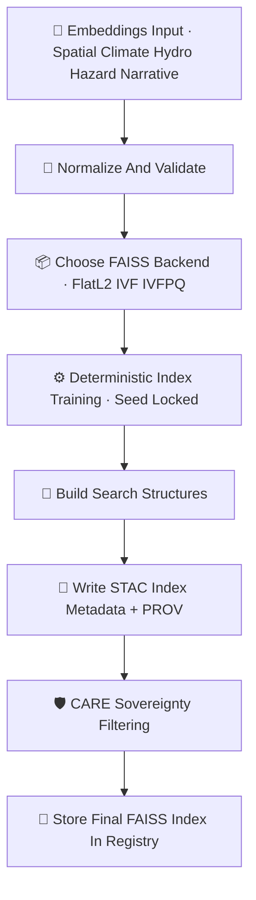

<div align="center">

# 🧠📦⚡ **FAISS Embedding Index — KFM v11.2.2 (MAX MODE)**  
`docs/pipelines/ai/inference/embeddings/index/faiss-index.md`

**Purpose**  
Define the deterministic, FAIR+CARE-protected **FAISS-based embedding index backend** powering  
high-dimensional semantic search for:

🗺️ Spatial embeddings  
🌡️ Climate embeddings  
💧 Hydrology embeddings  
🌪️🔥🌊❄️ Hazard embeddings  
📚 Narrative embeddings  
🎯 Focus Mode + Story Node v3 multimodal vectors

Supports **FlatL2**, **IVF**, **IVFPQ**, and **HNSW-FAISS hybrid** configurations under strict  
seed-locked reproducibility.

</div>

---

## 🧠📘📦 **Overview — Why FAISS?**

FAISS provides:

- Ultra-fast ANN + exact vector search  
- Deterministic index training under seeded builds  
- GPU acceleration (optional, reproducibility enforced)  
- IVFPQ compression for large embedding spaces  
- FlatL2 exact search for small/mid-sized sets  
- HDF5/Parquet index serialization compatible with STAC metadata  
- CI-safe reproducibility when seeded  

FAISS is used for:

- Multi-hazard analog search  
- Climate regime pattern retrieval  
- Watershed-fingerprint similarity  
- Narrative semantic lookup  
- Geospatial-context matching  

---

## 🧬📦⚙️ **FAISS Index Pipeline (Mermaid-Safe)**



---

## 📦🔡⚙️ **Supported FAISS Index Types**

### 1️⃣ **FlatL2 (Exact Search)**  
- Deterministic  
- Perfect for low-volume, high-accuracy retrieval  
- Used for hazard embeddings and narrative embeddings  

### 2️⃣ **IVF (Inverted File Index)**  
- Clusters vectors into deterministic centroids  
- IVF-Flat and IVF-PQ allowed  
- Suitable for mid-volume climate/hydro/hazard corpora  

### 3️⃣ **IVFPQ (Product Quantization)**  
- Highly compressed representation  
- Best for **100M+** vectors  
- Deterministic centroids (seed-locked)  
- PQ codes stored with reproducible quantizers  

### 4️⃣ **Hybrid HNSW-FAISS**  
- Deterministic HNSW graph  
- FAISS backend for refinement  
- Used in Focus Mode & Story Node embeddings  

---

## 📊🔡🗂️ **Index Metadata Requirements**

Each FAISS index MUST include:

```json
{
  "faiss_index": {
    "backend": "ivfpq",
    "dim": 1024,
    "centroids": 4096,
    "pq_m": 16,
    "metric": "L2",
    "seed": 42
  }
}
```

Plus:

- Full STAC metadata block  
- FAIR+CARE classification  
- Sovereignty rules  
- PROV lineage (agent, activity, used embeddings)  
- Energy + carbon metrics for training  

---

## 💡🧠📈 **FAISS XAI Requirements**

Explainability MUST include:

- Cluster cohesion metrics  
- PCA or UMAP projections for QA (optional)  
- Neighbor influence scores  
- Distance-distribution telemetry  
- Sovereignty generalization impact  
- Importance of embedding dimensions  

Example:

```json
{
  "xai": {
    "cluster_score": 0.87,
    "distance_distribution": "trimodal",
    "sensitivity": {
      "dim_0": 0.12,
      "dim_14": 0.09,
      "dim_441": 0.07
    }
  }
}
```

---

## 🛡️⚖️🧭 **FAIR+CARE + Sovereignty Enforcement**

FAISS indexes MUST:

- Exclude or mask embeddings derived from sovereignty-restricted basins  
- Downsample clusters that would reveal sensitive patterns  
- Avoid exposing cultural/historic geospatial vectors  
- Attach explicit CARE block:

```json
{
  "care": {
    "masking": "h3-index-generalized",
    "scope": "public-generalized",
    "notes": ["FAISS index clusters generalized in sovereignty-protected territories"]
  }
}
```

---

## 🔒⚙️🧪 **Determinism Requirements**

- Seed-locked centroid selection  
- Deterministic PQ codebooks  
- Disabled randomness in HNSW/HNSW-FAISS hybrid  
- Ordered insertion of vectors  
- Reproducible Flat/IVF/IVFPQ build outputs  
- CI replay MUST produce identical `.faiss` outputs  

---

## 🧪📏🔬 **CI Validation Requirements**

CI MUST validate:

- Deterministic index generation  
- Metadata JSON schema correctness  
- STAC-XAI compliance  
- PROV lineage present  
- CARE block present and correct  
- Rebuild reproducibility (`index.faiss` identical hash)  
- Telemetry JSON valid (OTel + PROV + energy + carbon)  

Failure → ❌ CI BLOCK.

---

## 🕰️📜 **Version History**

| Version  | Date       | Notes                                         |
|----------|------------|-----------------------------------------------|
| v11.2.2  | 2025-11-28 | Initial FAISS Index Model (MAX MODE)          |

---

<div align="center">

### 🔗 Footer  
[📦 Back to Index Directory](./README.md) ·  
[🔡 Embeddings Pipeline](../README.md) ·  
[🏛 Governance](../../../../../../standards/governance/ROOT-GOVERNANCE.md)

</div>

