<div align="center">

# ⚙️🔡🧠 **HNSW Embedding Index — KFM v11.2.2 (MAX MODE)**  
`docs/pipelines/ai/inference/embeddings/index/hnsw-index.md`

**Purpose**  
Define the deterministic, sovereignty-safe, FAIR+CARE–aligned **HNSW (Hierarchical Navigable Small World)  
graph-based ANN index** for embedding search across spatial, climate, hydrology, hazard, and narrative vectors.  
Provides ultra-fast approximate nearest-neighbor search with fully deterministic, seed-locked construction.

</div>

---

## 📘⚙️🔡 **Overview — Why HNSW in KFM?**

HNSW provides:

- Lightning-fast approximate nearest-neighbor (ANN) search  
- Hierarchical graph structure suitable for **multi-scale spatial similarity**  
- Deterministic graph creation under seed-lock  
- High recall with small memory footprint  
- Perfect for **multi-modal embeddings**, especially  
  - 🗺️ Spatial vectors  
  - 📜 Narrative vectors  
  - 🌪️ Hazard fingerprints  
  - 💧 Hydrology regimes  
  - 🌡️ Climate envelopes  

When seeded, HNSW becomes a **perfectly reproducible ANN graph**, compliant with CI.

---

## 🧬⚙️📦 **HNSW Index Pipeline (Mermaid-Safe)**

```mermaid
flowchart TD
    A[🔡 Incoming Embeddings] --> B[🧽 Normalize And Validate Metadata]
    B --> C[⚙️ Build HNSW Graph · Seed Locked]
    C --> D[📦 Attach Vector Payloads]
    D --> E[📜 Write STAC Index Metadata And PROV]
    E --> F[🛡️ CARE Sovereignty Filtering]
    F --> G[📁 Persist HNSW Index To Registry]
```



---

## ⚙️🔡📈 **HNSW Construction Parameters**

Every HNSW index MUST specify:

```json
{
  "hnsw": {
    "M": 16,
    "ef_construction": 200,
    "ef_search": 100,
    "metric": "L2",
    "seed": 42
  }
}
```

Where:

- `M` = number of bi-directional links per node  
- `ef_construction` = construction recall depth  
- `ef_search` = ANN search quality  
- `metric` = distance function  
- `seed` = deterministic key for reproducibility

---

## 📦🔍📊 **Metadata Requirements**

Each HNSW index MUST include:

- Index domain (spatial/climate/hazard/etc.)  
- Vector dimensions  
- Deterministic seed  
- Index construction params  
- CRS info (if spatial)  
- STAC links  
- FAIR+CARE category  
- Sovereignty rules  
- PROV lineage  
- Telemetry (energy/carbon)

Example STAC-style block:

```json
{
  "index": {
    "backend": "hnsw",
    "dim": 512,
    "domain": "narrative",
    "seed": 42
  }
}
```

---

## 💡🧠📈 **HNSW XAI Requirements**

XAI MUST provide:

- Graph connectivity explainability  
- Node importance ranking  
- Cluster diagnostics  
- Distance distribution reports  
- Influence of each embedding dimension  
- Sovereignty impact on graph connectivity  

Example:

```json
{
  "xai": {
    "graph_connectivity": 0.91,
    "node_importance_top5": ["id37","id211","id54","id80","id16"],
    "dimension_importance": {
      "dim_2": 0.09,
      "dim_41": 0.07,
      "dim_98": 0.06
    }
  }
}
```

---

## 🛡️⚖️🧭 **FAIR+CARE + Sovereignty Enforcement**

HNSW MUST:

- Mask embeddings from sovereignty-sensitive regions  
- Prevent hazardous clusters exposing protected communities  
- Downsample or remove sensitive structural nodes in the graph  
- Attach explicit CARE block:

```json
{
  "care": {
    "masking": "h3-index-generalized",
    "scope": "public-generalized",
    "notes": ["HNSW index generalized in sovereignty-protected territories"]
  }
}
```

---

## 🔒⚙️🧪 **Determinism Requirements**

HNSW index MUST:

- Use deterministic seed  
- Maintain stable graph insertion order  
- Disable heuristic randomness  
- Produce identical graph structures across CI runs  
- Maintain reproducible nearest-neighbor sets  

---

## 🧪📏🔬 **CI Validation Requirements**

CI MUST verify:

- Deterministic rebuild  
- STAC-XAI metadata correctness  
- PROV lineage completeness  
- CARE metadata correctness  
- No sovereign-region leakage  
- Node/edge count stability  
- Query reproducibility  
- Energy/carbon telemetry present  

Failure → ❌ CI BLOCK.

---

## 🕰️📜 **Version History**

| Version  | Date       | Notes                                         |
|----------|------------|-----------------------------------------------|
| v11.2.2  | 2025-11-28 | Initial HNSW Index Implementation (MAX MODE)  |

---

<div align="center">

### 🔗 Footer  
[📦 Back to Index Directory](./README.md) ·  
[🔡 Embeddings Pipeline](../README.md) ·  
[🏛 Governance](../../../../../../standards/governance/ROOT-GOVERNANCE.md)

</div>

