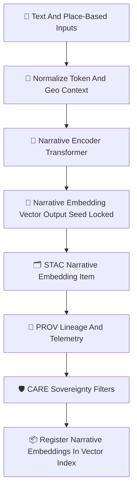

<div align="center">

# 📚🧠🔡 **Narrative Embeddings Model — KFM v11.2.2 (MAX MODE)**  
`docs/pipelines/ai/inference/embeddings/narrative-embeddings.md`

**Purpose**  
Define the sovereignty-safe, FAIR+CARE-governed, deterministic **Narrative Embeddings Model**  
that powers:  
📖 **Story Node v3 embeddings**,  
🧭 **Focus Mode v3 contextual cues**,  
🌡️💧🌪️ **climate/hydrology/hazard narrative linking**,  
🗺️ **place-based semantic modeling**, and  
🧠 **multimodal vector reasoning** across the entire Kansas Frontier Matrix.

</div>

---

## 📚🧬🔡 **Overview — What Are Narrative Embeddings?**

Narrative embeddings encode *meaning*, *context*, and *place* by fusing:

- 📜 Historical text fragments  
- 🗺️ Geospatial references (H3, coordinates, regions)  
- 🌡️ Climate/hazard signals tied to place  
- 💧 Hydrological events (floods, droughts, land–water interactions)  
- 🌾 Land-use/landscape semantic cues  
- 🧑‍🤝‍🧑 Cultural/tribal governance context (FAIR+CARE)  
- 🌀 Multi-hazard environmental context  
- 🧠 Embedding-level narrative structure  

They unify **text + geospatial + environmental signals** into a **single vector** suitable for:

- Story Node generation  
- Contextual retrieval  
- Focus Mode guidance  
- Historical analog search  
- Environmental narrative construction

Vectors MUST be deterministic, seed-locked, and provenance-safe.

---

## 🧬📚🧠 **Narrative Embeddings Pipeline (Mermaid-Safe)**



---

## 📜🗺️🧠 **Input Requirements**

### 1️⃣ 📜 Text Inputs  
- Historical documents  
- Climate or hydrology narratives  
- Research summaries  
- Story Node v3 text blocks  
- Local/regional descriptions  

### 2️⃣ 🗺️ Geospatial Inputs  
- Points, polygons, H3 cells  
- Watershed identifiers  
- Cultural boundaries  
- Elevation/terrain context  

### 3️⃣ 🌡️ Environmental Inputs  
- Climate states (temp, dewpoint, wind)  
- Hazards context (severe storms, flood, fire, heat, winter)  
- Hydrology: runoff, soil moisture, streamflow, drought  

### 4️⃣ 🔍 Derived Context  
- Place-based embeddings from spatial models  
- Hazard embeddings  
- Climate envelope embeddings  

All MUST include:

- CRS  
- Units (if applicable)  
- Timestamp (for temporal narratives)  
- FAIR+CARE classification  
- Sovereignty metadata  
- STAC lineage references  

---

## 🔡🧮📚 **Embedding Process (ASCII-Safe)**

```
narrative_embedding = f( narrative_tensor ; model_version, seed )
```

Where:

- `f` = deterministic narrative transformer  
- Inputs include fused text + geo + climate/hydro/hazard tensors  
- Output is a **fixed-length semantic vector**  

---

## 📦📚📊 **Outputs**

Narrative embeddings MUST produce:

- `narrative_embedding_vector.npy` or `.parquet`  
- `narrative_embedding_metadata.json`  
- `narrative_embedding_summary.json`  
- CAM/attention overlays (if enabled)  
- STAC-XAI embedding Item  
- PROV-O lineage  
- CARE block  
- Deterministic seed metadata  

---

## 💡🧠📚 **XAI for Narrative Embeddings**

XAI MUST show:

- Contribution of text vs geospatial vs environmental inputs  
- CAM/attention maps over narrative text  
- Attention over spatial tokens (H3, regions, basins)  
- Influence of climate/hazard embeddings  
- Feature importance vectors  
- STAC-XAI linkage  
- Seed metadata  

Example:

```json
{
  "xai": {
    "importance": {
      "text_content": 0.42,
      "geospatial_context": 0.22,
      "climate_context": 0.15,
      "hydrology_context": 0.11,
      "hazard_context": 0.10
    },
    "seed": 42
  }
}
```

---

## 🛡️⚖️🧭 **FAIR+CARE + Sovereignty Enforcement**

Narrative embeddings MUST:

- Mask culturally sensitive narrative cues  
- Remove location-precise tribal references  
- Prevent exposure of sensitive landscape associations  
- Carry explicit CARE metadata:

```json
{
  "care": {
    "masking": "h3-narrative-generalized",
    "scope": "public-generalized",
    "notes": ["Narrative embeddings generalized to protect sovereignty-sensitive cultural contexts"]
  }
}
```

---

## 🔒⚙️🧪 **Determinism Requirements**

- No stochastic token sampling  
- No random embedding noise  
- Seed-locked tokenizer + transformer path  
- Stable floating-point ops  
- Reproducible narrative vector generation  

---

## 🧪📏🔬 **CI Validation Requirements**

CI MUST ensure:

- Deterministic embeddings  
- Correct FAIR+CARE labeling  
- Complete STAC-XAI metadata  
- PROV lineage present  
- No sensitive region leakage  
- Text + spatial + environmental metadata integrity  
- Telemetry bundles (OTel + carbon + energy) included  

Failure → ❌ block merge.

---

## 🕰️📜 **Version History**

| Version  | Date       | Notes                                                   |
|----------|------------|---------------------------------------------------------|
| v11.2.2  | 2025-11-28 | Initial Narrative Embeddings Model (MAX MODE)           |

---

<div align="center">

### 🔗 Footer  
[🔡 Back to Embeddings Pipeline](./README.md) ·  
[📖 Story Node Embeddings](../../storynode/README.md) ·  
[🏛 Governance](../../../../../standards/governance/ROOT-GOVERNANCE.md)

</div>

