<div align="center">

# 🗺️🔡🧠 **Spatial Embeddings Model — KFM v11.2.2 (MAX MODE)**  
`docs/pipelines/ai/inference/embeddings/spatial-embeddings.md`

**Purpose**  
Define the deterministic, sovereignty-protected, FAIR+CARE-oriented **Spatial Embeddings Model**  
that produces high-dimensional representations of **terrain 🏔️**, **landcover 🌾**, **watersheds 💧**,  
**H3 spatial neighborhoods 🔷**, **geomorphology 🗾**, and **regional environmental context**.  
These embeddings anchor geospatial reasoning in Story Nodes, Focus Mode, hazard chains,  
and environmental similarity analysis.

</div>

---

## 🗺️📘🔡 **Overview — Spatial Embeddings in KFM**

Spatial embeddings encode **the physical and cultural geography of Kansas** as vectors that capture:

- Terrain slope, elevation, aspect  
- Flow direction, wetness index  
- Landcover classes + vegetation canopy  
- Soil type & permeability  
- Watershed boundaries + sub-basin hierarchy  
- H3 spatial neighborhoods (multi-resolution)  
- Geologic + geomorphic fingerprints  
- Ecozones / prairie / riparian distinctions  
- Anthropogenic features (FAIR+CARE safe)  

These embeddings enable:

- Spatial similarity search  
- Terrain/hydrology/hazard contextualization  
- Place-based knowledge fusion for StoryNode v3  
- Focus Mode geospatial guidance  
- Regional analog detection  

---

## 🧬🗺️🔡 **Spatial Embeddings Pipeline (Mermaid-Safe)**

```mermaid
flowchart TD
    A[🗺️ Terrain · Landcover · Watershed Inputs] --> B[🧽 Normalize Spatial Layers]
    B --> C[🧠 Spatial Encoder · Geospatial Transformer]
    C --> D[🔡 Embedding Vector Output · Seed Locked]
    D --> E[🗂️ STAC Spatial Embedding Item Builder]
    E --> F[📜 PROV Lineage And Telemetry]
    F --> G[🛡️ CARE Sovereignty Filters]
    G --> H[📦 Register Spatial Embeddings In Vector Index]
```



---

## 🏔️🌾💧 **Input Requirements**

Spatial embeddings draw from the following FAIR+CARE-approved geospatial fields:

### 1️⃣ 🏔️ Terrain  
- DEM elevation  
- Slope  
- Aspect  
- Curvature / relief  

### 2️⃣ 🌾 Landcover / Vegetation  
- Cropland / prairie / forest / urban classes  
- NDVI-like greenness (optional)

### 3️⃣ 💧 Hydrology / Watersheds  
- Flow direction (D8/D∞)  
- Flow accumulation  
- Watershed membership  
- Stream order  

### 4️⃣ 🗾 Soil / Surface Properties  
- Soil texture  
- Hydraulic conductivity  
- Soil permeability  

### 5️⃣ 🔷 H3 Spatial Context  
- H3 rings / neighbors  
- Multi-resolution adjacency  

### Metadata  
All MUST include:

- CRS  
- Units (for terrain/soil metrics)  
- Temporal metadata (if dynamic)  
- FAIR+CARE labels  
- Sovereignty protections  
- STAC lineage  

---

## 🔡🧮🗺️ **Embedding Process (ASCII-Safe)**

```
spatial_embedding = f( spatial_tensor ; model_version, seed )
```

Where:

- Inputs are normalized + sovereignty-masked  
- Model is deterministic (seed-locked)  
- Output vector maintains **spatial identity** while respecting CARE constraints  

---

## 📦🗺️📊 **Outputs**

Spatial Embeddings Model MUST generate:

- `spatial_embedding_vector.npy` or `.parquet`  
- `spatial_embedding_metadata.json`  
- `spatial_embedding_summary.json`  
- Optional CAM / spatial attribution grids  
- STAC-XAI Spatial Embedding Item  
- PROV lineage  
- CARE metadata block  
- Deterministic seed metadata  

---

## 💡🧠🗾 **XAI for Spatial Embeddings**

Spatial embedding XAI MUST expose:

- Terrain contribution weight  
- Soil + hydrology influence  
- Landcover importance  
- Watershed + H3 locality signals  
- CAM overlays for geographic regions  
- Attention maps for multi-scale spatial tokens  
- STAC-XAI links  
- Deterministic seed tracking  

Example:

```json
{
  "xai": {
    "importance": {
      "terrain": 0.33,
      "landcover": 0.21,
      "soil": 0.17,
      "watershed": 0.18,
      "h3_neighbors": 0.11
    },
    "seed": 42
  }
}
```

---

## 🛡️⚖️🧭 **FAIR+CARE + Sovereignty Enforcement**

Spatial embeddings MUST:

- Mask sovereignty-sensitive geographic features  
- Remove precise cultural site signals  
- Generalize watershed-level sensitive properties  
- Enforce H3 generalization near tribal regions  

CARE block:

```json
{
  "care": {
    "masking": "h3-spatial-generalized",
    "scope": "public-generalized",
    "notes": ["Spatial embeddings generalized in sovereignty-protected regions"]
  }
}
```

---

## 🔒⚙️🧪 **Determinism Requirements**

- Strict seed-lock  
- No random token dropout  
- Fixed normalization order  
- CI reproducibility  
- Stable floating-point ops  

---

## 🧪📏🔬 **CI Validation Requirements**

CI MUST verify:

- Deterministic embeddings  
- CRS / metadata correctness  
- STAC-XAI compliance  
- PROV lineage completeness  
- CARE protection present  
- No leakage of sensitive regions  
- Vector reproducibility  
- Energy + carbon telemetry present  

Failure → ❌ CI BLOCKED.

---

## 🕰️📜 **Version History**

| Version  | Date       | Notes                                              |
|----------|------------|----------------------------------------------------|
| v11.2.2  | 2025-11-28 | Initial Spatial Embeddings Model (MAX MODE)        |

---

<div align="center">

### 🔗 Footer  
[🔡 Back to Embeddings Pipeline](./README.md) ·  
[🗺️ Spatial Models](../../spatial/README.md) ·  
[🏛 Governance](../../../../../standards/governance/ROOT-GOVERNANCE.md)

</div>

