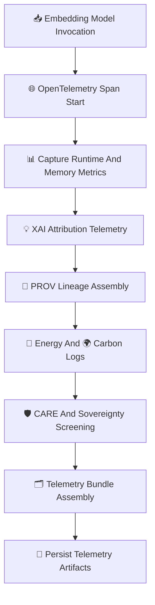

<div align="center">

# 📡🧠🔡 **Embeddings Telemetry & Observability — KFM v11.2.2 (MAX MODE)**  
`docs/pipelines/ai/inference/embeddings/telemetry/README.md`

**Purpose**  
Provide the complete **telemetry + observability specification** for Embeddings AI Inference.  
Covers 🌐 **OpenTelemetry spans**, 📊 **metrics**, 💡 **XAI attribution**, 📜 **PROV-O lineage**,  
🔋 **energy usage**, 🌍 **carbon data**, and 🛡️ **CARE + sovereignty enforcement**  
for all embedding domains: geospatial, climate, hydrology, hazards, narratives, and Focus Mode vectors.

</div>

---

## 🗂️📁🔡 **Directory Layout (MAX MODE)**

```
docs/pipelines/ai/inference/embeddings/telemetry/
    📄 README.md                   # ← This file
    📄 example-span.json           # OTel span example
    📄 example-provenance.json     # PROV-O lineage block
    📄 example-xai.json            # XAI embedding metadata
    📄 example-energy.json         # Energy usage bundle (Wh)
    📄 example-carbon.json         # Carbon footprint bundle (gCO2e)
```

---

## 📡🔡🧬 **Embeddings Telemetry Architecture (Mermaid-Safe)**



---

## 🔡📡📊 **Telemetry Components**

### 1️⃣ 🌐 OTel Spans  
Track:

- Model name / embedding domain  
- Vector dimension  
- Inference latency  
- Seed used for deterministic construction  
- Input STAC references  
- Node-level resource data  

### 2️⃣ 📊 Metrics  
Include:

- FLOPs per embedding  
- Memory utilization  
- CPU/GPU time  
- Vector dimension × batch size  
- Normalization cost  
- Optional SIMD utilization  

### 3️⃣ 💡 XAI Attribution Telemetry  
Captures:

- Feature importance per embedding  
- CAM overlays (spatial embeddings only)  
- Attention maps (Transformer embeddings)  
- Deterministic seeds  
- STAC-XAI links  

Example:

```json
{
  "xai": {
    "importance": {
      "terrain": 0.30,
      "soil_moisture": 0.18,
      "hazard_signal": 0.16,
      "climate_pattern": 0.22,
      "narrative_context": 0.14
    },
    "seed": 42
  }
}
```

### 4️⃣ 📜 PROV-O Lineage  
Describe:

- Upstream inputs  
- Embedding model version  
- Activities, agents, usage chain  
- Deterministic parameter snapshot  

### 5️⃣ 🔋🌍 Energy + Carbon  
Log:

- Energy used (Wh)  
- Carbon footprint (gCO₂e)  
- Aggregated totals for embedding index builds  

### 6️⃣ 🛡️ CARE + Sovereignty Telemetry  
Includes:

```json
{
  "care": {
    "masking": "h3-generalized",
    "scope": "public-generalized",
    "notes": ["Spatial embedding generalized in sovereignty-protected region"]
  }
}
```

---

## 🧠🔡📈 **XAI Telemetry for Embeddings**

Embedding XAI MUST reveal:

- Variable/feature importance  
- Distance-preservation metrics  
- Cluster separation attribution  
- Watershed/hazard narrative contributions  
- CAM overlays (if spatial)  
- Attention-weight maps  

---

## 🔒⚙️🧪 **Determinism Requirements**

Telemetry MUST verify:

- Seed-lock correctness  
- Deterministic vector generation  
- Stable ordering of operations  
- Non-random sampling  
- Reproducible normalization flow  

---

## 🧪📏🔬 **CI Validation Requirements**

CI MUST ensure:

- Schema validity for all telemetry JSON  
- OTel spans include seed + resource metadata  
- PROV blocks complete  
- STAC-XAI linked  
- CARE included  
- Carbon + energy telemetry present  
- No sensitive region leakage  
- All embedding model types registered  

Failure → ❌ CI BLOCKED.

---

## 🕰️📜 **Version History**

| Version  | Date       | Notes                                                      |
|----------|------------|------------------------------------------------------------|
| v11.2.2  | 2025-11-28 | Initial Embeddings Telemetry README (MAX MODE)             |

---

<div align="center">

### 🔗 Footer  
[🔡 Back to Embeddings Pipeline](../README.md) ·  
[📁 Telemetry Examples](./examples/) ·  
[🏛 Governance](../../../../../standards/governance/ROOT-GOVERNANCE.md)

</div>

