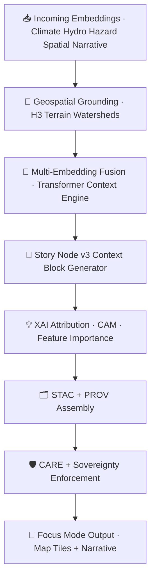

<div align="center">

# 🎯🧠🗺️ **Focus Mode AI Inference Pipeline — KFM v11.2.2 (MAX MODE)**  
`docs/pipelines/ai/inference/focus/README.md`

**Purpose**  
Define the deterministic, sovereignty-safe, FAIR+CARE-governed **Focus Mode AI inference pipeline**.  
This system fuses:

🔡 **Embeddings (spatial, climate, hydrology, hazard, narrative)**  
📖 **Story Node v3 semantic models**  
🗺️ **Geospatial context (H3 + terrain + watershed)**  
🌡️🌧️🌪️ **Realtime environment (climate + hydrology + hazard)**  
🧠 **Transformer-based contextual reasoning**  

to produce **hyper-local, geospatially-aware, risk-aware narrative intelligence** for KFM UI experiences.

</div>

---

## 📘🎯🧠 **Overview — What is Focus Mode?**

**Focus Mode** is the KFM’s *contextual intelligence layer*:

- It understands **where the user is** (geospatial grounding).
- It understands **what environmental signals are active** (climate/hydro/hazard fusion).
- It understands **historic or cultural context** of the location.
- It produces **narrative + map-aware insights** via Story Node v3 scaffolding.
- It uses **deterministic cross-domain embeddings** to match:
  - similar hazards  
  - similar hydrology regimes  
  - similar climate environments  
  - similar narrative histories  
  - similar landscapes  

Used for:

- Map overlays  
- Story Node v3 narrative bursts  
- Interactive Explainability  
- Multi-hazard situational awareness  
- Environmental analog detection  

---

## 🗂️📁🎯 **Directory Layout**

```
docs/pipelines/ai/inference/focus/
    📄 README.md                       # ← This file
    📄 context-routing.md              # Embedding + metadata routing layer
    📄 vector-fusion.md                # Multi-embedding fusion engine
    📄 geo-awareness.md                # Terrain/H3/watershed-aware components
    📄 hazard-awareness.md             # Hazard/hydro/climate composite context
    📁 xai/                            # XAI overlays + importance vectors
        📄 README.md
    📁 telemetry/                      # OTel + PROV + energy/carbon bundles
        📄 README.md
```

---

## 🧬🧠🎯 **Focus Mode Inference Pipeline Architecture (Mermaid-Safe)**



---

## 🧭🗺️🌎 **1. Geospatial Grounding Layer**

Provides **place-aware context**, including:

- H3 spatial position  
- Terrain relief (slope, aspect, elevation)  
- Watershed membership  
- Hydrologic region  
- Landcover-based narrative signals  
- Spatial-cultural boundaries (FAIR+CARE safe)  

---

## 🔡🧠⚡ **2. Embedding Fusion Layer**

Combines:

- 🗺️ Spatial embeddings  
- 🌡️ Climate embeddings  
- 💧 Hydrology embeddings  
- 🌪️ Hazard embeddings  
- 📚 Narrative embeddings  

Fusion rules:

- Deterministic transformer mixer  
- Seed-locked attention  
- Optional cross-attention with environmental tensors  
- FAIR+CARE masking applied at every token boundary  

---

## 📖🧩💬 **3. Story Node v3 Context Block Generator**

Produces **location-aware narrative blocks**:

- Climate context  
- Hydrology + watershed interpretation  
- Hazard situation summary  
- Cultural + historical narrative overlays  
- Confidence + uncertainty phrasing  
- Sovereignty-aware redactions  
- Multi-modal semantic linking  

---

## 💡🧠🗺️ **4. XAI for Focus Mode**

XAI outputs MUST include:

- CAM maps for spatial relevance  
- Embedding importance vectors  
- Environmental driver attribution  
- Hazard/hydro/climate influence scores  
- Deterministic attention-weight maps  
- STAC-XAI metadata  

Example:

```json
{
  "xai": {
    "importance": {
      "spatial": 0.28,
      "climate": 0.21,
      "hydrology": 0.19,
      "hazard": 0.17,
      "narrative": 0.15
    },
    "seed": 42
  }
}
```

---

## 🛡️⚖️🧭 **5. Sovereignty + FAIR+CARE Enforcement**

Focus Mode is **extremely sensitive**, requiring:

- Redaction of location-precise cultural/historic info  
- H3-based location generalization  
- Masking of hazard-specific vulnerability hotspots  
- Narrative smoothing in tribal territories  
- CARE metadata injection:

```json
{
  "care": {
    "masking": "h3-focus-generalized",
    "scope": "public-generalized",
    "notes": ["Focus Mode context generalized to protect sovereignty-sensitive regions"]
  }
}
```

---

## 📦📊📡 **6. Outputs**

Focus Mode MUST emit:

- Narrative context blocks  
- CAM overlays (raster)  
- Embedding fusion summary JSON  
- STAC-XAI Items  
- PROV lineage  
- CARE block  
- Energy + carbon telemetry  
- Seed metadata  

---

## 🧪📏🔬 **CI Validation Requirements**

CI MUST validate:

- Deterministic outputs  
- No unauthorized sensitive content  
- Correct FAIR+CARE + sovereignty labeling  
- PROV completeness  
- XAI metadata integrity  
- Telemetry presence  
- Valid STAC-XAI structure  
- Identical fusion vectors under repeated runs  

Failure → ❌ CI BLOCK.

---

## 🕰️📜 **Version History**

| Version  | Date       | Notes                                          |
|----------|------------|------------------------------------------------|
| v11.2.2  | 2025-11-28 | Initial Focus Mode Inference Pipeline (MAX MODE) |

---

<div align="center">

### 🔗 Footer  
[🧠 Back to AI Pipelines](../README.md) ·  
[🔡 Embeddings Pipeline](../embeddings/README.md) ·  
[🏛 Governance](../../../standards/governance/ROOT-GOVERNANCE.md)

</div>

