<div align="center">

# 🧭🎯🔡 **Focus Mode Context Routing Engine — KFM v11.2.2 (MAX MODE)**  
`docs/pipelines/ai/inference/focus/context-routing.md`

**Purpose**  
Define the **Context Routing Engine** that drives Focus Mode’s cross-domain contextual reasoning.  
It determines **which embeddings**, **which climate/hydro/hazard signals**, and  
**which Story Node semantic channels** must be activated to generate location-aware,  
environment-aware, sovereignty-safe context intelligence.

</div>

---

## 🎯🧠🗺️ **Overview — What is Context Routing?**

Context Routing is the **core decision layer** of Focus Mode:

- Decides which embeddings matter for *this place*, *this time*, and *this environmental state*.  
- Routes geospatial, climate, hydrology, hazard, and narrative signals into the fusion engine.  
- Enforces **FAIR+CARE sovereignty limits**, masking or shaping context.  
- Links environment → embeddings → narrative → map tiles → Story Node v3 blocks.  
- Produces the **Context Stack**, the unified representation used by the fusion engine.

Routing MUST be:

- Deterministic  
- XAI explainable  
- FAIR+CARE compliant  
- Sovereignty-safe  
- STAC + PROV traceable  

---

## 🧬🧭🎯 **Context Routing Architecture (Mermaid-Safe)**

```mermaid
flowchart TD
    A[📥 Incoming Geospatial + Environmental Inputs] --> B[🧭 Determine Spatial Context · H3 Terrain Watersheds]
    B --> C[🔡 Select Relevant Embedding Domains · Spatial Climate Hydro Hazard Narrative]
    C --> D[⚡ Resolve Environmental Triggers · Hazards Hydrology Climate]
    D --> E[📖 Activate StoryNode v3 Semantic Channels]
    E --> F[🌐 Build Context Stack · Unified Routing Object]
    F --> G[💡 Send Context Stack To Fusion Engine]
    G --> H[📜 Log PROV + Telemetry + CARE Enforcement]
```



---

## 🗺️🧭🌎 **1. Spatial Context Routing**

Spatial routing determines the **environmental frame** for Focus Mode:

- H3 cell + parent rings  
- Terrain slope / elevation class  
- Watershed membership  
- Riparian vs upland region  
- Ecozone tag  
- Urban vs rural context  
- Sovereignty boundary detection (FAIR+CARE)  

Outputs:

- `spatial_context.json`  
- Spatial CAM seeds  
- Sovereignty routing flags  

---

## 🌡️🌧️🔥🌪️ **2. Environmental Trigger Routing**

Focus Mode evaluates:

- Climate anomalies  
- Hydrology states (soil moisture, runoff, streamflow)  
- Hazard drivers (CAPE, CIN, shear, LLJ, hail, tornado, flood, fire-weather, heat, winter)  

Routing logic chooses:

- Which signals should influence the context  
- How strongly they affect narrative generation  
- Which environmental vectors are passed to the fusion block  
- Which hazard/hydro indicators are suppressed due to sovereignty rules  

Outputs:

- `env_triggers.json`  
- `hazard_trigger_flags.json`  
- `hydrology_trigger_flags.json`

---

## 🔡🧠📚 **3. Embedding Domain Routing**

Context Routing selects which embeddings to activate:

- 🗺️ Spatial Embeddings  
- 🌡️ Climate Embeddings  
- 💧 Hydrology Embeddings  
- 🌪️ Hazard Embeddings  
- 📚 Narrative Embeddings  

It determines:

- Embedding priority  
- Weight initialization for fusion  
- Cross-domain presence masks  
- Sovereignty-safe domain selection  

Outputs:

- `embedding_routing_table.json`  
- `embedding_weights.json`  

---

## 📖🧩🧠 **4. Story Node v3 Channel Routing**

Uses:

- Geospatial profile  
- Environmental triggers  
- Hazard/hydro state  
- Narrative embeddings  

Routes Story Node v3 channels, including:

- Climate context  
- Watershed/hydro context  
- Hazard-situation summaries  
- Cultural + historical overlays  
- Narrative safety filters  

Outputs:

- `storynode_channel_routing.json`  

---

## 🎯📦🧠 **5. The Context Stack (Core Output)**

Context Routing produces a **unified cross-domain context object**:

```
{
  "spatial": {...},
  "climate": {...},
  "hydrology": {...},
  "hazards": {...},
  "narrative": {...},
  "sovereignty": {...},
  "care": {...},
  "embeddings_selected": [...],
  "context_priority": {...},
  "fusion_ready": true
}
```

This “Context Stack” is what the Fusion Engine consumes.

---

## 💡🧠📊 **XAI for Context Routing**

Routing XAI explains:

- Why certain embeddings were chosen  
- Why hazards/hydro/climate channels were activated  
- Why some channels were suppressed (CARE/sovereignty)  
- Feature importance for routing decisions  
- Spatial + environmental CAM overlays  

Example:

```json
{
  "xai": {
    "importance": {
      "spatial": 0.27,
      "climate": 0.21,
      "hydrology": 0.18,
      "hazards": 0.17,
      "narrative": 0.17
    },
    "seed": 42
  }
}
```

---

## 🛡️⚖️🧭 **FAIR+CARE + Sovereignty Enforcement**

Context routing MUST enforce:

- H3-based location generalization  
- Hazard masking in sovereignty regions  
- Narrative-suppression rules  
- Hydrology privacy boundaries  
- Cultural/tribal non-disclosure protections  

CARE block example:

```json
{
  "care": {
    "masking": "h3-focus-generalized",
    "scope": "public-generalized",
    "notes": ["Routing generalized because region intersects sovereignty-protected zone"]
  }
}
```

---

## 🔒⚙️🧪 **Determinism Requirements**

Context routing MUST be deterministic:

- Seed-locked decision tree  
- Stable ordering  
- No random sampling  
- Reproducible environmental triggers  
- Deterministic Story Node activation logic  

---

## 🧪📏🔬 **CI Validation Requirements**

CI MUST validate:

- Deterministic routing decisions  
- Correct FAIR+CARE + sovereignty rules  
- Environmental trigger correctness  
- Embedding selection accuracy  
- Story Node channel routing correctness  
- PROV lineage completeness  
- Telemetry generation  
- Schema-compliant routing outputs  

Failure → ❌ CI BLOCK.

---

## 🕰️📜 **Version History**

| Version  | Date       | Notes                                                |
|----------|------------|------------------------------------------------------|
| v11.2.2  | 2025-11-28 | Initial Context Routing Engine Documentation (MAX MODE) |

---

<div align="center">

### 🔗 Footer  
[🎯 Back to Focus Mode Pipeline](./README.md) ·  
[🧠 Fusion Engine](./vector-fusion.md) ·  
[🏛 Governance](../../../../../standards/governance/ROOT-GOVERNANCE.md)

</div>

