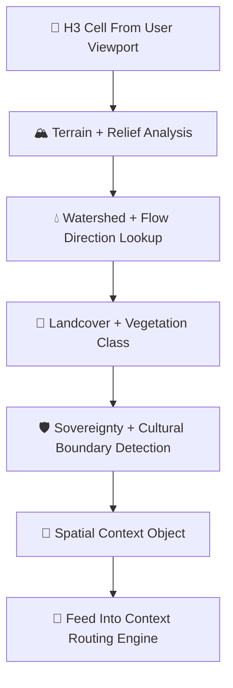

<div align="center">

# 🗺️🧭🌄 **Focus Mode Geo-Awareness Engine — KFM v11.2.2 (MAX MODE)**  
`docs/pipelines/ai/inference/focus/geo-awareness.md`

**Purpose**  
Define the **Geo-Awareness Engine** responsible for grounding Focus Mode in real geography:  
H3 spatial indexing, terrain interpretation, watershed structure, landcover semantics,  
and sovereignty-aware spatial masking.  
This engine powers **Context Routing**, **Fusion**, **XAI**, and **Story Node v3** generation.

</div>

---

## 🗺️📘🧭 **Overview — Why Geo-Awareness Matters**

Focus Mode must know:

- 🧭 **Where the user is** (H3 cell + hierarchy)  
- 🏔️ **What the terrain is** (slope, aspect, relief)  
- 💧 **What the water context is** (watershed, flow, wetlands)  
- 🌾 **What the land surface is** (grassland, cropland, forest, urban)  
- 🛡️ **Which sovereignty protections apply** (tribal/cultural/ecological)  
- 🧠 **How to contextualize environmental + narrative signals accordingly**

Geo-awareness is the **geospatial substrate** for all Focus Mode logic.

---

## 🧬🗺️🧭 **Geo-Awareness Architecture (Mermaid-Safe)**



---

## 🔷🗺️🧭 **1. H3 Spatial Localization**

H3 hierarchy is used for deterministic geospatial grounding:

- Identify user’s H3 cell  
- Resolve into parent H3 rings  
- Generate spatial indexes for embeddings  
- Handle map zoom → H3 resolution scaling  
- Apply sovereignty-aware generalization  

Outputs:

- `h3_context.json`  
- H3 CAM seed  

---

## 🏔️🧗🌄 **2. Terrain & Elevation Awareness**

Use DEM-derived layers:

- Elevation  
- Slope  
- Aspect  
- Hillshade (for narrative context)  
- Relief category (high plains, bluff, riparian, mixed prairie)  

Outputs:

- `terrain_context.json`  

---

## 💧🌊🗺️ **3. Watershed & Hydrologic Context**

Determine:

- Watershed ID (HUC)  
- Flow direction (D8/D∞)  
- Flow accumulation  
- Riparian vs upland indicator  
- Floodplain proximity  

Outputs:

- `watershed_context.json`  

---

## 🌾🌿🏞️ **4. Landcover & Ecological Context**

Ingest landcover datasets:

- Crop  
- Grass  
- Forest  
- Wetland  
- Urban  
- Range/pasture  
- Ecological zones  

Outputs:

- `landcover_context.json`  

---

## 🛡️⚖️🧭 **5. Sovereignty & Cultural Boundary Detection**

Absolutely mandatory under FAIR+CARE:

- Detect tribal boundaries  
- Mask sensitive geography  
- Apply H3 generalization in protected regions  
- Remove cultural site proximity context  
- Set sovereignty routing flags  

Outputs:

- `sovereignty_context.json`  

CARE block:

```json
{
  "care": {
    "masking": "h3-focus-generalized",
    "scope": "public-generalized",
    "notes": ["Geo-awareness generalized due to sovereignty protection"]
  }
}
```

---

## 🧭🎯💡 **6. Spatial Context Object**

Final unified output:

```
{
  "h3": {...},
  "terrain": {...},
  "watershed": {...},
  "landcover": {...},
  "sovereignty": {...},
  "care": {...},
  "fusion_ready": true
}
```

This object is passed directly into **Context Routing**.

---

## 💡🧠📊 **Geo-Awareness XAI**

Explainability MUST include:

- Spatial CAM overlays  
- Terrain/hydrology importance  
- Landcover sensitivity  
- Sovereignty-driven redactions  
- Deterministic attribution maps  

Example:

```json
{
  "xai": {
    "importance": {
      "h3": 0.32,
      "terrain": 0.21,
      "watershed": 0.18,
      "landcover": 0.17,
      "sovereignty": 0.12
    },
    "seed": 42
  }
}
```

---

## 🔒⚙️🧪 **Determinism Requirements**

- Deterministic H3 resolution logic  
- Deterministic terrain/hydrology lookups  
- Fixed-load ordering  
- No stochastic spatial sampling  
- CI-reproducible  

---

## 🧪📏🔬 **CI Validation Requirements**

CI MUST validate:

- CRS + metadata correctness  
- Deterministic spatial context output  
- FAIR+CARE compliance  
- Sovereignty masking reliability  
- STAC/PROV linkage  
- Telemetry output present  
- XAI metadata integrity  
- No leakage of sensitive features  

Failure → ❌ CI BLOCK.

---

## 🕰️📜 **Version History**

| Version  | Date       | Notes                                               |
|----------|------------|-----------------------------------------------------|
| v11.2.2  | 2025-11-28 | Initial Geo-Awareness Engine (MAX MODE)             |

---

<div align="center">

### 🔗 Footer  
[🎯 Back to Focus Mode Pipeline](./README.md) ·  
[🧭 Context Routing](./context-routing.md) ·  
[🏛 Governance](../../../../../standards/governance/ROOT-GOVERNANCE.md)

</div>

