<div align="center">

# 🌪️🔥🌊🌡️❄️🎯 **Focus Mode Hazard-Awareness Engine — KFM v11.2.2 (MAX MODE)**  
`docs/pipelines/ai/inference/focus/hazard-awareness.md`

**Purpose**  
Define the deterministic, sovereignty-safe, FAIR+CARE-aligned **Hazard-Awareness Engine** for Focus Mode.  
This subsystem ingests hazard drivers (storm/hail/tornado/fire/flood/heat/winter), evaluates relevance  
relative to location + environment, applies sovereignty protections, and routes hazard signals  
into the **Context Stack** and **Fusion Engine** for Story Node v3 and map-aware intelligence.

</div>

---

## 🌪️📘🔥 **Overview — What Is Hazard Awareness in Focus Mode?**

Focus Mode must understand **environmental danger** at the user’s location, including:

- ⛈️ Severe storm precursors  
- 🌪️ Tornado potential  
- 🌨️ Hail formation environment  
- 🌊 Flood + rise-rate risk  
- 🔥 Fire-weather danger  
- 🌡️ Heat stress  
- ❄️ Winter hazards  
- 🧂 Multihazard stacking + transitions  

Hazard awareness MUST be:

- Deterministic  
- FAIR+CARE + sovereignty-filtered  
- XAI-explainable  
- STAC + PROV traceable  
- Geospatially grounded (H3 / terrain / watershed)  

---

## 🧬🌪️🔥 **Hazard-Awareness Architecture (Mermaid-Safe)**

```mermaid
flowchart TD
    A[🌡️ Climate + Hydro + Hazard Drivers] --> B[🌪️ Evaluate Hazard Relevance · CAPE CIN Shear]
    B --> C[🌊 Assess Hydro-Hazard Links · Runoff Soil Moisture Streamflow]
    C --> D[🔥 Fire + Heat + Wind Context]
    D --> E[❄️ Winter Thermodynamics Check]
    E --> F[🛡️ Apply Sovereignty + CARE Filters]
    F --> G[🎯 Produce Hazard Context Object]
    G --> H[📦 Feed Into Context Routing + Fusion Engine]
```



---

## 🌪️⚡⛈️ **1. Severe Storm Hazard Awareness**

Evaluate:

- CAPE / CIN  
- Shear (0–6 km, 0–1 km)  
- LLJ strength  
- Lapse rates  
- Dryline convergence  
- Theta-e ridging  

Outputs:

- `severe_storm_context.json`  
- `convective_trigger_flags.json`

---

## 🌪️🧲📉 **2. Tornado Hazard Awareness**

Inputs:

- SRH (0–1 km / 0–3 km)  
- CAPE/CIN balance  
- LCL height  
- Storm motion vectors  
- Shear + LLJ profiles  

Outputs:

- `tornado_context.json`  
- `tornado_trigger_flags.json`

---

## 🌨️⚡❄️ **3. Hail Hazard Awareness**

Inputs:

- Freezing-level height  
- Updraft proxy  
- Mid-level lapse rates  
- CAPE profiles  
- Storm-top thermodynamics  

Outputs:

- `hail_context.json`

---

## 🌊💧📈 **4. Flood Hazard Awareness**

Inputs:

- Runoff  
- Rapid Runoff Hazard Index (RRHI)  
- Soil saturation  
- Streamflow Q + ΔQ/Δt  
- Terrain accumulation  

Outputs:

- `flood_context.json`  
- `flood_trigger_flags.json`

---

## 🔥🌬️🌡️ **5. Fire Weather Awareness**

Inputs:

- VPD  
- RH  
- Temperature  
- Wind  
- Fuel dryness  
- Terrain slope  

Outputs:

- `fire_weather_context.json`

---

## 🌡️🥵🌫️ **6. Heat Hazard Awareness**

Inputs:

- Heat Index  
- WBGT  
- Humidity stress  
- Radiation load  
- Overnight heat retention  

Outputs:

- `heat_context.json`

---

## ❄️🧊🌬️ **7. Winter Hazard Awareness**

Inputs:

- Snowfall rate  
- Freezing rain potential  
- Ice accretion  
- Wind chill  
- Wet-bulb thermodynamics  

Outputs:

- `winter_context.json`

---

## 🛡️⚖️🧭 **8. Sovereignty + CARE Enforcement**

Hazard awareness must respect:

- Tribal sovereignty boundaries  
- Cultural/historic site protections  
- Sensitive hydrological basins  
- Hazard confidentiality zones  

All hazard context must be **generalized** in sensitive areas.

CARE block example:

```json
{
  "care": {
    "masking": "h3-hazard-generalized",
    "scope": "public-generalized",
    "notes": ["Hazard awareness generalized due to sovereignty-protected region"]
  }
}
```

---

## 🎯📦🧠 **9. Hazard Context Object**

Final output merged into Context Stack:

```
{
  "hazards": {
    "severe_storm": {...},
    "tornado": {...},
    "hail": {...},
    "flood": {...},
    "fire": {...},
    "heat": {...},
    "winter": {...}
  },
  "sovereignty": {...},
  "care": {...},
  "fusion_ready": true
}
```

---

## 💡🧠📊 **Hazard Awareness XAI**

XAI MUST provide:

- Hazard-driver importance ranking  
- Spatial hazard CAM overlays  
- Sovereignty-driven redaction explanations  
- Environmental trigger attributions  
- Deterministic seed tracking  

Example:

```json
{
  "xai": {
    "importance": {
      "tornado": 0.22,
      "hail": 0.18,
      "flood": 0.19,
      "fire": 0.14,
      "heat": 0.15,
      "winter": 0.12
    },
    "seed": 42
  }
}
```

---

## 🔒⚙️🧪 **Determinism Requirements**

Hazard awareness MUST be:

- Fully seed-locked  
- Deterministic across hardware  
- Stable ordering of hazard evaluation  
- No random sampling  

---

## 🧪📏🔬 **CI Validation Requirements**

CI MUST verify:

- Deterministic hazard-context output  
- FAIR+CARE compliance  
- Sovereignty masking accuracy  
- Correct mapping to Context Stack  
- XAI metadata integrity  
- Telemetry (OTel + carbon + energy) present  
- Schema compliance  

Failure → ❌ CI BLOCK.

---

## 🕰️📜 **Version History**

| Version  | Date       | Notes                                              |
|----------|------------|----------------------------------------------------|
| v11.2.2  | 2025-11-28 | Initial Hazard-Awareness Engine (MAX MODE)         |

---

<div align="center">

### 🔗 Footer  
[🎯 Back to Focus Mode Pipeline](./README.md) ·  
[🧭 Geo-Awareness](./geo-awareness.md) ·  
[🏛 Governance](../../../../../standards/governance/ROOT-GOVERNANCE.md)

</div>

