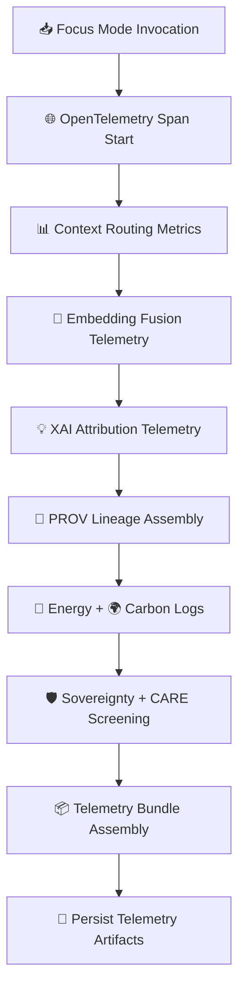

<div align="center">

# 📡🎯🧠 **Focus Mode Telemetry & Observability — KFM v11.2.2 (MAX MODE)**  
`docs/pipelines/ai/inference/focus/telemetry/README.md`

**Purpose**  
Define the **telemetry + observability specification** for **Focus Mode AI**,  
covering:

🌐 **OpenTelemetry spans**  
📊 **context-routing metrics**  
🔡 **embedding fusion diagnostics**  
🧠 **XAI attribution telemetry**  
🗂️ **STAC + PROV lineage**  
🛡️ **CARE + sovereignty compliance events**  
🔋 **energy usage**  
🌍 **carbon footprint**  

across all contextual reasoning steps.

</div>

---

## 🗂️📁🎯 **Directory Layout**

```
docs/pipelines/ai/inference/focus/telemetry/
    📄 README.md                  # ← This file
    📄 example-span.json          # OpenTelemetry span example
    📄 example-provenance.json    # PROV-O lineage example
    📄 example-xai.json           # XAI telemetry block
    📄 example-energy.json        # Energy usage bundle
    📄 example-carbon.json        # Carbon usage bundle
```

---

## 🎯📡🧬 **Focus Telemetry Architecture (Mermaid-Safe)**



---

## 📡📊🎛️ **Telemetry Components**

### 1️⃣ 🌐 **OpenTelemetry Spans**
Include:

- Focus invocation ID  
- User viewport H3 region  
- Embeddings engaged (spatial/climate/hydro/hazard/narrative)  
- Inference latency (fusion, routing, XAI)  
- Model version + seed  
- CPU/GPU resource metadata  

---

### 2️⃣ 🔡 **Embedding Fusion Metrics**
Record:

- Number of embeddings fused  
- Dimensionality of fused vector  
- Fusion attention depth  
- Cross-modal latency (climate↔hazard, hydro↔narrative)  
- Spatial-context application time  

---

### 3️⃣ 🧭 **Geospatial Awareness Telemetry**
Track:

- H3 boundary lookups  
- Terrain/watershed load times  
- Sovereignty-zone detection triggers  
- Redaction-level applied  

---

### 4️⃣ 💡 **XAI Telemetry**
Stores:

- CAM overlays summary  
- Feature importance vectors  
- Attention entropy metrics  
- Layer-wise attribution  
- XAI seeds  
- FAIR+CARE justification notes  

Example:

```json
{
  "xai": {
    "importance": {
      "spatial": 0.28,
      "climate": 0.21,
      "hydrology": 0.19,
      "hazard": 0.17,
      "narrative": 0.15
    },
    "seed": 42
  }
}
```

---

### 5️⃣ 📜 **PROV-O Lineage**
Includes:

- All embeddings used  
- Activities (`prov:wasGeneratedBy`)  
- Agents (`prov:wasAssociatedWith`)  
- STAC items powering inference  
- Sovereignty events  

---

### 6️⃣ 🔋🌍 **Energy + Carbon Telemetry**
Record:

- FLOPs used  
- GPU/CPU cycles  
- Energy (Wh)  
- Carbon (gCO₂e)  

---

### 7️⃣ 🛡️ **CARE + Sovereignty Telemetry**
Enforce:

```json
{
  "care": {
    "masking": "h3-focus-generalized",
    "scope": "public-generalized",
    "notes": ["Focus Mode redactions triggered due to sovereignty zone"]
  }
}
```

Covers:

- Cultural site redaction  
- Geospatial generalization level  
- Narrative smoothing  

---

## 🔒⚙️🧪 **Determinism Requirements**

Telemetry MUST confirm:

- Seed consistency  
- Fusion determinism  
- Stable attribute ordering  
- No stochastic sampling  
- Identical telemetry for repeated calls  

---

## 🧪📏🔬 **CI Validation Requirements**

CI MUST:

- Validate telemetry JSON schemas  
- Confirm PROV lineage completeness  
- Confirm CARE blocks exist  
- Validate STAC references  
- Validate deterministic behavior  
- Confirm no sensitive region leakage  
- Validate energy + carbon metrics  
- Replay telemetry equality test  

Failure → ❌ CI BLOCK.

---

## 🕰️📜 **Version History**

| Version  | Date       | Notes                                           |
|----------|------------|-------------------------------------------------|
| v11.2.2  | 2025-11-28 | Initial Focus Mode Telemetry README (MAX MODE)  |

---

<div align="center">

### 🔗 Footer  
[🎯 Back to Focus Mode Pipeline](../README.md) ·  
[📡 Telemetry Examples](./examples/) ·  
[🏛 Governance](../../../../../standards/governance/ROOT-GOVERNANCE.md)

</div>

