<div align="center">

# 🧠🎯🔡 **Focus Mode Vector Fusion Engine — KFM v11.2.2 (MAX MODE)**  
`docs/pipelines/ai/inference/focus/vector-fusion.md`

**Purpose**  
Define the **Vector Fusion Engine**, the heart of Focus Mode.  
It merges **spatial 🗺️**, **climate 🌡️**, **hydrology 💧**, **hazard 🌪️**, and **narrative 📖 embeddings**  
into a **single deterministic fused context vector**, used to drive:

- Story Node v3 contextual narratives  
- Focus Mode map overlays  
- Hazard/Climate/Hydro explainability  
- Embedding similarity routing  
- Environmental + cultural awareness

This engine MUST be deterministic, sovereignty-safe, and FAIR+CARE compliant.

</div>

---

## 🎯🧠📘 **Overview — What Is Vector Fusion?**

The fusion engine performs **cross-domain embedding integration** by:

- Aligning vector dimensions via deterministic projections  
- Applying **seed-locked attention mixing**  
- Conditioning embeddings on geospatial + environmental context  
- Masking or down-weighting embeddings in sovereignty-sensitive regions  
- Producing a **single fused semantic vector** representing place + time + environment + meaning  

Think of it as the “brainstem” linking:

📍 *Where you are*  
🌦️ *What’s happening in the environment*  
🌪️ *What hazards matter*  
💧 *What hydrology is relevant*  
📖 *What narrative context applies*  

---

## 🧬🎯⚙️ **Vector Fusion Architecture (Mermaid-Safe)**

```mermaid
flowchart TD
    A[🔡 Context Stack From Routing Engine] --> B[🧠 Cross-Embedding Attention · Seed Locked]
    B --> C[🎛️ Apply Spatial · Climate · Hydro · Hazard · Narrative Weights]
    C --> D[🤖 Deterministic Fusion Encoder · Transformer Layer]
    D --> E[📦 Fused Context Vector · 1xN Representation]
    E --> F[💡 XAI Attribution And CAM Seeds]
    F --> G[🗂️ STAC + PROV Assembly]
    G --> H[🛡️ CARE + Sovereignty Filtering]
```



---

## 🔡🧭🌡️ **Inputs — The Context Stack**

The Fusion Engine consumes the unified Context Stack from Context Routing:

```
{
  "spatial": {...},
  "climate": {...},
  "hydrology": {...},
  "hazards": {...},
  "narrative": {...},
  "sovereignty": {...},
  "care": {...},
  "embeddings_selected": [...],
  "context_priority": {...}
}
```

This stack is guaranteed deterministic and sovereignty-safe.

---

## 🧠🎛️📈 **1. Cross-Embedding Attention Layer**

The fusion process begins with:

- Deterministic scaled dot-product attention  
- Projections for each embedding domain  
- Cross-domain mixing: spatial↔climate, hydro↔hazard, narrative↔environmental  
- Sovereignty-aware masking of attention heads  

Outputs:

- `cross_attention_weights.json`  
- `domain_interaction_matrix.json`  

---

## 🔡🧮🎯 **2. Embedding Weight Application**

Each domain gets deterministic, version-pinned fusion weights:

- Spatial weight  
- Climate weight  
- Hydrology weight  
- Hazard weight  
- Narrative weight  

Weights may be modulated by:

- Active hazards  
- Drought/soil moisture conditions  
- Climate anomalies  
- Narrative relevance  
- Sovereignty policies  

Outputs:

- `embedding_weight_vector.json`

---

## 🤖🎯💡 **3. Deterministic Fusion Encoder**

A seed-locked transformer encoder:

- Aligns domains into common latent space  
- Applies sovereign-aware down-weighting if required  
- Produces the **Fused Context Vector**  

Vector examples:

```
fused_vector.shape = (1, 1024)
```

It is ALWAYS the same for identical inputs.

---

## 📦🔡🧠 **4. Fused Context Vector (Core Output)**

Produced vector is used for:

- Story Node v3  
- Focus Mode narrative context  
- Hazard/hydro/climate overlays  
- Embedding similarity  
- XAI importance scoring  

Stored as:

- `fused_vector.npy` or `.parquet`  
- `fused_vector_metadata.json`  

---

## 💡🧠🗺️ **5. XAI Attribution for Fusion**

Fusion XAI MUST include:

- Cross-domain importance vector  
- CAM overlays (spatial relevance maps)  
- Attention matrices  
- Narrative attribution scores  
- Influence of hazards/hydro/climate  

Example:

```json
{
  "xai": {
    "importance": {
      "spatial": 0.26,
      "climate": 0.22,
      "hydrology": 0.18,
      "hazards": 0.19,
      "narrative": 0.15
    },
    "seed": 42
  }
}
```

---

## 🛡️⚖️🧭 **6. Sovereignty + FAIR+CARE Filtering**

Fusion MUST enforce:

- H3-based masking for protected regions  
- Removal or down-weighting of hazard-sensitive contributions  
- Filtering of narrative elements tied to cultural regions  
- Injecting CARE metadata:

```json
{
  "care": {
    "masking": "h3-focus-generalized",
    "scope": "public-generalized",
    "notes": ["Vector Fusion output generalized to respect sovereignty-sensitive boundaries"]
  }
}
```

---

## 🔒⚙️🧪 **Determinism Requirements**

Fusion MUST be:

- Fully seed-locked  
- Free of random sampling  
- Reproducible across all hardware  
- Fully traceable under PROV  

---

## 🧪📏🔬 **CI Validation Requirements**

CI MUST validate:

- Identical fused vectors on replay  
- Correct FAIR+CARE enforcement  
- Full PROV lineage  
- XAI metadata present & valid  
- STAC-XAI structure intact  
- No leakage of sensitive spatial signals  
- Telemetry (energy/carbon) available  

Failure → ❌ CI BLOCK.

---

## 🕰️📜 **Version History**

| Version  | Date       | Notes                                                 |
|----------|------------|-------------------------------------------------------|
| v11.2.2  | 2025-11-28 | Initial Vector Fusion Engine Documentation (MAX MODE) |

---

<div align="center">

### 🔗 Footer  
[🎯 Back to Focus Mode Pipeline](./README.md) ·  
[🧭 Context Routing](./context-routing.md) ·  
[🏛 Governance](../../../../../standards/governance/ROOT-GOVERNANCE.md)

</div>

