<div align="center">

# 💡🎯🧠 **Focus Mode XAI Subsystem — KFM v11.2.2 (MAX MODE)**  
`docs/pipelines/ai/inference/focus/xai/README.md`

**Purpose**  
Provide the full **explainability architecture** for KFM **Focus Mode**, including:

🧠 **Cross-embedding attribution** (spatial · climate · hydrology · hazard · narrative)  
🗺️ **Geospatial CAM overlays**  
📖 **Story Node v3 semantic driver attribution**  
🔡 **Embedding-fusion attention diagnostics**  
📜 **PROV-O traceability**  
🛡️ **FAIR+CARE sovereignty-safe explainability**  
🌐 **STAC-XAI metadata**  

This subsystem ensures Focus Mode outputs are **auditable**, **transparent**,  
**culturally safe**, and **fully deterministic**.

</div>

---

## 🗂️📁🎯 **Directory Layout**

```
docs/pipelines/ai/inference/focus/xai/
    📄 README.md                      # ← This file
    📄 example-cam.json               # Spatial CAM metadata
    📄 example-importance.json        # Embedding importance vector
    📄 example-attribution.json       # Cross-domain attribution
    📄 example-provenance.json        # PROV-O example
```

---

## 🧬💡🎯 **Focus Mode XAI Architecture (Mermaid-Safe)**

```mermaid
flowchart TD
    A[📥 Focus Fusion Output] --> B[🔡 Extract Embedding-Level Attributions]
    B --> C[🧠 Compute Cross-Modal Importance · Spatial Climate Hydro Hazard Narrative]
    C --> D[🗺️ Generate CAM Layers · H3 Terrain Watersheds]
    D --> E[📊 Create Feature Importance Tables]
    E --> F[📜 Attach PROV + STAC-XAI Metadata]
    F --> G[🛡️ CARE · Sovereignty Filtering]
    G --> H[💾 Emit XAI Artifacts]
```



---

## 💡🎯🔍 **XAI Components**

Focus Mode XAI includes:

### 1️⃣ **Cross-Embedding Attribution**
Measures how each embedding type influenced the output:

- Spatial embeddings  
- Climate embeddings  
- Hydrology embeddings  
- Hazard embeddings  
- Narrative embeddings  

### 2️⃣ **Context-Routing Attribution**
Shows which contextual signals dominated:

- H3 region  
- Watershed  
- Terrain  
- Hazard precursors  
- Narrative context  

### 3️⃣ **CAM & Spatial Overlays**
H3-based and raster overlays showing where Focus Mode “looked.”

### 4️⃣ **Story Node XAI**
Explains:

- Which environmental signals shaped the narrative  
- Which historical/cultural components influenced text  
- How hazards/hydrology altered narrative tone  

### 5️⃣ **Attention Diagnostics**
Deterministic transformer attention patterns:

- Cross-modal attention  
- Self-attention in narrative blocks  
- Relative token importance  

---

## 🔡🧠📈 **Embedding Importance Vector (EIV)**

All Focus Mode inferences MUST output:

```json
{
  "xai": {
    "importance": {
      "spatial": 0.28,
      "climate": 0.20,
      "hydrology": 0.19,
      "hazard": 0.17,
      "narrative": 0.16
    },
    "seed": 42
  }
}
```

This vector is used for:

- XAI graphs  
- Telemetry  
- Story Node v3 narrative modifiers  
- Focus Mode UI confidence indicators  

---

## 🗺️🌀💡 **CAM Generation Requirements**

CAM overlays MUST:

- Be generated at **deterministic resolution**  
- Respect **H3 + DEM + watershed** boundaries  
- Mask or downsample in sovereignty-protected regions  
- Produce **STAC-XAI assets**, e.g.:

```json
{
  "assets": {
    "focus_cam_spatial": {
      "href": "s3://kfm/focus/xai/cam_spatial_2025-06-03.tif",
      "roles": ["xai", "explanation"],
      "type": "image/tiff"
    }
  }
}
```

---

## 🛡️⚖️🧭 **Sovereignty + FAIR+CARE Enforcement**

Focus XAI MUST:

- Hide culturally sensitive geographic patterns  
- Mask hazard-vulnerability signatures in tribal regions  
- Generalize narrative-attention attribution over sensitive zones  

CARE block example:

```json
{
  "care": {
    "masking": "h3-focus-generalized",
    "scope": "public-generalized",
    "notes": ["Focus Mode XAI generalized to protect sovereignty-sensitive areas"]
  }
}
```

---

## 📜🧾🧠 **PROV-O Integration**

XAI MUST include:

```json
{
  "prov": {
    "wasGeneratedBy": "urn:kfm:activity:xai:focus:abcd123",
    "used": [
      "urn:kfm:data:stac:climate_embedding_item",
      "urn:kfm:data:stac:hazard_embedding_item"
    ],
    "agent": "urn:kfm:service:focus-xai-engine"
  }
}
```

---

## 🔒⚙️🧪 **Determinism Requirements**

- All XAI subroutines must be seed-locked  
- Attention maps deterministic  
- No random feature masking  
- Deterministic CAM grid creation  
- CI reproducibility enforced  

---

## 🧪📏🔬 **CI Validation Requirements**

CI MUST verify:

- All XAI JSON conforms to schema  
- Attributions sum to expected totals  
- CAM layers mask sovereignty zones  
- STAC-XAI item integrity  
- PROV lineage completeness  
- CARE metadata correctness  
- Telemetry output present  
- Deterministic reproduction  

Failure → ❌ CI BLOCK.

---

## 🕰️📜 **Version History**

| Version  | Date       | Notes                                            |
|----------|------------|--------------------------------------------------|
| v11.2.2  | 2025-11-28 | Initial Focus Mode XAI Subsystem (MAX MODE)       |

---

<div align="center">

### 🔗 Footer  
[🎯 Back to Focus Mode Pipeline](../README.md) ·  
[📡 Telemetry](../telemetry/README.md) ·  
[🏛 Governance](../../../../../standards/governance/ROOT-GOVERNANCE.md)

</div>

