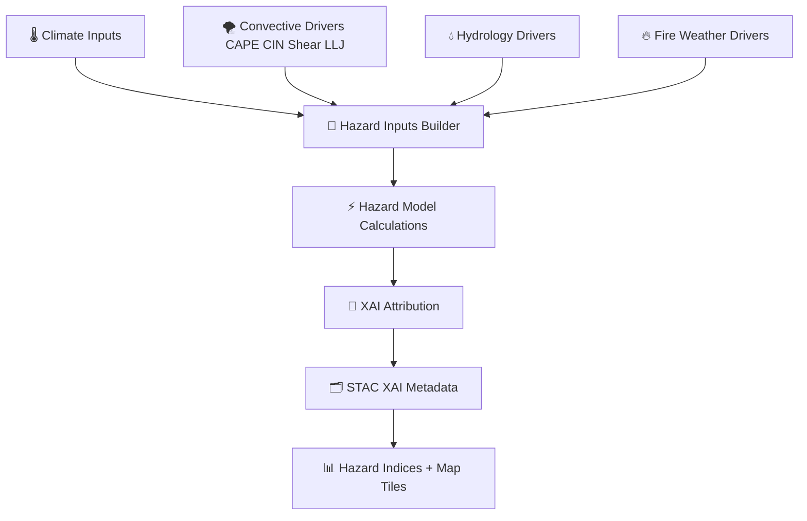

<div align="center">

# 🌪️⚡🔥 **Hazards AI Inference — KFM v11.2.2**  
`docs/pipelines/ai/inference/hazards/README.md`

**Purpose**  
Define the **FAIR+CARE governed, sovereignty-protected, deterministic, XAI-enhanced hazards inference system**  
for KFM, including:

🌪️ *Severe Storm Hazards*  
⚡ *Convective Hazard Indices*  
🧲 *Tornado / Hail / Wind Risk Models*  
🌊 *Flood & Flash-Flood Risk*  
🔥 *Fire-Weather Indices*  
🌡️ *Heat Stress & Heat Hazard Indices*  
❄️ *Winter Storm Severity / Ice Accretion*  
🌀 *Multi-Hazard Composites*  
💡 *Explainability for Hazards Models*  
📡 *Realtime hazard telemetry + provenance*

</div>

---

## 🌩️🌪️🔥 **Overview — Hazard Inference in KFM**

The Hazards Pipeline integrates:

- 🌡️ **Climate downscaling outputs**  
- 🌪️ **CAPE, CIN, shear, LLJ, lapse rates**  
- 💧 **Hydrology drivers** (runoff, streamflow, soil moisture)  
- 🌊 **Flood index** + antecedent wetness  
- 🔥 **Fire-weather drivers** (VPD, RH, winds, fuels)  
- 🧊 **Winter-weather fields** (wet bulb, freezing rain, wind chill)  
- 🌡️ **Heat index, WBGT, humidity stress**  
- 📡 **Realtime inputs** from atmospheric + hydrological AI  
- 🧠 **XAI models** explaining hazard contributions  
- 🛡️ **Sovereignty masking + CARE filtering**  
- 🗂️ **STAC-XAI hazard cataloging**  
- 📜 **PROV-O lineage for every hazard field**  

All hazards outputs MUST be **seed-locked**, **deterministic**, and **explainable**.

---

## 🗂️📁🔥 **Directory Layout (v11.2.2)**

```
docs/pipelines/ai/inference/hazards/
    📄 README.md                       # ← This file
    📄 severe-storms.md                # Thunderstorm hazards index
    📄 tornado-risk.md                 # Tornado potential model
    📄 hail-risk.md                    # Hail probability / size model
    📄 fire-weather.md                 # Fire weather danger model
    📄 flood-risk.md                   # Flood / flash-flood hazard
    📄 heat-risk.md                    # Heat stress & WBGT model
    📄 winter-weather.md               # Snow/Ice storm severity index
    📄 hazard-composite.md             # Multi-hazard composite index
    📄 xai-hazards.md                  # Explainability subsystem
    📁 telemetry/                      # Telemetry bundle examples
        📄 README.md
```

---

## ⚡🌪️🧬 **Hazards Pipeline Architecture**



---

## 🌪️⚡📈 **Hazard Categories**

### 1️⃣ 🌩️ Severe Storm Hazards  
- CAPE / CIN balance  
- Shear vectors  
- Storm-relative helicity  
- Lapse rates  
- Downburst indices  
- Dryline hazard factors  

### 2️⃣ 🧲 Tornado & Hail Hazards  
- Tornado Potential Index (TPI)  
- Significant Tornado Parameter (STP-style deterministic variant)  
- Hail Size Index (HSI)  
- Updraft proxy + thermodynamics  

### 3️⃣ 🌊 Flood & Flash-Flood Hazards  
- From Flood Index + Rapid Runoff + Rise Rate  
- Hydrology drivers + rainfall intensity synergy  
- Watershed scale risk  

### 4️⃣ 🔥 Fire Weather Hazards  
- VPD  
- RH  
- Wind + dryness  
- Rate of spread proxies  
- Fuel moisture & thermal stress  

### 5️⃣ 🌡️ Heat Hazards  
- Heat Index  
- WBGT  
- Humidity Stress Index  
- Overnight heat retention  

### 6️⃣ ❄️ Winter Storm Hazards  
- Snowfall rate  
- Ice accretion  
- Freezing rain probability  
- Wind chill  
- Blizzard risk  

### 7️⃣ 🌀 Multi-Hazard Composite  
- Weighted deterministic blend  
- Hazard stacking  
- Temporal persistence awareness  
- CARE-governed sensitivity controls  

---

## 💡🔍🧠 **Explainability (Hazards XAI)**

Hazards XAI outputs MUST include:

- Feature contributions per hazard  
- CAM overlays  
- Watershed / storm-environment heatmaps  
- Deterministic gradients  
- Seed-lock metadata  
- STAC-XAI assets  
- PROV lineage  
- CARE-filtered overlays for sovereignty  

---

## 🛡️⚖️🧭 **FAIR+CARE + Sovereignty Enforcement**

Hazard outputs MUST:

- Apply **H3 hazard masking** in sovereignty-protected regions  
- Mask sensitive tornado/hail hotspots on tribal lands  
- Aggregate fire-weather + heat risk in sensitive ecological zones  
- Include CARE block:

```json
{
  "care": {
    "masking": "h3-generalized",
    "scope": "public-generalized",
    "notes": ["Hazard fields generalized in sovereignty-protected areas"]
  }
}
```

---

## 🧪📏🔬 **CI Validation Requirements**

CI MUST verify:

- CRS + units  
- Hazard model determinism  
- STAC-XAI compliance  
- Complete PROV lineage  
- CARE metadata block present  
- Telemetry bundle integrity  
- No missing drivers or hazard components  
- XAI attribution correctness  

Fail → ❌ CI Block.

---

## 🕰️📜 **Version History**

| Version  | Date       | Notes                                             |
|----------|------------|---------------------------------------------------|
| v11.2.2  | 2025-11-28 | Initial Hazards Inference Pipeline (MAX MODE)     |

---

<div align="center">

### 🔗 Footer  
[⚡ Back to Climate Inference](../README.md) ·  
[🌊 Hydrology Pipeline](../hydrology/README.md) ·  
[🏛 Governance](../../../standards/governance/ROOT-GOVERNANCE.md)

</div>

