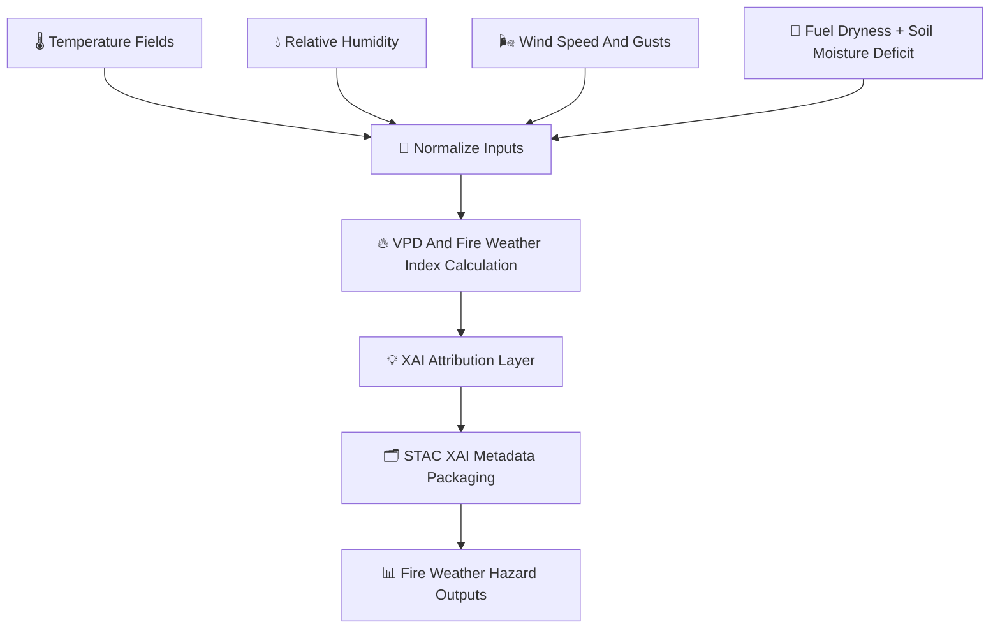

<div align="center">

# 🔥🌬️🌡️ **Fire Weather Hazard Model — KFM v11.2.2**  
`docs/pipelines/ai/inference/hazards/fire-weather.md`

**Purpose**  
Define the deterministic, FAIR+CARE-enforced, sovereignty-protected **Fire Weather Hazard Model**,  
which blends **VPD 🔥**, **Relative Humidity 💧**, **Wind Speed 🌬️**, **Fuel Dryness 🌾**,  
and **Temperature 🌡️** into a **composite fire-weather hazard index** suitable for realtime maps,  
hazard chains, and Story Node v3 narrative overlays.

</div>

---

## 🔥📘🌡️ **Overview — Fire Weather in KFM**

The Fire Weather model assesses **meteorological fire danger** by combining:

- 🌡️ Temperature-driven vapor pressure  
- 💧 Relative humidity (dryness deficits)  
- 🔥 **VPD (Vapor Pressure Deficit)**  
- 🌬️ Wind speed & gust potential  
- 🌾 Fuel dryness + soil moisture deficit  
- 🗺️ Terrain slope & aspect modifiers  
- 🧠 Optional deterministic ML refinement  
- 🛡️ CARE + sovereignty safe hazard spatialization  
- 🗂️ STAC-XAI hazard model metadata  
- 📜 PROV-O lineage for traceability  

This model powers:  
- Fire risk map tiles  
- Realtime fire-weather alerting  
- Multi-hazard composites  
- Focus Mode v3 hazard narratives  

---

## 🧬🔥⚙️ **Fire Weather Hazard Pipeline**



---

## 🌡️💧🌬️ **Input Requirements**

### 1️⃣ 🌡️ Temperature  
- 2 m temp, 850 mb temp, or downscaled surface temp  
- Used for saturation vapor pressure  

### 2️⃣ 💧 Relative Humidity  
- Needed for actual vapor pressure  
- Optional dewpoint-based RH reconstruction  

### 3️⃣ 🌬️ Wind Speed & Gusts  
- 10 m wind  
- Derived gust fields  
- Critical for fire spread potential  

### 4️⃣ 🌾 Fuel Dryness  
- Derived from soil moisture deficit  
- Optional vegetation index modifiers  

### 5️⃣ 🗺️ Terrain  
- Slope  
- Aspect (south-facing slope dryness enhancement)  

All MUST include CRS, units, and ISO timestamps.

---

## 🔥🧮📈 **Core Hazard Formula (ASCII-Safe)**

### **1. Vapor Pressure Deficit (VPD)**  
```
es = 0.6108 * exp((17.27 * T) / (T + 237.3))
ea = es * (RH / 100)
VPD = es - ea
```

### **2. Fire Weather Index (FWI-like deterministic variant)**  
```
FWI = w1 * VPD_norm
    + w2 * wind_norm
    + w3 * fuel_dryness_norm
    + w4 * temp_norm
```

Weights MUST be deterministic and version-pinned.

---

## 📦📊🔥 **Outputs**

Model MUST produce:

- `fire_weather_grid.tif`  
- `fire_weather_metadata.json`  
- `fire_weather_summary.json`  
- Optional CAM-like attribution maps  
- STAC Item referencing all hazard drivers  
- Deterministic seeds  
- PROV-O lineage  
- CARE metadata block  

---

## 💡🧠🔥 **XAI Integration**

Fire-weather XAI MUST reveal:

- VPD contributions  
- Wind sensitivity  
- RH (moisture) impact  
- Fuel dryness weight  
- Terrain-driven amplification  
- CAM overlays across watersheds or fire polygons  

Example XAI excerpt:

```json
{
  "xai": {
    "importance": {
      "vpd": 0.52,
      "wind": 0.33,
      "fuel_dryness": 0.10,
      "temperature": 0.05
    },
    "seed": 42
  }
}
```

---

## 🛡️⚖️🔥 **CARE + Sovereignty Enforcement**

Fire-weather hazard maps MUST NOT expose hyperlocal hotspot patterns in sovereignty-protected regions.

Apply:

- **H3 hazard generalization**  
- Downsampling around sensitive ecological or tribal areas  
- Removal of high-risk detail where culturally sensitive  

CARE block example:

```json
{
  "care": {
    "masking": "h3-hazard-generalized",
    "scope": "public-generalized",
    "notes": ["Fire weather hotspots generalized in sovereignty-protected regions"]
  }
}
```

---

## 🔒⚙️🧪 **Determinism Requirements**

- Seed-locked operations  
- No stochastic hazard sampling  
- Deterministic wind adjustments  
- DEM slope/applications stable  
- Exact reproducibility under CI replay  

---

## 🧪📏🔬 **CI Validation Requirements**

CI MUST verify:

- Deterministic FWI output  
- CRS + units present  
- XAI metadata complete  
- PROV lineage populated  
- STAC-XAI compliance  
- CARE + sovereignty block present  
- Telemetry (OTel, energy, carbon) attached  
- Weights fixed and version-pinned  

Fail → ❌ merge blocked.

---

## 🕰️📜 **Version History**

| Version  | Date       | Notes                                                |
|----------|------------|------------------------------------------------------|
| v11.2.2  | 2025-11-28 | Initial Fire Weather Hazard Model (MAX MODE)         |

---

<div align="center">

### 🔗 Footer  
[🌪️ Back to Hazards Pipeline](./README.md) ·  
[🔥 Fire Weather Models](./) ·  
[🏛 Governance](../../../../standards/governance/ROOT-GOVERNANCE.md)

</div>

